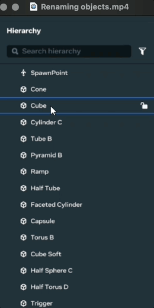
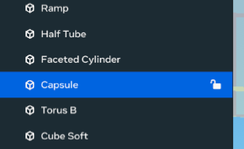
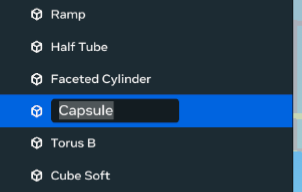
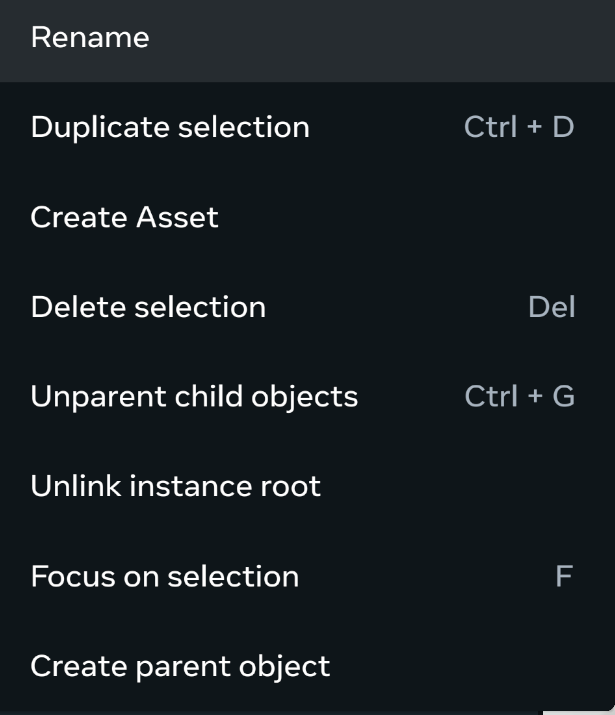
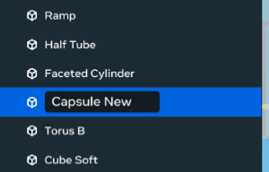
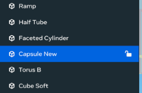

# Renaming Objects

This feature enables you to rename objects and gizmos in the hierarchy, so they are easy to find later.

Follow these steps to rename objects in the hierarchy:

- Select any entity in the world (*single left click*).
  
- Click on the selected entity again (*single left click*) or Press F2.
  
  You can also right click and select **Rename** from the popup menu.
  
- Type in the new name.
  
- Press Enter or unfocus the text input to save.
  