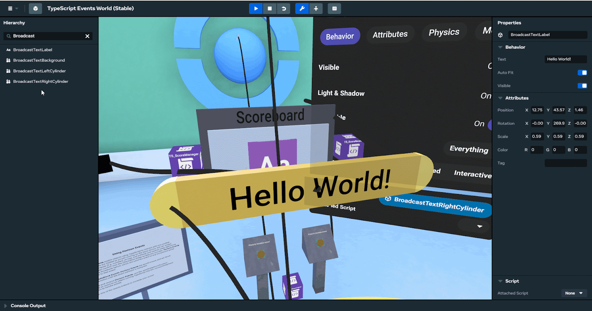
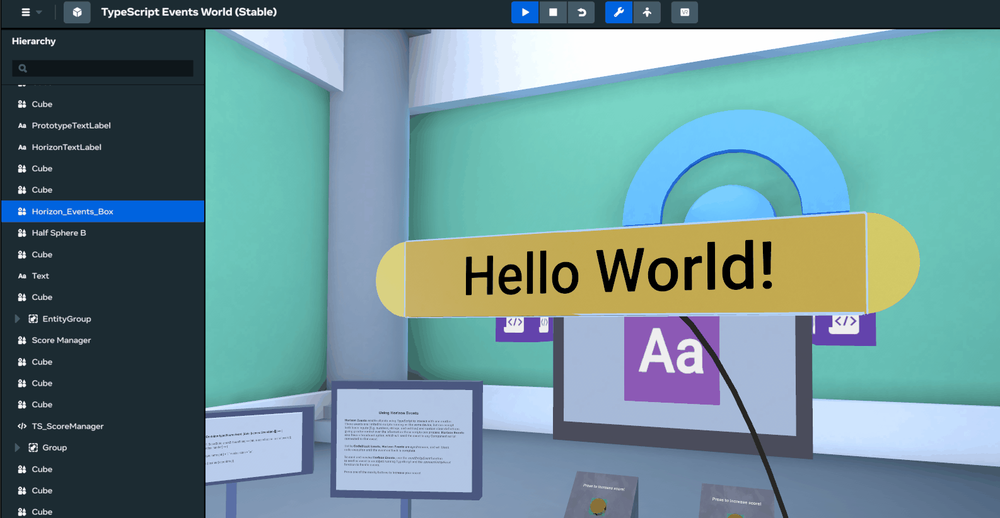
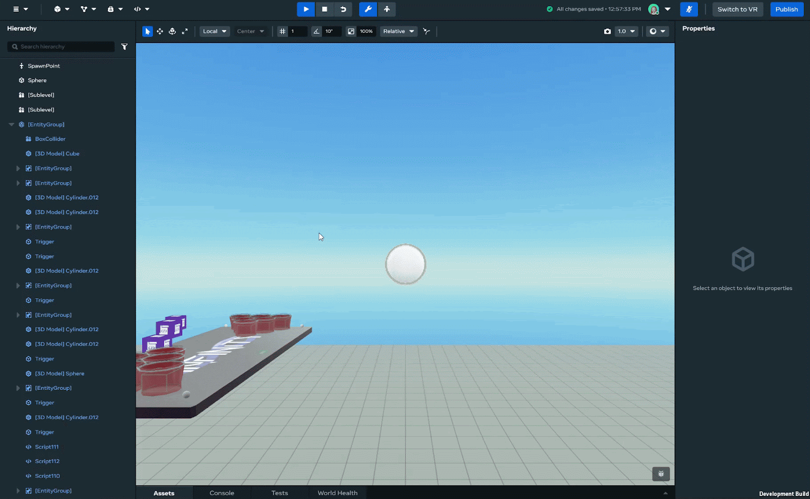
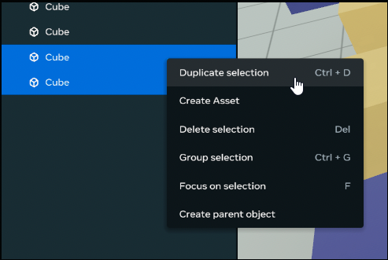
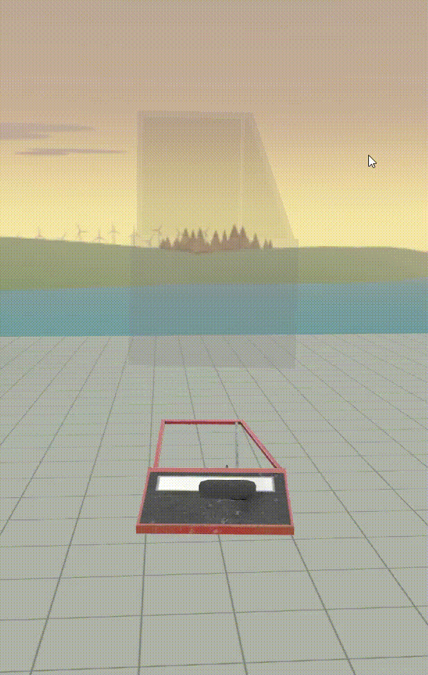
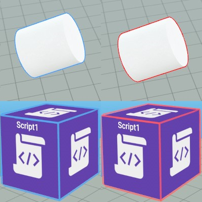
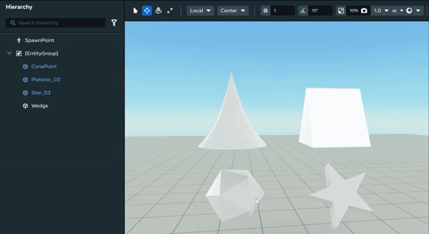

# [Selecting Objects in Desktop Editor](#selecting-objects-in-desktop-editor)

When working in the Desktop Editor, you can select an object and edit its properties or attached script by:

- Clicking on an object directly in the scene.
- Clicking on an object in the Hierarchy panel window.

**Note:** To redirect the view towards a specific object, select an object and press the “F” key.

## [Selecting multiple objects](#selecting-multiple-objects)

You can select multiple objects in the Hierarchy panel in the following ways:

- Select an object, then hold the Ctrl key and click another object to add it to the selection. You may repeat this until all the desired objects are selected. You can also use this method to deselect individual objects.

- Select an object, then hold the Shift key and click another object to select those objects and all objects in between them.

**NOTE:** You can also click individual objects in the scene while holding Shift or Ctrl to add or remove them from the current selection.

## [Duplicate selected objects](#duplicate-selected-objects)

After selecting an object, or multiple objects, in the hierarchy view you can duplicate it to create multiple instances of the same object. Duplicating your existing objects can help reduce the time needed to create things like multiple instances of an item or texture that needs to be repeated or reused.

To do so use the following process:

1. Select an object or objects in the hierarchy view.
2. Right click and select **Duplicate selection** from the pop-up menu. You can also use the keyboard shortcut **Ctrl + D**. 
3. Your selected objects, including any child objects, will appear in the hierarchy view.

## [Sub-Object Selection](#sub-object-selection)

In the Desktop Editor, you can’t select a single sub-object of a group simply by clicking on it in the scene.

Sub-object selection is a feature for the Desktop Editor that lets you select sub-objects in the scene using a second click.

- The first click selects the group.
- The second click selects the sub-object that you clicked on.

**NOTE**: Sub-object selection applies only to groups. For sub-objects in regular hierarchies, the first click still selects the sub-object. To select the parent object, you can simply select it directly.

### [User flow](#user-flow)

Use this procedure to try out sub-object selection.

1. In the Desktop Editor, travel to any world in Edit mode.
2. In the world, either create a new group of entities, or find an existing group.
3. Click on one of the objects in the group. The entire group is selected.
4. Click on the same object again. The sub-object is selected.
5. You can repeat this procedure again with nested groups.

## [Selecting simulated objects and ghost visuals](#selecting-simulated-objects-and-ghost-visuals)

While running a simulation, animated or physics objects (the objects that move) leave behind a ghost visual at their origin point.

While the simulation is running, you can select the moving object either by clicking on the simulated object itself, or its ghost visual.

This works for both regular selection and marquee selection.

## [Outline colors](#outline-colors)

- **Selected** objects and gizmos are outlined in blue.
- **Locked** objects and gizmos are outlined in red, both on mouse over and when selected.

## [Focusing the camera on a selected entity](#focusing-the-camera-on-a-selected-entity)

To focus the camera on a specific object or gizmo, select the object and press the “F” key. 

## [Grouped object behaviors](#grouped-object-behaviors)

In grouped objects, when selecting a child object it selects the whole group.

Locked entities can be selected in the viewport, but manipulators are disabled on locked entities.

Ghost visuals of a single mesh entity use the object’s mesh, but the ghost of a grouped object uses the group’s bounding box instead.

## [Marquee selection](#marquee-selection)

Marquee selection makes it easier to select multiple objects. It simplifies the selection process by allowing you to select more than one object by creating a box around the objects you want selected and highlighting them in blue.

#### [How to use marquee selection](#how-to-use-marquee-selection)

1. In the Desktop Editor, click and drag a selection box over the objects that you want to select.
   1. All non-locked and visible objects within the box become outlined in blue.
   2. Child objects not within the selection box but with parents that are within the selection box are outlined in white.
   3. Any object within the selection box and belonging to either a group or asset template instance will result in the entire group/asset template instance being outlined in blue. 
2. When you unclick, the blue outlined objects within the box are selected.

