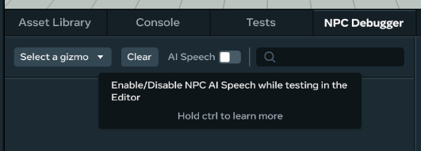
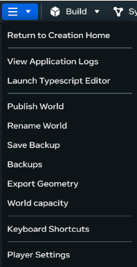
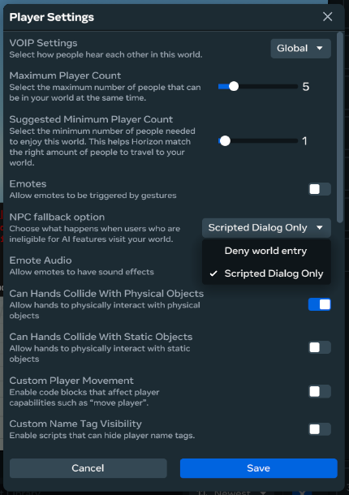

# [NPC Fallback](#npc-fallback)

This guide will walk you through handling situations where AI speech services are unavailable. By default, users who cannot access AI Speech services will be denied access to your world, should it feature AI Speech. You have the option to implement AI Speech Fallbacks so these users can access your world with modifications. Implementing fallback logic ensures that when AI is not available, the world experience remains immersive and uninterrupted. This guide covers AI speech fallback configuration, APIs to detect and script fallback instances, and testing procedures.

## [What are AI Speech Fallbacks and why are they needed?](#what-are-ai-speech-fallbacks-and-why-are-they-needed)

AI Speech Fallbacks are mechanisms to handle scenarios where the generative AI (LLM) service is unavailable or limited. In these cases, users are routed to a separate instance of your world where the LLM service is disabled. Creators can implement predefined scripts to ensure AI-speech disabled NPCs still provide meaningful responses.

Creators using AI NPCs should plan for and implement fallbacks to:

- Guarantee consistent player experience, in case of platform or AI outages
- Comply with policy requirements that disable AI features for certain players

**Example scenarios:**

- If the AI Speech service is temporarily unreachable, instead of breaking immersion with an error, the NPC can switch to scripted responses.
- If the user is in a region where AI speech is not available (outside the US), instead of denying the player entry to the world, the user can enter an AI disabled fallback instance of the world where AI NPCs return scripted responses.
- AI Speech NPCs are only available for users who are 18 years or older and in the US.

## [APIs for creating Fallback Instances with Scripted Dialog](#apis-for-creating-fallback-instances-with-scripted-dialog)

The **horizon/npc** API has a few ways you can detect if the player is eligible for AI features and to adjust logic accordingly:

1. Use the `isAiAvailable` API to detect if the player is eligible for AI speech.

```typescript
  import { NpcConversation } from 'horizon/npc';

  const npc = this.entity.as(Npc);
  const isAiAvailable = NpcConversationnpc.isAiAvailable();
  if (!isAiAvailable) {
    // Add AI speech fallback logic, like scripted responses
    npc.conversation.speak("Welcome! I'm Bob the NPC. Please step forward so I can show you what to do next.");
  }
```

1. Catch `AiNotAvailableError` from the `elicitResponse` LLM API to return scripted responses.

```typescript
  import { Npc, NpcError, NpcErrorCategory } from 'horizon/npc';

  const npc = this.entity.as(Npc);
  npc.conversation.elicitResponse('Warn players that time is running out and suggest going through the door with the flashing arrow.').catch((error: NpcError) => {
    if (error.category === NpcErrorCategory.AiNotAvailableError) {
    // Fallback to scripted dialog when AI speech is disabled
      npc.conversation.speak("Why are you still here? Try the door with the flashing arrow. Get moving!");
        }
  });
```

**Tip**: Scripted dialog should match the NPC’s personality and context.

## [Testing AI Speech Fallbacks](#testing-ai-speech-fallbacks)

### [Testing in Editor](#testing-in-editor)

To test how NPCs behave when the AI system is disabled or unreachable, you can disable AI Speech in the NPC Debugger tab. This will simulate an AI NPC Speech disabled fallback instance when previewing your world in the editor by forcing your scripts that use the `isAiAvailable` API to return false and the `elicitResponse` LLM API to throw a `AiNotAvailableError`.



### [Production testing](#production-testing)

Outside of the editor, you can test AI disabled fallback instances by using an account that is under the age of 18 or outside of the US.

## [Configuring Fallback Settings in the Horizon Desktop Editor](#configuring-fallback-settings-in-the-horizon-desktop-editor)

Once you have completed testing AI Speech Fallbacks and are satisfied, it’s time to publish your world with the new Fallback features. By default, AI ineligible users are denied entry to worlds that contain AI Speech NPCs. Once you have completed this step, ineligible users will be routed to a separate instance of the world where AI is disabled:

1. Open **Player Settings**
2. Set the **“NPC fallback option** to **Scripted Dialog Only**
3. Publish update to your world

## [Group Party Travel](#group-party-travel)

If any player in the group party is ineligible for AI features, all members of the group will be routed to the AI disabled fallback instance of your world.

If an AI ineligible player tries to join an AI eligible player who is already in an LLM instance, travel will fail.

