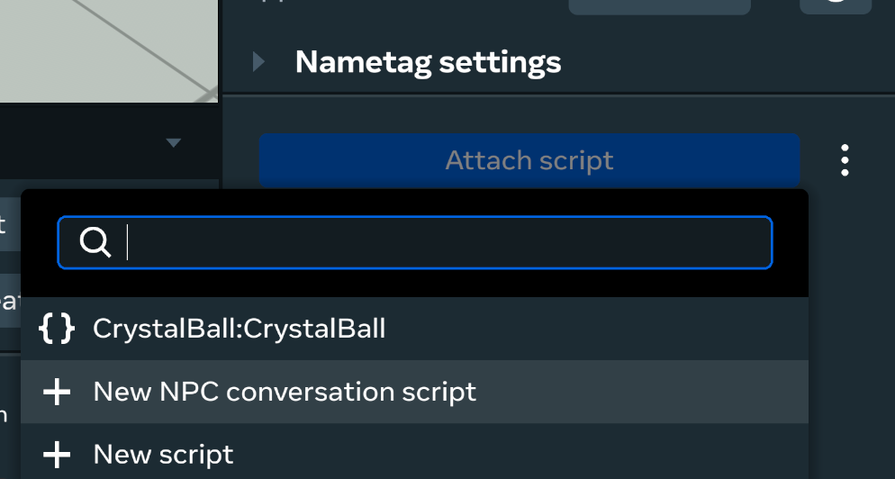
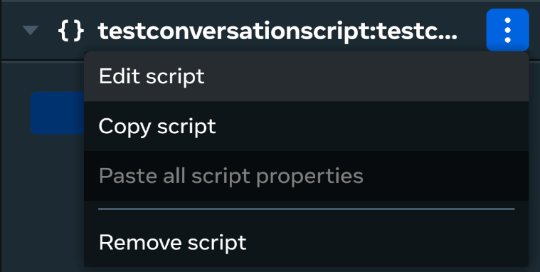

# [Scripted NPCs](#scripted-npcs)

## [**Setting up Conversations for NPCs**](#setting-up-conversations-for-npcs)

This guide focuses on creating NPCs that engage players through **scripted behaviors**, rather than generative AI speech. This approach is ideal when you need predictable interactions, specific animations, and a controlled narrative flow, without the complexities of a large language model (LLM).

- **Speak fixed lines of text**: You can attach and play audio files to simulate speech.
- **Using expressive animations (emotes)**: Scripted Avatar NPCs come with various animations that can convey emotions or responses, such as waving, celebrating, taunting, nodding “yes” or “no,” or pointing.
- **Responding to player actions**: By using trigger zones and code block events, you can program your NPC to react to players entering or exiting areas, or even performing specific actions.

To build a conversation for your scripted NPC, use the following process:

1. Navigate to **Build > Gizmos**, select the **NPC** gizmo and drag it into your scene. Set the **NPC type** to **Horizon Avatar (Body Only).**
2. After configuring the NPC’s properties in the **Properties** pane, click **Attach script** and select **New NPC conversation script** from the menu. 
3. Name your script for your NPC, click **Create and attach**, and wait for the script to compile. Once compiled you can click the three dot menu and select **Edit script** to open the script in your preferred IDE. 

This created script attached to your NPC manages its behavior and maps to various APIs to drive its actions.

## [Start and Stop Listening APIs (All NPCs)](#start-and-stop-listening-apis-all-npcs)

These methods are helpful for situations where the game flow requires specific windows of time where players can speak to an NPC.

- `startListeningTo(player: Player, responseTrigger: ConversationResponseTrigger): Promise<void>`
- `stopListening(): Promise<void>`

There are two primary setups for using the based on your desired behavior.

## [ConversationResponseTrigger.Manual](#conversationresponsetriggermanual)

If you call the startListeningTo method with the responseTrigger parameter set to Manual, the NPC will continue listening to the specified player until the stopListening method is called. This is handy when you want players to explicitly signal when they’ve finished speaking.

## [ConversationResponseTrigger.Automatic](#conversationresponsetriggerautomatic)

If you call the startListeningTo method with the responseTrigger parameter set to Automatic, the NPC will continue listening to the specified player until they stop speaking. This is handy when you want the NPC to listen to a specific player at a specific moment in time, but don’t want to require any additional actions from the player. This can result in a more natural feeling experience for the player.

# [Registered Participant APIs (Horizon Avatar Body Type Only)](#registered-participant-apis-horizon-avatar-body-type-only)

These methods are helpful for creating a more natural conversation experience. NPCs will automatically listen to registered players that are nearby and looking at the NPC. The NPC will also respond automatically to what it heard as soon as the engaged player stops speaking.

- `registerParticipant(player: Player): Promise<void>`
- `unregisterParticipant(player: Player): Promise<void>`
- `unregisterAllParticipants(): Promise<void>`
- `getRegisteredParticipants(): Promise<Array<Player>>`

# [Attention Target APIs (Horizon Avatar Body Type Only)](#attention-target-apis-horizon-avatar-body-type-only)

The attention target APIs are used to control who or what an NPC will look at. If an NPC is in the idle engagement phase they will switch their gaze between one of their attention targets or just looking forward every so often. If an NPC is engaged with a specific player, they will look at that player until they are no longer engaged.

- `addAttentionTarget(target: NpcAttentionTarget): void`
- `removeAttentionTarget(target: NpcAttentionTarget): void`
- `removeAllAttentionTargets(): void`
- `getCurrentAttentionTarget(): NpcAttentionTarget | undefined`
- `getAllAttentionTargets(): Array<NpcAttentionTarget>`

# [Example Use Cases and Scripts](#example-use-cases-and-scripts)

## [Microphone - Start Listening w/ Manual Response Trigger](#microphone---start-listening-w-manual-response-trigger)

Here is an example script to implement an NPC microphone. When a player grabs it, the NPC will listen to them until they let go of the microphone. At that point, the NPC will respond to the things the player said while holding the microphone.

```typescript
class NpcMicrophone extends Component<typeof NpcMicrophone> {
  static propsDefinition = {
    npc: {type: PropTypes.Entity},
    microphone: {type: PropTypes.Entity},
  }

  private npc: Npc = null!;
  private engagementPhase: NpcEngagementPhase = NpcEngagementPhase.Idle;

  public start() {
    this.npc = this.props.npc!.as(Npc);
    const microphone = this.props.microphone!;

    // Make the NPC (if idle) start listening to the player with the microphone
    this.connectCodeBlockEvent(
      microphone,
      CodeBlockEvents.OnGrabStart,
      (isRightHand: boolean, player: Player) => {
        if (this.engagementPhase == NpcEngagementPhase.Idle) {
          this.npc.conversation.startListeningTo(
            player,
            ConversationResponseTrigger.Manual
          );
        }
      }
    );

    // Make the NPC stop listening (and start responding) when the player lets go of the microphone
    this.connectCodeBlockEvent(
      microphone,
      CodeBlockEvents.OnGrabStop,
      (isRightHand: boolean, player: Player) => this.npc.conversation.stopListening();
    );

    // Store the value of the current engagement phase
    this.connectNetworkEvent(
      this.npc,
      NpcEvents.OnNpcEngagementChanged,
      (payload) => this.engagementPhase = payload.phase
    );
  }
}
```

## [Greeter - Start Listening w/ Automatic Response Trigger](#greeter---start-listening-w-automatic-response-trigger)

Here is an example script to implement an NPC that will engage a player that enters a Trigger Gizmo, listens until the player stops speaking, then responds.

```typescript
class NpcGreeter extends Component<typeof NpcGreeter> {
  static propsDefinition = {
    npc: {type: PropTypes.Entity},
    trigger: {type: PropTypes.Entity},
  }

  private npc: Npc = null!;
  private npcPlayer: NpcPlayer | undefined;
  private engagementPhase: NpcEngagementPhase = NpcEngagementPhase.Idle;

  async public start() {
    this.npc = this.props.npc!.as(Npc);
    this.npcPlayer = await this.npc.tryGetPlayer();
    const trigger = this.props.trigger!.as(TriggerGizmo);

    // Make the NPC (if idle) start listening to a player that has entered the trigger
    this.connectCodeBlockEvent(
      trigger,
      CodeBlockEvents.OnPlayerEnterTrigger,
      (player: Player) => {
        this.npcPlayer?.addAttentionTarget(player);
        if (this.phase == NpcEngagementPhase.Idle) {
          this.npc.conversation.startListeningTo(
            player,
            ConversationResponseTrigger.Automtaic
          );
        }
      }
    );

    // Prevent the NPC from staring at players that have left the trigger
    this.connectCodeBlockEvent(
      trigger,
      CodeBlockEvents.OnPlayerExitTrigger,
      (player: Player) => this.npcPlayer?.removeAttentionTarget(player)
    );

    // Store the value of the current engagement phase
    this.connectNetworkEvent(
      this.npc,
      NpcEvents.OnNpcEngagementChanged,
      (payload) => this.engagementPhase = payload.phase
    );
  }
}
```

## [Conversationalist - Register Participant](#conversationalist---register-participant)

Here is an example script to implement an NPC that will hold a back-and-forth conversation with players that are nearby and inside a Trigger Gizmo:

```typescript
class NpcGreeter extends Component<typeof NpcGreeter> {
  static propsDefinition = {
    npc: {type: PropTypes.Entity},
    trigger: {type: PropTypes.Entity},
  }

  private npc: Npc = null!;
  private npcPlayer: NpcPlayer | undefined;

  async public start() {
    this.npc = this.props.npc!.as(Npc);
    this.npcPlayer = await this.npc.tryGetPlayer();
    const trigger = this.props.trigger!.as(TriggerGizmo);

    this.connectCodeBlockEvent(
      trigger,
      CodeBlockEvents.OnPlayerEnterTrigger,
      (player: Player) => {
        this.npcPlayer?.addAttentionTarget(player);
        this.npc.conversation.registerParticipant(player);
      }
    );

    this.connectCodeBlockEvent(
      trigger,
      CodeBlockEvents.OnPlayerExitTrigger,
      (player: Player) => {
        this.npcPlayer?.removeAttentionTarget(player);
        this.npc.conversation.unregisterParticipant(player);
      }
    );
  }
}
```

Alternate version of greeter - introduces itself if it’s the first time being activated by a specific player. The “turn to face” part is also useful for testing because you can tell if elicitResponse failed vs the entire trigger not happening:

```typescript
import { CodeBlockEvents, Component, Player, PropTypes, TriggerGizmo } from 'horizon/core';
import { Npc, NpcPlayer } from 'horizon/npc';


class TestNpc extends Component<typeof TestNpc>{
  static propsDefinition = {
    trigger: { type: PropTypes.Entity },
  };


  private npc : Npc | undefined;
  private npcPlayer : NpcPlayer | undefined;
  private greetedPlayers : Set<number> = new Set<number>();


  async start() {
    this.npc = this.entity.as(Npc);
    this.npcPlayer = await this.npc.tryGetPlayer();


    const trigger = this.props.trigger!.as(TriggerGizmo);
    this.connectCodeBlockEvent(trigger, CodeBlockEvents.OnPlayerEnterTrigger, (player: Player) => {
      if(Npc.playerIsNpc(player)) {
        return;
      }


      this.npc?.conversation.registerParticipant(player);
      this.npcPlayer?.addAttentionTarget(player);
      this.npcPlayer?.rotateTo(player.position.get().sub(this.npcPlayer.position.get()));


      if(!this.greetedPlayers.has(player.id)) {
        this.npc?.conversation.elicitResponse("Introduce yourself to " + player.name.get());
        this.greetedPlayers.add(player.id);
      }
    });


    this.connectCodeBlockEvent(trigger, CodeBlockEvents.OnPlayerExitTrigger, (player: Player) => {
      this.npc?.conversation.unregisterParticipant(player);
      this.npcPlayer?.removeAttentionTarget(player);
    });
  }
}
Component.register(TestNpc);
```

