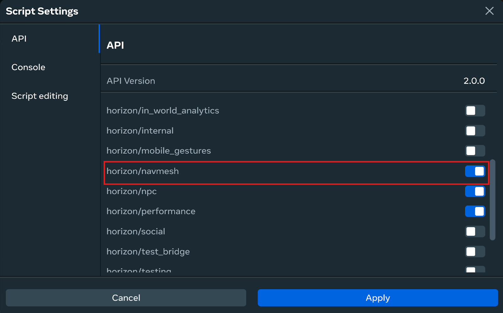
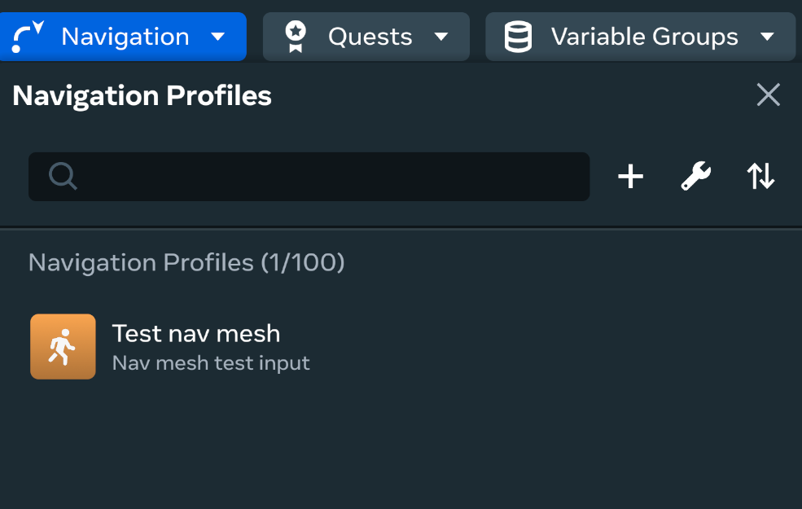
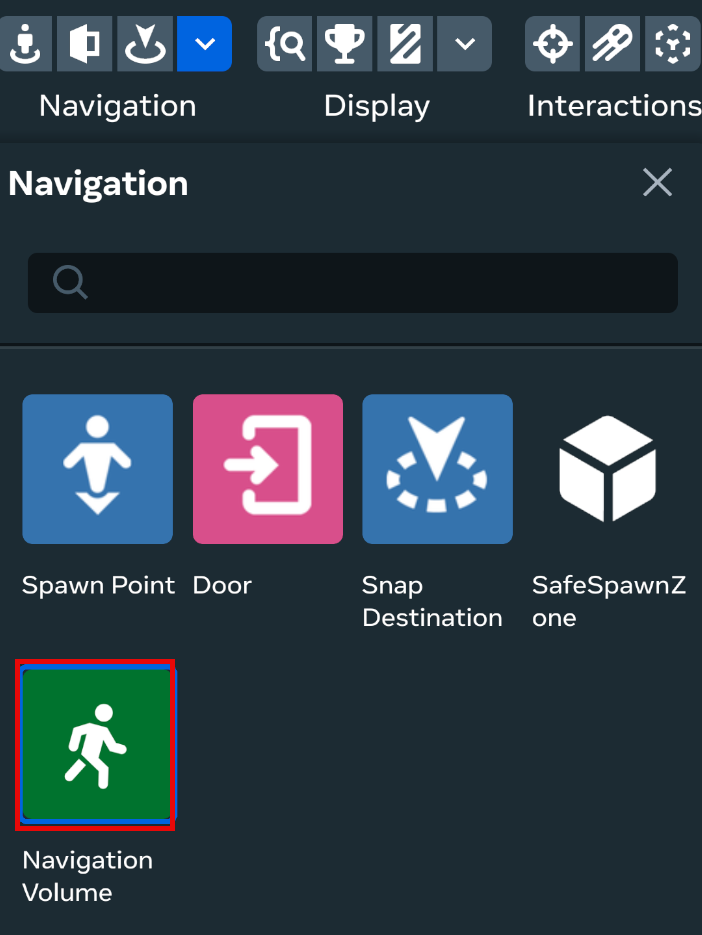
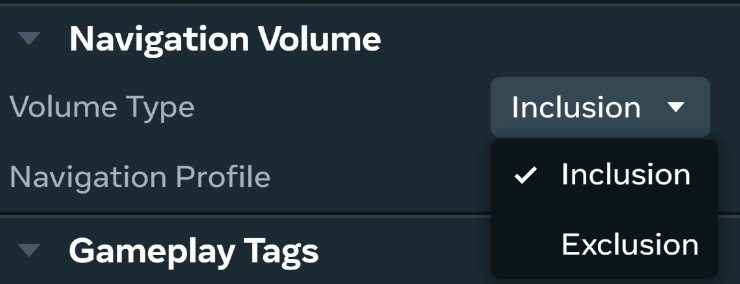
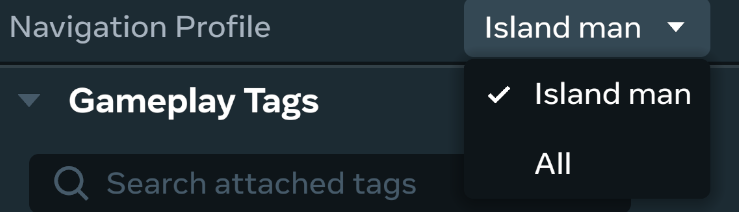
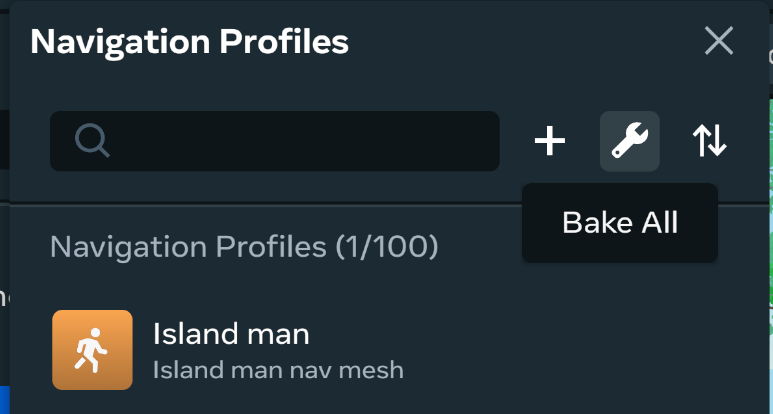

# [NPCs Locomotion](#npcs-locomotion)

# [**Implementing Locomotion for NPCs**](#implementing-locomotion-for-npcs)

Effective locomotion allows your NPCs to move realistically and interact dynamically with your world, whether they are performing pre-defined actions or responding to complex AI logic.

Locomotion helps make your NPCs perform actions like walking, turning, and jumping from scripting via Typescript. This style of direct locomotion can be controlled with methods like `moveToPosition()`, `rotateTo()`, and `jump()`.

## [Set up direct NPC movement](#set-up-direct-npc-movement)

Setting up Direct NPC movement provides immediate, controllable locomotion without requiring a NavMesh setup. These APIs are ideal when you require direct control over your NPC’s movement.

### [Sample](#sample)

```typescript
import * as hz from 'horizon/core';
import { Npc, NpcPlayer, NpcLocomotionResult } from 'horizon/npc';

// Example component - you can name this whatever fits your use case
class NPCMovementExample extends hz.Component<typeof NPCMovementExample> {
 static propsDefinition = {
   npcEntity: { type: hz.PropTypes.Entity },
   targetEntity: { type: hz.PropTypes.Entity },
 };

 private npc: Npc | null = null;
 private npcPlayer: NpcPlayer | null = null;

 async start() {
   this.npc = this.props.npcEntity?.as(Npc);


   if (this.npc) {
     this.npcPlayer = await this.npc.tryGetPlayer();
     this.performBasicMovement();
   }
 }

 private async performBasicMovement() {
   if (!this.npcPlayer || !this.props.targetEntity) return;

   const targetPosition = this.props.targetEntity.position.get();


   // Basic movement with default options using the actual NpcPlayer API
   try {
     const result = await this.npcPlayer.moveToPosition(targetPosition);


     if (result === NpcLocomotionResult.Complete) {
       console.log('NPC reached destination successfully');
       // Perfect for triggering follow-up actions like:
       // - Starting dialogue
       // - Playing animations
       // - Activating game objects
       // - Updating quest states
     } else {
       console.warn(`Movement failed with result: ${result}`);
     }
   } catch (error) {
     console.error('Movement error:', error);
   }
 }
}

hz.Component.register(NPCMovementExample);
```

If using a Nav Mesh for your NPC, here are some additional core concepts to know before setting up your NPC for navigation:

**Navigation volume gizmo**

The navigation gizmo is the primary building block for designing navigation meshes. The box-shaped gizmo allows you to define which areas of your world should be used when generating a navigation mesh. By placing a navigation gizmo in your world, the navigation mesh generation process recognizes the gizmo’s boundaries and identifies any walkable areas within that space.

Conversely, you can set a gizmo to inclusion or exclusion mode. Exclusion mode cuts out an area from the navigation mesh. You can also make gizmos profile-specific, meaning you can design profile-specific walkable areas, exclude agents from a certain area, and so on.

**Navigation mesh (Nav mesh)**

A navigation mesh is a 3D polygonal mesh that defines sections of an environment that an agent can traverse. A world can have multiple navigation meshes for different types of AI agents, dictated by the navigation profiles you define. Each profile has an associated navigation mesh, which can be queried at runtime through the TypeScript API.

**Agent**

An agent is an entity that queries and traverses a navmesh. Agents are typically NPCs, but they can also be player characters depending on the game’s implementation. There is no specific Agent class or code structure; it is a general term that refers to entities that query and use the navigation mesh to function.

**Navigation profile**

A navigation profile defines properties that describe the agent traversing the world. These properties tell the navigation mesh how tall or wide the agent is, as well as details such as the maximum slope angle that can be climbed. These details not only impact the mesh generation, but also the paths calculated at runtime. You can configure the following properties in a navigation profile:

- Radius: The closest the center point of an agent can get to a wall or ledge.
- Height: The minimum height needed for an agent to move through an area.
- Max slope angle: The maximum incline an agent can move up in degrees (between 0 and 60).
- Step height: The maximum height an agent can step up.

## [Build navigation for NPCs](#build-navigation-for-npcs)

Before beginning to build and configure navigation for your NPCs, first you should ensure that the correct APIs are enabled in your world environment.

Select **Scripts \*\*from the top menu bar, then click the options icon. Select \*\*API** from the menu and ensure that **horizon/navmesh** is enabled.

After verifying that the **horizon/navmesh** API is enabled, you can begin building navigation for your NPCs.



### [Build a navigation profile](#build-a-navigation-profile)

Use the following process to setup and generate nav meshes that can be accessed with the NavMesh API:

1. In the **Systems** menu, click **Navigation** to open the **Navigation Profiles** menu. This menu lists any navigation profiles defined for your world and allows you to create new ones.
2. Click the **+** button to begin creating a new profile. 
3. In the **Navigation Profiles** window, click the **Create Profile** button to begin creating a new agent profile. The agent profile options are as follows:

| Property     | Description                                                                                                                                                                                                                                                                                                                                         |
| ------------ | --------------------------------------------------------------------------------------------------------------------------------------------------------------------------------------------------------------------------------------------------------------------------------------------------------------------------------------------------- |
| Agent Height | How high an area needs to be in order for the NPC to navigate underneath it.                                                                                                                                                                                                                                                                        |
| Agent Radius | How wide an area needs to be in order for the NPC to be able to walk through it.                                                                                                                                                                                                                                                                    |
| Agent Slope  | How steep a slope an NPC can walk up.                                                                                                                                                                                                                                                                                                               |
| Step Height  | How high an obstacle needs to be before it will block the NPC. For example, a small stone would be easy for the Android to step over and a bigger rock might be more difficult or might actually obstruct their path. These properties could be different for the Android as opposed to the Chicken. It would be able to step over a smaller stone. |

1. Once finished click **Create** to create and save your profile. Your created profile will be added to the **Navigation profiles** window. 

### [Add navigation volume for NPCs](#add-navigation-volume-for-npcs)

After creating a profile, you can add the **Navigation volume** gizmo to your world to define which areas are navigable.

To do so use the following process:

1. After adding an NPC to your world and choosing its embodiment, select the dropdown arrow in the **Navigation** portion of the tool bar. In the menu, select **Navigation volume**. The Navigation volume will be used in order to determine what areas are navigable by the NPC. So you want to stretch this box out to cover the entire floor of what you want to be navigable. 
2. Once your navigation volume is added and you can configure the **Volume Type** which controls whether it is an **Inclusion** or **Exclusion** navigation volume. Setting the volume to **Exclusion** cuts the covered area out from any generated navigation mesh.  Exclusion is useful for in-world assets that shouldn’t affect NPC navigation like doors.
3. Next, set what the created navigation volume applies to. Use **Navigation Profile** and select a created navigation profile or set to **All** to apply to all entities. 

### [Build the navigation meshes](#build-the-navigation-meshes)

Once you have created and defined profiles and navigation volume gizmos for your world, the next step is to build the meshes for each profile. Alternatively, this is called “baking” the navigation mesh.

Navigate to **Systems > Navigation** and select **Bake All**.



After selecting **Bake All** you should see the navigation meshes built for your world. If it appears that nothing happened when building the navigation mesh, you likely need to enable the in-editor previews. Hover over each profile and ensure the visibility indicator is set to 👁 by clicking the relevant button.

### [NPC Nav Mesh Sample Script](#npc-nav-mesh-sample-script)

```typescript
import * as hz from 'horizon/core';
import { Npc, NpcPlayer, NpcLocomotionOptions, NpcLocomotionResult } from 'horizon/npc';
import NavMeshManager, {NavMesh, NavMeshPath} from 'horizon/navmesh';
// This is an example of how to control an Avatar embodied NPC with a NavMesh.
class NavMeshExample extends hz.Component<typeof NavMeshExample> {
 static propsDefinition = {
   npc: {type: hz.PropTypes.Entity},
   banana: {type: hz.PropTypes.Entity},
   bananaTrigger: {type: hz.PropTypes.Entity},
   customer: {type: hz.PropTypes.Entity}
 };
 private npcGizmo: Npc | undefined;
 // NPC Player is how we control the Avatar embodied NPCs. NpcPlayer derives from Player, so the full Player API is available.
 private npcPlayer: NpcPlayer | undefined;
 private player: hz.Player | undefined;
 private hasBanana: boolean = false;
 // The name of the NavMesh profile we want to use for NPCs.
 private readonly NAV_PROFILE_NAME: string = "NPC";
 // The NavMesh object used to create a path for our NPC to move along.
 private navMesh: NavMesh | null = null;
 // Create locomotion options - we can use this to customize NPC locomotion.
 private moveOptions: NpcLocomotionOptions = {
   movementSpeed: 3, // Control how fast the NPC moves.
   faceMovementDirection: true // Force the NPC to face the direction of movement.
 };
 async start() {
   this.npcGizmo = this.props.npc?.as(Npc);
   if(this.npcGizmo == undefined) {
     console.error("NPC Gizmo is undefined!");
     return;
   }
   // We await to be sure the NPC is fully initialized and the NpcPlayer is available.
   this.npcPlayer = await this.npcGizmo.tryGetPlayer();
   if(this.npcPlayer == undefined) {
     console.error("NPC Player is undefined!");
     return;
   }
   // Retrieve the NavMesh that corresponds to the profile used by NPCs.
   this.navMesh = await NavMeshManager.getInstance(this.world).getByName(this.NAV_PROFILE_NAME);
   if(this.navMesh == null) {
     console.error("NavMesh is null!");
     return;
   }
   // When a player interacts with the trigger, we move the NPC to the Banana.
   this.connectCodeBlockEvent(
     this.props.bananaTrigger!,
     hz.CodeBlockEvents.OnPlayerEnterTrigger,
     (player: hz.Player) => {
       this.player = player;
       this.moveToBanana();
     }
   );
 }
 // We find a path along the NavMesh that takes us to a wanted destination.
 getPathFromNavMesh(targetPosition: hz.Vec3): hz.Vec3[] | null {
   // Find the nearest point on the NavMesh, within 1 meter, to where we want the NPC to go.
   const navMeshTarget: hz.Vec3 | null = this.navMesh!.getNearestPoint(targetPosition, 1);
   if(navMeshTarget == null) {
     console.error("The NPC couldn't find a valid NavMesh position close enough to the wanted destination!");
     return null;
   }
   // Find a starting position on the NavMesh based on the NPC's current position.
   const npcPostion: hz.Vec3 = this.npcPlayer!.position.get();
   const navMeshStart: hz.Vec3 | null = this.navMesh!.getNearestPoint(npcPostion, Number.MAX_SAFE_INTEGER);
   if(navMeshStart == null) {
     console.error("The NPC couldn't find a valid starting NavMesh position!");
     return null;
   }
   const navMeshPath: NavMeshPath | null = this.navMesh!.getPath(navMeshStart, navMeshTarget);
   if(navMeshPath == null) {
     console.error("The NPC couldn't find a NavMesh path to the wanted destination!");
     return null;
   }
   // Return the array of Vec3 to use with NPC's moveToPositions method.
   return navMeshPath.waypoints;
 }
 // We move the NPC to a position close to the Banana and then grab it.
 async moveToBanana(): Promise<void> {
   // Calculate a position that is 1 meter away from the banana.
   const bananaPosition: hz.Vec3 = this.props.banana!.position.get();
   const npcPosition = this.npcPlayer!.position.get();
   const delta = npcPosition.sub(bananaPosition).normalize();
   const targetPosition = bananaPosition.add(delta);
   // Move to our target position with our locomotion options and await completion.
   const result: NpcLocomotionResult = await this.npcPlayer!.moveToPosition(targetPosition, this.moveOptions);
   // Check that moveToPostion was successful.
   if(result != NpcLocomotionResult.Complete) {
     console.error("Something went wrong trying to go to the Banana!");
     return;
   }
   this.grabBanana();
   this.deliverBanana();
 }
 // As long as the NPC has the banana, it will follow the Player but once the NPC is within 2 meters of the Player, it will drop the Banana.
 async deliverBanana(): Promise<void> {
   if(!this.hasBanana || this.player === undefined) {
     return;
   }
   // Find our path
   const destination: hz.Vec3 = this.props.customer!.position.get();
   const path: hz.Vec3[] | null = this.getPathFromNavMesh(destination);
   if(path == null) {
     return;
   }
   console.log("Delivering the Banana!");
   const result: NpcLocomotionResult = await this.npcPlayer!.moveToPositions(path, this.moveOptions);
   if(result != NpcLocomotionResult.Complete) {
     console.error("The NPC failed to deliver the Banana!");
     return;
   }
   this.dropBanana();
 }
 // Check if the NPC isn't currently holding anything and if not, grab the Banana.
 grabBanana(): void {
   // getGrabbedEntity returns undefined if the NPC isn't holding anything.
   if(this.npcPlayer!.getGrabbedEntity(hz.Handedness.Right) == undefined) {
     // Pick up the banana.
     this.npcPlayer!.grab(hz.Handedness.Right ,this.props.banana!);
     this.hasBanana = true;
     console.log("Banana Acquired!");
   }
 }
 dropBanana(): void {
   if(this.npcPlayer!.getGrabbedEntity(hz.Handedness.Right) == undefined) {
     console.error("NPC isn't holding the Banana!");
     return;
   }
   // Drop the banana.
   this.npcPlayer!.drop(hz.Handedness.Right);
   this.hasBanana = false;
 }
}
hz.Component.register(NavMeshExample);
```

