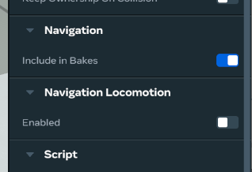
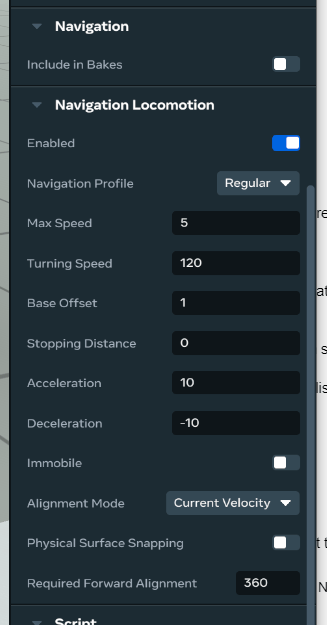
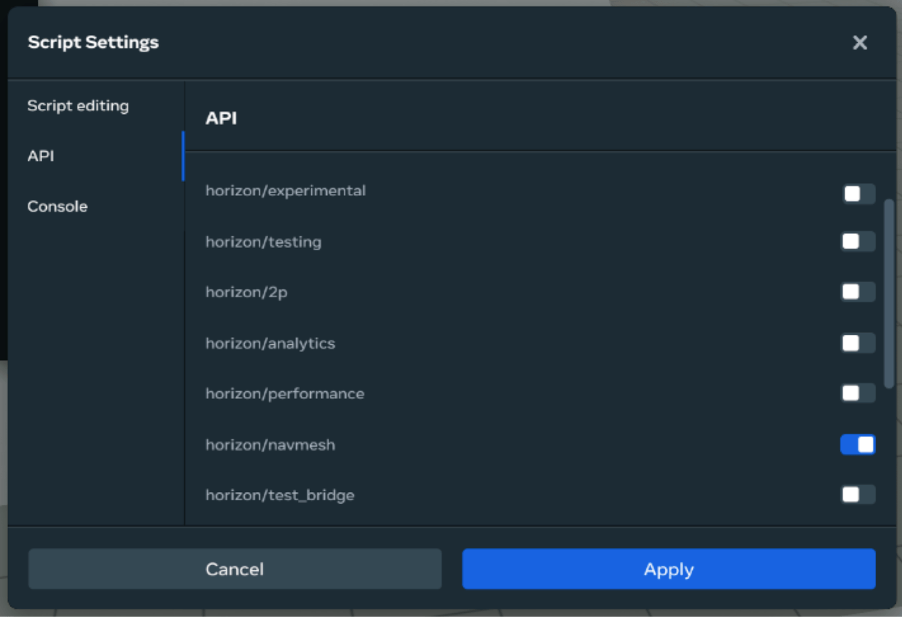
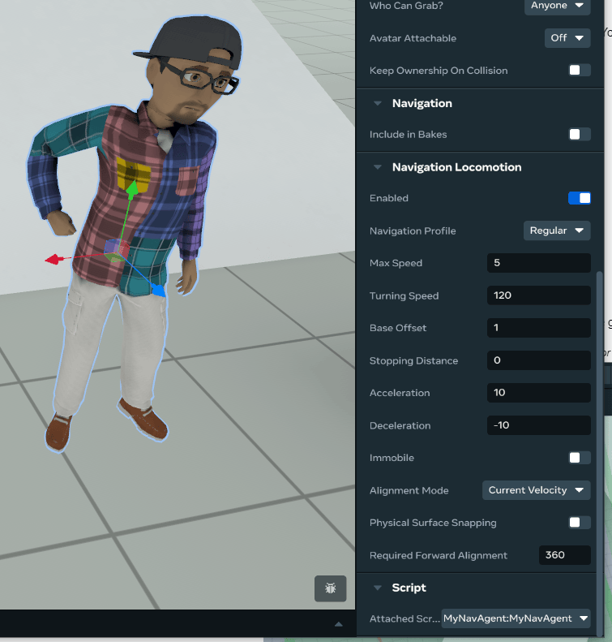

# [Nav Mesh Agents](#nav-mesh-agents)

The navigation mesh (NavMesh) agent feature allows you to create [agents](Navigation%20mesh%20generation.md#agent) that autonomously navigate through a world avoiding obstacles, guided by [navigation meshes](Navigation%20mesh%20generation.md#navigation-mesh-navmesh). Agents can be simple, like a primitive object, or complex, like a premade [NPC asset](https://developers.meta.com/horizon-worlds/learn/documentation/desktop-editor/npcs/getting-started-with-npc-assets). You can create an agent from any of the following entity types:

- Meshes (primitive and custom model)
- Unity Asset Bundles (2p-only)
- Empty/group objects

The NavMesh agent feature provides Desktop Editor tools to configure agents and a [NavMeshAgent API](https://horizon.meta.com/resources/scripting-api/navmesh.navmeshagent.md/?api_version=2.0.0) to execute commands on agents, as well as configure them.

## [Create navigation meshes](#create-navigation-meshes)

Before setting up an agent, you must create:

- Navigation meshes, to determine the areas of your world that NPCs can access and the paths they can use to get there.
- Navigation profiles, to determine which navigation meshes are used for a given agent.

See the [Navigation Mesh Generation](Navigation%20mesh%20generation.md) docs for instructions on how to create navigation meshes and profiles.

## [Set up agents using Desktop Editor](#set-up-agents-using-desktop-editor)

Once you have created navigation profiles and navigation meshes, you can configure agents using the Desktop Editor.

1. First, select the object you’ll use as an agent and open the **Properties** pane.

2. Scroll down to the **Navigation Locomotion** section and toggle on the Enabled property.

   

3. Configure the navigation locomotion settings for your agent. These properties can also be configured through the NavMeshAgent API. See the [NavMeshAgent API docs](https://horizon.meta.com/resources/scripting-api/navmesh.navmeshagent.md/?api_version=2.0.0) for more details about these properties.

   

   1. **Enabled**: Whether the object is a NavMesh agent.
   2. **Navigation Profile**: The navigation profile the agent will use.
   3. **Max Speed**: The maximum speed the agent will move in meters per second.
   4. **Turning Speed**: The rate the agent will rotate towards its desired orientation in degrees per second.
   5. **Base Offset**: The distance from the agent’s center to the surface of its attached navmesh. This value affects collision avoidance such that agents with higher values will avoid other agents with similar base offsets.
   6. **Stopping Distance**: The distance the agent will stop from its destination in meters.
   7. **Acceleration**: The agent’s acceleration rate in meters per second squared.
   8. **Deceleration**: The agent’s deceleration rate in meters per second squared.
   9. **Immobile**: Prevents the agent from moving, even if a destination is set. The agent will not move while the property is toggled on.
   10. **Alignment Mode**: The orientation faced by the agent when traveling. See [NavMeshAgentAlignment enum API docs](https://horizon.meta.com/resources/scripting-api/navmesh.navmeshagentalignment.md/?api_version=2.0.0) for more information.
   11. **Physical Surface Snapping**: Whether the agent stays attached (“snapped”) to the physical surface position or uses the NavMesh surface.
   12. **Required Forward Alignment**: When this is set, the agent will only begin traveling in a given direction when it facing less than the specified angle in degrees away from the direction of travel. This ensures an agent only starts moving once it’s generally facing the right direction.

4. Scroll up to the **Navigation** section and ensure the **Include in Bakes** toggle is off. This ensures the agent itself isn’t included in the navigation mesh. If this is toggled on, the agent will not be able to move through the NavMesh properly.

## [Move agents with the NavMeshAgent API](#move-agents-with-the-navmeshagent-api)

To enable your agents to move, you need to write a script to determine their movements with the [`NavMeshAgent API`](https://horizon.meta.com/resources/scripting-api/navmesh.navmeshagent.md/?api_version=2.0.0).

To use the NavMeshAgent API, first enable the `horizon/navmesh` package in the **Script Settings** menu and **Apply** your changes.



Then, create a new script using the [NavMeshAgent API](https://horizon.meta.com/resources/scripting-api/navmesh.navmeshagent.md/?api_version=2.0.0). See the [Adding and Editing Scripts](../Get%20started%20with%20Desktop%20Editor/Adding%20and%20editing%20scripts.md) documentation for how to create a new script.

After you create a script to move your agent, don’t forget to attach the script to the agent object in the **Properties** pane.



### [Example scripts](#example-scripts)

#### [Walk to random points](#walk-to-random-points)

Here’s an example script where the agent walks to random points in the world:

```typescript
import * as hz from 'horizon/core';
import {INavMesh, NavMeshAgent} from 'horizon/navmesh';

class MyNavAgent extends hz.Component<typeof MyNavAgent> {
  static propsDefinition = {};
  agent!: NavMeshAgent;
  navmesh!: INavMesh;

  start = async () => {
    // Access the NMA API for the attached entity
    this.agent = this.entity.as(NavMeshAgent)!; // Access the navmesh to which this agent is attached
    const mesh = await this.agent.getNavMesh();
    this.navmesh = mesh!; // Move to a random point on the navmesh every 5 seconds

    this.async.setInterval(this.moveToRandomPoint, 5000);
  };

  moveToRandomPoint = () => {
    let foundValidPt = false;
    while (!foundValidPt) {
      // Generate a random point and then find a valid spot on the navmesh nearby
      const randomPoint = new hz.Vec3(
        Math.random() * 10,
        0,
        Math.random() * 10,
      );
      const range = 3;
      const point = this.navmesh.getNearestPoint(randomPoint, range); // Move the agent to the found point!
      if (point) {
        this.agent.destination.set(point);
        foundValidPt = true;
      }
    }
  };
}
hz.Component.register(MyNavAgent);
```

#### [Follow a player](#follow-a-player)

Here’s an example script where the agent follows a player:

```typescript
import * as hz from 'horizon/core';
import {INavMesh, NavMeshAgent} from 'horizon/navmesh';

type Props = {};

class NavAgentTest extends hz.Component<Props> {
  static propsDefinition = {};

  private currentTarget?: hz.Player;
  private agent!: NavMeshAgent;
  private navmesh!: INavMesh;
  private lastKnownGood: hz.Vec3 = hz.Vec3.zero;

  listenForPlayerJoinLeave = () => {
    this.connectCodeBlockEvent(
      this.entity,
      hz.CodeBlockEvents.OnPlayerEnterWorld,
      player => {
        this.currentTarget = player;
        this.update();
      },
    );

    this.connectCodeBlockEvent(
      this.entity,
      hz.CodeBlockEvents.OnPlayerExitWorld,
      player => {
        delete this.currentTarget;
      },
    );
  };

  start() {
    this.agent = this.entity.as(NavMeshAgent)!;
    this.listenForPlayerJoinLeave(); // Get the navmesh reference so we can use it later

    this.agent.getNavMesh().then(mesh => {
      this.navmesh = mesh!;
    }); // Update 4 times per second

    this.async.setInterval(this.update, 1000 / 4); // Tracking variable setup

    this.lastKnownGood = this.entity.position.get();
  }

  update = () => {
    if (this.currentTarget) {
      let targetPos: hz.Vec3 = this.currentTarget.position.get(); // Target is off-mesh, try to find a nearby point.

      if (this.navmesh) {
        const after = this.navmesh.getNearestPoint(targetPos, 3);
        targetPos = after ?? this.entity.position.get();
      }

      this.lastKnownGood = targetPos ?? this.lastKnownGood;
      this.agent.destination.set(this.lastKnownGood);
    }
  };
}
hz.Component.register(NavAgentTest);
```

