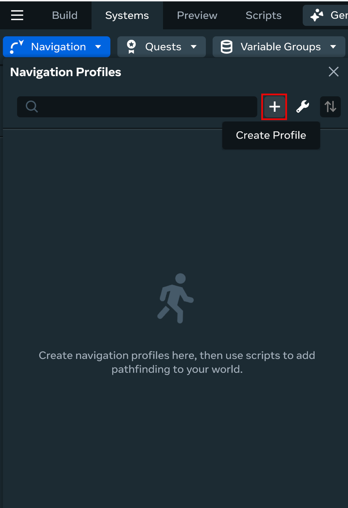
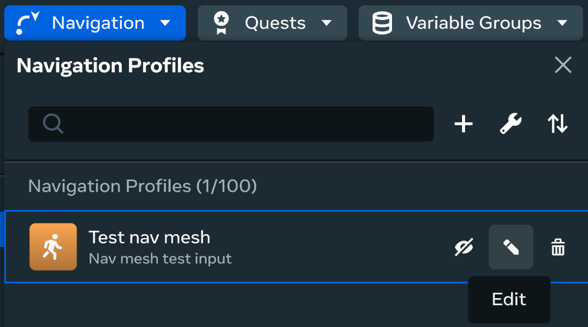
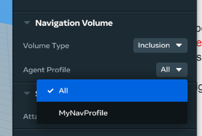
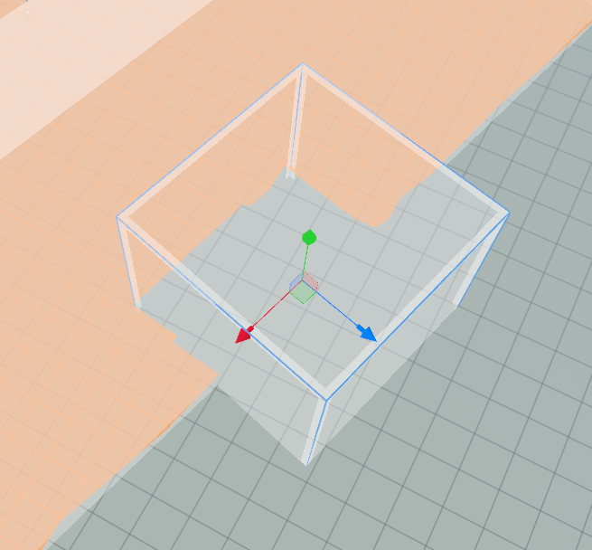
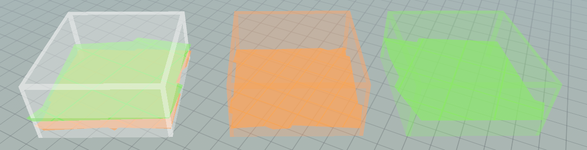
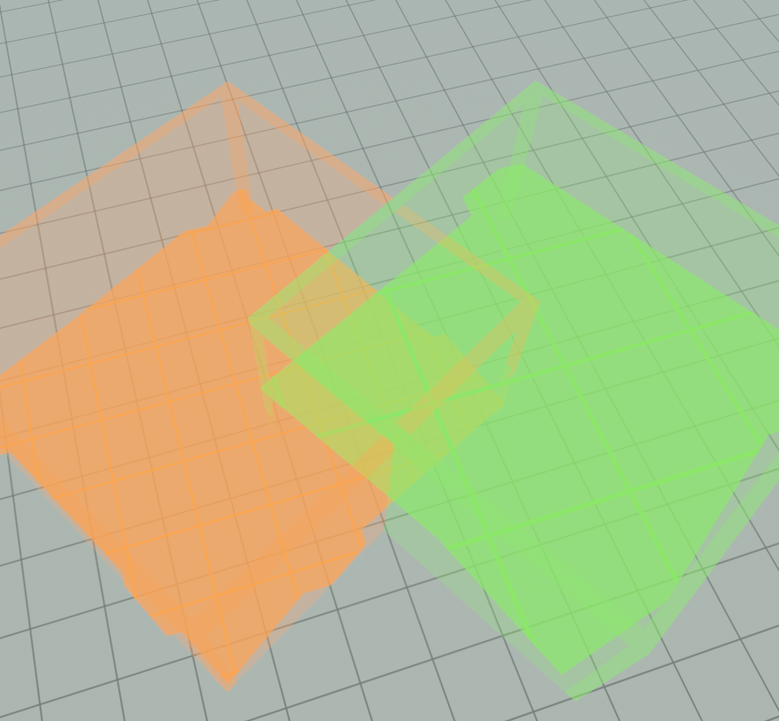
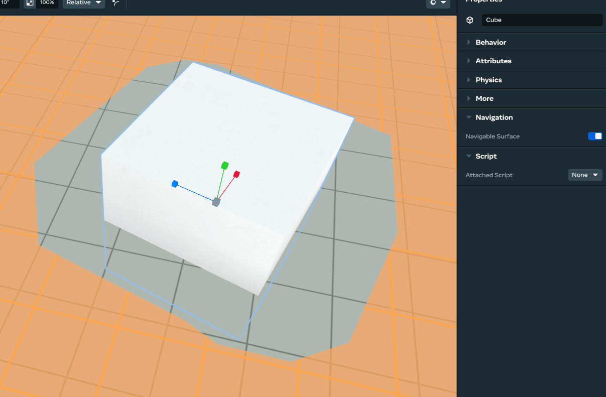
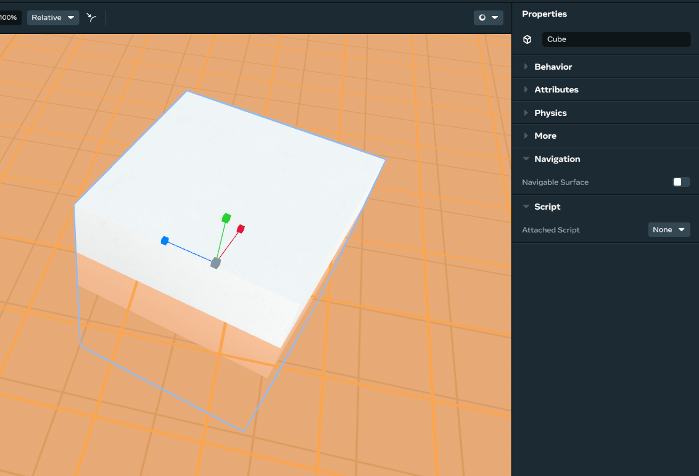
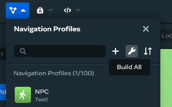
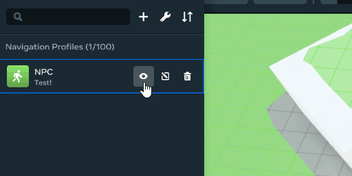

# [Navigation mesh generation](#navigation-mesh-generation)

Horizon includes World Builder tools and APIs that provide navigation meshes for defining walkable areas of an environment. For example, you might have cases where non-player characters (NPCs) should move within a defined space toward specific locations. This can involve multiple constraints to find an optimal path, such as walkable areas within the environment, obstacles in the path of the target, and slopes leading up or down towards the target. Navigation meshes are 3D polygonal meshes representing the predetermined walkable spaces of a world.

Navigation meshes are used to determine the areas of your world that NPCs can access and the paths they can use to get there. With World Builder tools, you can set up, create, and update your meshes. You can then use the NavMesh TypeScript APIs to create scripts that retrieve navigation path calculations for your NPCs.

This document will cover these navigation mesh topics:

- Main concepts
- Setup procedures
- API reference

## [Concepts](#concepts)

Before you get started setting up a navigation mesh, here’s an overview of the main concepts you’ll be using.

### [Agent](#agent)

An agent is an entity that queries and traverses a navmesh. Agents are typically NPCs, but they can also be player characters depending on the game’s implementation. There is no specific Agent class or code structure; it is a general term that refers to entities that query and use the navigation mesh to function.

### [Navigation mesh (NavMesh)](#navigation-mesh-navmesh)

A navigation mesh is a 3D polygonal mesh that defines sections of an environment that an agent can traverse. A world can have multiple navigation meshes for different types of AI agents, dictated by the navigation profiles you define. Each profile has an associated navigation mesh, which can be queried at runtime through the TypeScript API.

### [Navigation profile](#navigation-profile)

A navigation profile defines properties that describe the agent traversing the world. These properties tell the navigation mesh how tall or wide the agent is, as well as details such as the maximum slope angle that can be climbed. These details not only impact the mesh generation, but also the paths calculated at runtime. You can configure the following properties in a navigation profile:

- **Radius**: The closest the center point of an agent can get to a wall or ledge.
- **Height**: The minimum height needed for an agent to move through an area.
- **Max slope angle**: The maximum incline an agent can move up in degrees (between 0 and 60).
- **Step height**: The maximum height an agent can step up.

### [Navigation gizmo](#navigation-gizmo)

The navigation gizmo is the primary building block for designing navigation meshes. The box-shaped gizmo allows you to define which areas of your world should be used when generating a navigation mesh. By placing a navigation gizmo in your world, the navigation mesh generation process recognizes the gizmo’s boundaries and identifies any walkable areas within that space.

Conversely, you can set a gizmo to **inclusion** or **exclusion** mode. Exclusion mode cuts out an area from the navigation mesh. You can also make gizmos profile-specific, meaning you can design profile-specific walkable areas, exclude agents from a certain area, and so on.

## [Setting up in World Builder](#setting-up-in-world-builder)

This section describes how to set up and generate navigation meshes in World Builder (Desktop Editor or CST panel only) so you can access them with the NavMesh API.

### [Adding and editing agent profiles](#adding-and-editing-agent-profiles)

1. In the **Systems** drop-down menu, click the **Navigations** button. The **Navigation Profiles** menu lists any navigation profiles defined for your world.
2. Click the **+** button to define a new navigation profile.



1. In the **Create Navigation Profile** menu, fill in the properties and click **Create**. This displays the new agent profile in the **Navigation Profiles** menu.
2. To update a profile, hover over the menu item and click the **Edit** button. This displays the properties for that profile, which can be modified and saved.



### [Adding a navigation gizmo](#adding-a-navigation-gizmo)

1. Drag and drop the **Navigation Volume** gizmo into your world from the toolbar in the Navigation section.


1. Adjust the size of the space to indicate where navigation meshes can be created.
2. The **Navigation Volume** gizmo applies to all defined navigation profiles for newly added gizmos by default; however, you can specify other profiles within the **Agent Profile** drop-down menu.



1. You can also change the **Volume Type** to **Exclusion** or **Inclusion**. Setting the volume to **Exclusion** cuts out that area from any generated navigation mesh.



1. Setting the gizmo’s profile only impacts the navigation for that profile. For example, setting the gizmo to **Inclusion** for a particular profile will generate a walkable area in that volume for that particular profile.



If volumes overlap, walkable space is made for all associated profiles. 

### [Excluding specific obstacles/entities](#excluding-specific-obstaclesentities)

When generating navigation meshes, you can exclude specific entities from impacting the final result. This can be particularly useful when you have an in-world asset that shouldn’t affect agent navigation such as doors, or even dynamic agents themselves.

All entities are considered navigable by default. To exclude an entity from being navigable, select the object and toggle off the **Navigable Surface** option in the **Navigation** panel:



### [Building the navigation meshes](#building-the-navigation-meshes)

1. At this point, we have profiles defined and gizmos placed in our world. The next step is to **build** the navigation meshes for each profile. An alternative term is “baking” the navigation mesh **.** These terms are interchangeable.
2. From the **Systems** menu, open the **Navigation Profiles** menu and click the **Build All** button.



1. If it appears that nothing happened when building the navigation mesh, you likely need to enable the in-editor previews. Hover over each profile and ensure the visibility indicator is set to 👁 by clicking the relevant button:



## [Using the NavMesh APIs](#using-the-navmesh-apis)

You can use the NavMesh TypeScript API to get references to navigation mesh instances in order to perform pathfinding calculations at runtime.

The general approach to getting the API up and running is as follows:

1. Set up the API..
2. Instantiate the NavMeshManager for this particular world
3. Use that NavMeshManager instance to request NavMesh references
4. Use the exposed API on those NavMesh references to perform pathfinding calculations.

### [Setting up the APIs](#setting-up-the-apis)

This section describes how to set up the API and provides a basic example of how to use it.

The TypeScript APIs that handle navigation mesh calculations are located in the **horizon/navmesh** module.

#### [Example](#example)

The following script demonstrates the basic setup for accessing NavMesh references, including the initial manager setup, requesting profiles, and performing queries on the cached references returned by the manager.

```typescript
import NavMeshManager, {NavMesh} from 'horizon/navmesh';
import * as hz from 'horizon/core';

type Props = {};

class ExampleNavAgentScript extends hz.Component<Props> {
  static propsDefinition: hz.PropsDefinition<Props> = {};
  navMesh!: NavMesh;

  public start = async () => {
    // The manager/`directory` is responsible for procuring navmesh references.
    // The `getInstance` result can be cached, or the method can be called again later as needed.
    const directory = NavMeshManager.getInstance(this.world); // The directory allows us to get references to any navmesh profile we've defined in the editor.

    const mesh = await directory.getByName('NPC');
    if (!mesh) {
      console.log('No navmesh available! Did you type the name wrong?');
      return;
    } // The reference can be treated as a first-class object and stored, passed around, etc.

    this.navMesh = mesh; // Finally, we can do something with the navmesh reference.

    this.findPathExample();
  };

  private findPathExample = () => {
    // Get a path from the origin to (5,0,5)
    const path = this.navMesh.getPath(
      new hz.Vec3(0, 0, 0),
      new hz.Vec3(5, 0, 5),
    );
    if (path) {
      // access `path.waypoints`
    }
  };
}

hz.Component.register(ExampleNavAgentScript);
```

## [NavMesh API reference](#navmesh-api-reference)

#### [`NavMesh` class](#navmesh-class)

A reference to a navigation mesh instance, which scripts can use to query paths, raycasts, and nearest points. Each `NavMesh` class represents a profile already defined in the editor; you can not define or modify profiles at runtime. As such, the `NavMesh` class is generally considered to be read-only.

There can only be one instance of a given NavMesh for each profile. For example, if you procure the same reference from multiple scripts, you are still operating against the same, singular NavMesh reference. This ensures your NavMesh reference can be safely passed between classes, functions, etc.

```typescript
const dir = NavMeshManager.getInstance(this.world);
const mesh1 = dir.getByName('NPC');
const mesh2 = dir.getByName('NPC');
mesh1 === mesh2; // true!
```

#### [GetPath method](#getpath-method)

Calculates any viable or partially-viable path between a start position and target destination. If either the start position or destination position don’t lie on the given NavMesh, no path is returned. If both points lie on the mesh but don’t have a viable path between them, a partial path is returned with waypoints from the start position to the closest possible point to the destination.

We recommend using the `getNearestPosition` method to filter the parameters for this method, so the start and target paths are always valid.

**Parameters**

| **Parameter** | **Type** | **Description**                             |
| ------------- | -------- | ------------------------------------------- |
| start         | Vec3     | The position to calculate the path from.    |
| destination   | Vec3     | The position to calculate the path towards. |

**Return Type**

|          |                                                                                 |
| -------- | ------------------------------------------------------------------------------- |
| \*\*Null | NavMeshPath -\*\* The following scenarios may occur when calling this function: |

- If there’s no path to the target destination, returns null.
- If any partial path is possible, returns an object containing details about the path, such as the list of waypoints to traverse and if the path reaches its destination.

#### [raycast (Origin with direction) method](#raycast-origin-with-direction-method)

Performs a raycast from an origin position that travels in the given direction along the navigation mesh. The ray travels until it either hits something or reaches the max range.

This raycast is different from a physics ray cast because it works in 2.5D on the navigation mesh. A `NavMesh` raycast can detect all kinds of navigation obstructions, such as holes in the ground, and can also climb up slopes if the area is navigable. A physics raycast, in comparison, typically travels linearly through 3D space.

**Parameters**

| **Parameter** | **Type** | **Description**                                      |
| ------------- | -------- | ---------------------------------------------------- |
| origin        | Vec3     | The starting position of the raycast.                |
| direction     | Vec3     | The direction for the raycast to travel in 3D space. |
| range         | number   | The maximum distance the raycast should travel.      |

**Return Type**

**NavMeshHit**

- Data about the raycast calculation, such as if a collision occurred and the distance from the origin.

#### [raycast (start and end points)](#raycast-start-and-end-points)

Performs a raycast between a start and end position on a navigation mesh.

This raycast is different from a physics raycast because it works in 2.5D on the navigation mesh. A `NavMesh` raycast can detect all kinds of navigation obstructions, such as holes in the ground, and can also climb up slopes if the area is navigable. A physics raycast, in comparison, typically travels linearly through 3D space.

**Parameters**

| **Parameter** | **Type** | **Description**                    |
| ------------- | -------- | ---------------------------------- |
| startPoint    | Vec3     | The start position of the raycast. |
| endPoint      | Vec3     | The destination of the raycast.    |

**Return Type**

**NavMeshHit**

- Data about the raycast calculation, such as if a collision occurred and the distance from the start point.

#### [getNearestPoint method](#getnearestpoint-method)

Gets the nearest point on the navigation mesh within the range of the target position, even if the target isn’t on the navigation mesh. This is useful for filtering input parameters for other NavMesh queries. For example, if we want to navigate towards a player that is standing on a box (and therefore off the NavMesh), we can use this call to find the closest valid position for a NavMesh query.

**Parameters**

| **Parameter** | **Type** | **Description**                                     |
| ------------- | -------- | --------------------------------------------------- |
| position      | Vec3     | The target position to check for the nearest point. |
| range         | number   | The maximum distance for the calculation.           |

**Return Type**

|          |          |
| -------- | -------- |
| \*\*Null | Vec3\*\* |

- Returns the nearest `Vec3` position within the range, or `null` if no point is available.

#### [rebake method](#rebake-method)

Requests that the server rebuilds the navigation mesh. This allows you to rebuild a navigation profile’s mesh at runtime in order to respond to loading/placing assets or as a result of an obstacle in the world moving.

**Parameters (none)**

**Return Type**

`Promise<boolean>`

- Returns a promise containing the result of the rebake request.

#### [NavMeshHit type](#navmeshhit-type)

Collision data returned when a raycast is performed on a NavMesh.

**Variables**

| **Variable** | **Type** | **Description**                                                                              |
| ------------ | -------- | -------------------------------------------------------------------------------------------- |
| position     | Vec3     | The ending location where the raycast collided with the NavMesh.                             |
| normal       | Vec3     | The normal vector at the point of impact for this raycast.                                   |
| distance     | number   | The distance traveled when the raycast was performed.                                        |
| hit          | boolean  | true if the raycast hits any obstructions or edges during the calculation; otherwise, false. |
| navMesh      | NavMesh  | The NavMesh that the raycast was performed on.                                               |

#### [NavMeshProfile type](#navmeshprofile-type)

Defines a navigation profile configuration created in World Builder.

**Variables**

| **Variable**  | **Type** | **Description**                                              |
| ------------- | -------- | ------------------------------------------------------------ |
| name          | string   | The name of the profile entity in World Builder.             |
| color         | string   | The color of the given profile as defined in World Builder.  |
| agentRadius   | number   | The radius for the agent’s navmesh calculations.             |
| agentMaxSlope | number   | The maximum angle on a slope the agent can traverse.         |
| navMesh       | NavMesh  | The NavMesh that the agent is running a calculation against. |

#### [NavMeshPath type](#navmeshpath-type)

Defines the pathfinding calculation results for a `getPath` query.

**Variables**

| **Variable**           | **Type** | **Description**                                                                                                |
| ---------------------- | -------- | -------------------------------------------------------------------------------------------------------------- |
| waypoints              | Vec3\[]  | The list of waypoints for the generated path.                                                                  |
| startPos               | Vec3     | The origin point for the generated path.                                                                       |
| endPos                 | Vec3     | The terminal point for the generated path. This might not be the same as the query destination.                |
| destinationPos         | Vec3     | The requested terminal point for the generated path. This may not be reachable, and can differ from `endPos` . |
| pathReachesDestination | boolean  | `true` if the endPos reaches the destinationPos, `false` if an incomplete path is returned.                    |

