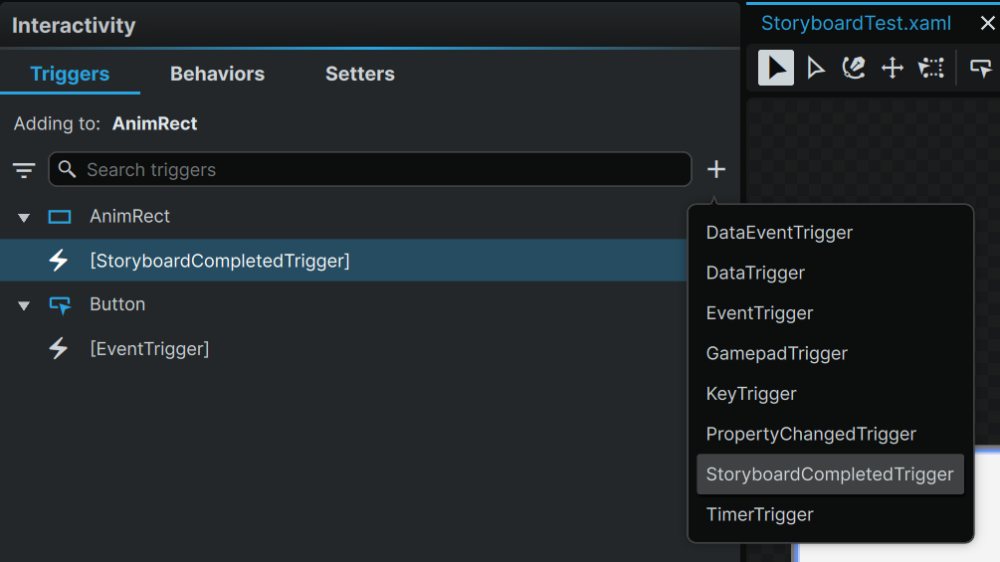
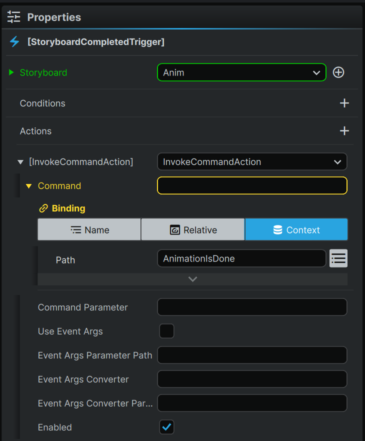

# [Noesis UI Animations](#noesis-ui-animations)

Animation functionality in NoesisUI allows you to build dynamic effects into your UI panels. Leveraging the animation functionality of Noesis allows for the creation of richer 2D UIs with generally improved rendering performance compared to legacy CustomUI.

Since the Noesis UI workflow requires you to build your UI in Noesis Studio, then import it into the desktop editor it’s important to understand how XAML (Extensible Application Markup Language) can be used. XAML is a declarative markup language that instantiates objects and defines your UI elements and their properties.

## [Defining animations in Noesis](#defining-animations-in-noesis)

The **`Storyboard`** object is used in XAML to define a timeline that details a sequence of property changes to apply to specific UI elements over a predetermined duration.

To successfully apply an animation to your created UI you must specify the following aspects for the **`Storyboard`**:

1. **Name the target element**: You must specify a name for the UI element you intend to animation by using the **x:Name** attribute. i.e.`Circle x:Name=”Circle”>`.
2. **Specify the target property:** Use the attached properties **TargetName** and **TargetProperty** to point the animation at the desired UI element.

## [Trigger animations](#trigger-animations)

Once you’ve defined your animations you must use XAML to trigger them. You can use the `BeginStoryBoard` action and an `EventTrigger` which begins the action when the specified event occurs.

You can also automatically launch an animation as soon as your created UI launches by using the `FrameworkElement.Loaded` event instead of waiting for an input event like `Button.Click`

## [Advanced animations](#advanced-animations)

For any animations that require more precise control over movement or non-linear effects, you can use additional tools beyond basic interpolation.

### [Keyframe animations](#keyframe-animations)

While standard animations only support linear interpolation, keyframe animations allow more complex behavior and are required to define specific values at specific times.

Keyframes use specific classes that replace From/To properties with a Keyframe collection. The main types of keyframes are:

- **Linear keyframes** - Interpolation is performed linearly between the defined keyframe values
- **Spline keyframes** - Defines motion as a cubic Bezier curve using a KeySpline property, allowing of custom, non-linear timing control
- **Discrete keyframes** - No interpolation occurs; the value changes instantly at the specified time

## [Process Storyboard Animation End Event](#process-storyboard-animation-end-event)

Sometimes creators may want to add specific action at the end of an animation. To do so please follow steps in the Noesis Studio:

1. Open **Interactivity** tab in the left toolbar
2. Select desired component and press plus icon to **Add trigger**
3. Select **Storyboard Completed Trigger** to handle end of animation state. 
4. In the properties panel on the right add **InvokeCommandAction** in the **Actions** section and select a desired command. 

## [Additional resources](#additional-resources)

For more information about Noesis UI animations, see the [Noesis UI documentation](https://www.noesisengine.com/studio/) and check the [NoesisUI Animation Tutorial](https://www.noesisengine.com/docs/Gui.Core.AnimationTutorial.html).

