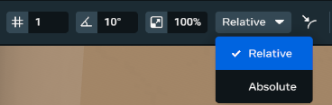
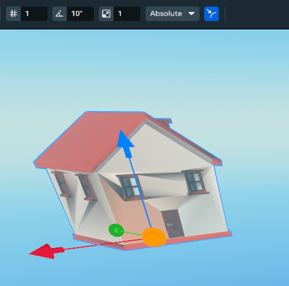

# Grid and Surface Snapping

You can snap objects to specific increments in your world with grid, angle, and scale snapping. These features make it possible to be more precise and uniform when placing objects. They are supported by both Local and Global coordinate systems.

## How to use snapping tools

* The snapping tool icons are located on the tools top bar to the right of the Select, Translate, Rotate, and Scale tool icons.
* Get started by selecting a grid, angle, or scale snap icon to toggle snapping on or off.

### Snapping Hotkey

You can hold down the Ctrl key to quickly enable snapping for your transform. This acts the same as clicking the snapping button, and you can toggle this on/off before or during a transform.

## Rotation example

How to rotate an object by 5-degree increments:

- Turn on Angle Snap by either:
  * Selecting the Angle Snap icon in the top bar (middle option)
  * Holding down Ctrl
- Set degrees to 5 (the default is 10).
- Press [E] to toggle into Rotation mode.

## Snapping tools modes

There are three snapping tool mode options:

- Grid snap mode
  * This affects Translation [W] and Planar Translation [W].
  * Objects will move along an axis or a plane by relative increments of grid snap units.
  * Default Grid Snapping is set to increments of 1 unit.
- Angle snap mode
  * This affects Rotation [E].
  * Object will rotate along an axis by relative angles of angle snap units.
  * Default Angle Snapping is set to increments of 10 degrees.
- Scale snap mode
  * This affects Scale [R].
  * Object will scale by multiples of the scale snap percentage value.
  * For example: 100% means the object will scale by 100% of the starting scale value of each snap.
  * Default Scale Snapping is set to increments of 100%.

## Relative and Absolute snapping

You can toggle between relative and absolute snapping using the dropdown.

Relative: Snap to a value relative to the object’s starting position.

Absolute: Snap to a value regardless of the starting position.

## Surface snapping

Follow these steps to snap an object’s pivot to the collider of another object:

- First, select the object you want to snap and change to Translate mode [W].
- Next, click the surface snap toggle button (or hold Ctrl + Shift) to see the surface snap manipulation handle.
- Then, drag the orange sphere handle on top of another object to surface snap the selected object to a collider.