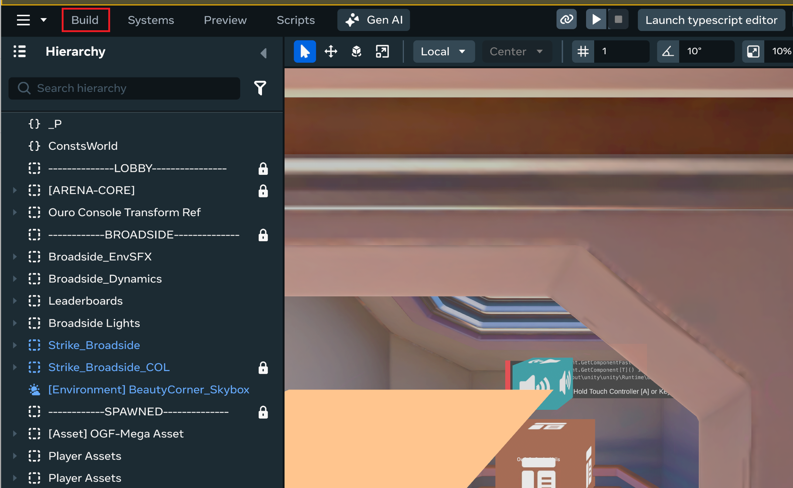
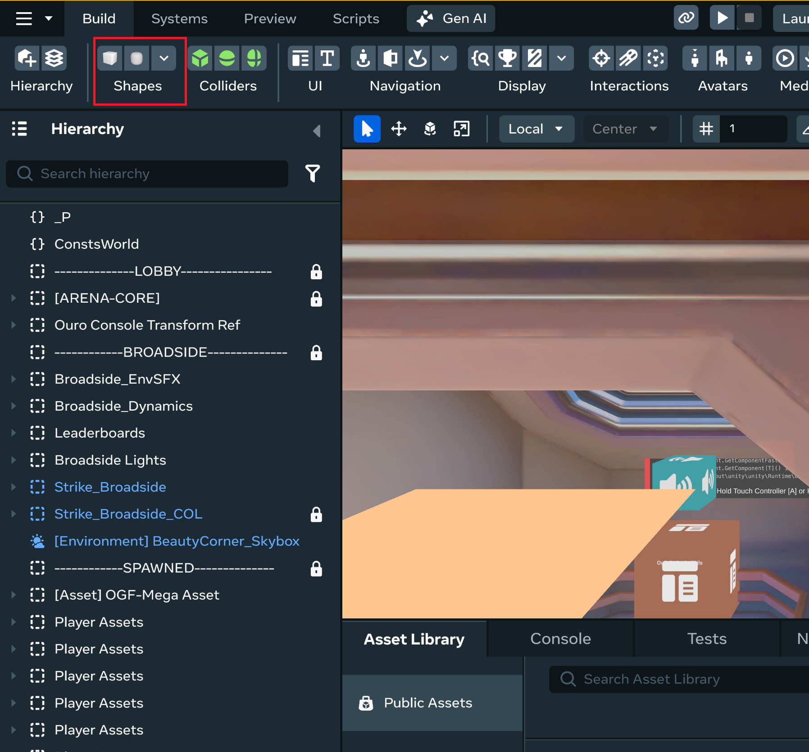
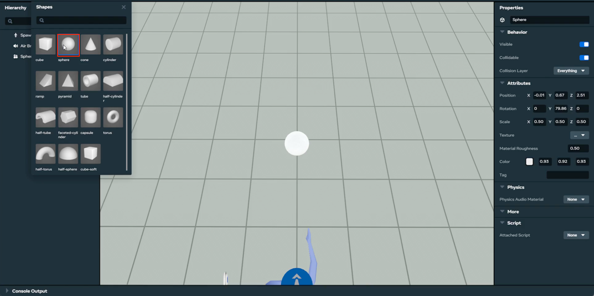
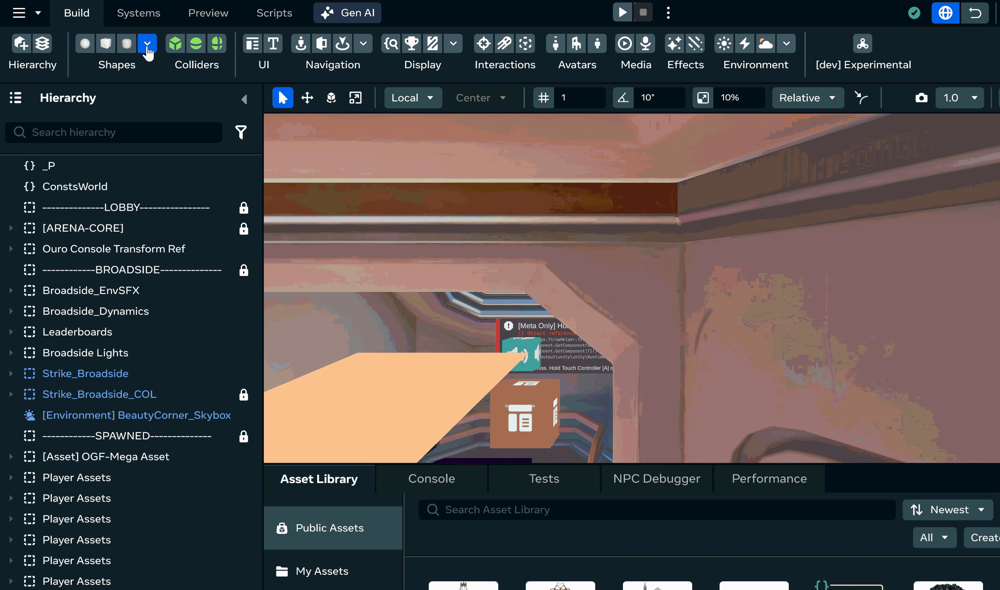

# [Object Instantiation](#object-instantiation)

1. Click on the “Build” box icon from the top bar. 
2. Selecting shapes, gizmos, sounds from the drop-down menu will display 3D objects. 
3. When the user clicks on a 3D object, the object is spawned in the world. 

## [Demo](#demo)

