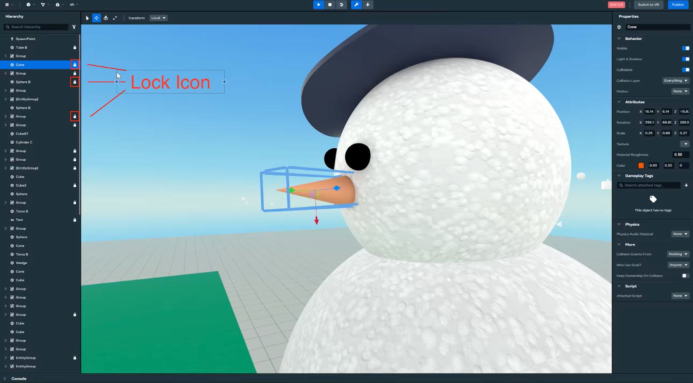

# [Object Lock and Unlock](#object-lock-and-unlock)

Locking objects can be helpful for:

- Stopping accidental movement.
- Viewport selection: locking can ensure that only the intended object is manipulated in complex scenes or in scenes where an object is surrounded or obstructed.

## [Using Lock and Unlock](#using-lock-and-unlock)

- The lock/unlock implementation in the Desktop Editor displays a lock icon in the hierarchy beside an object that is locked. This icon can be clicked to unlock the object.
- If you hover over an object that is unlocked, an unlock icon will appear that can be clicked to lock the object.
- When an object is “locked,” a user will not be able to move it using the manipulators or select it in the scene.
- In order to change properties from the property panel, the user must select the object from the hierarchy.

