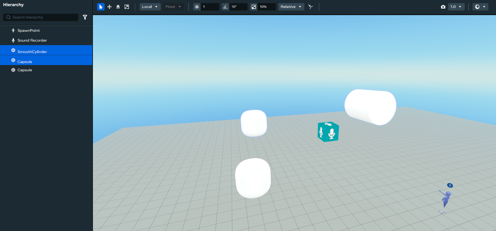
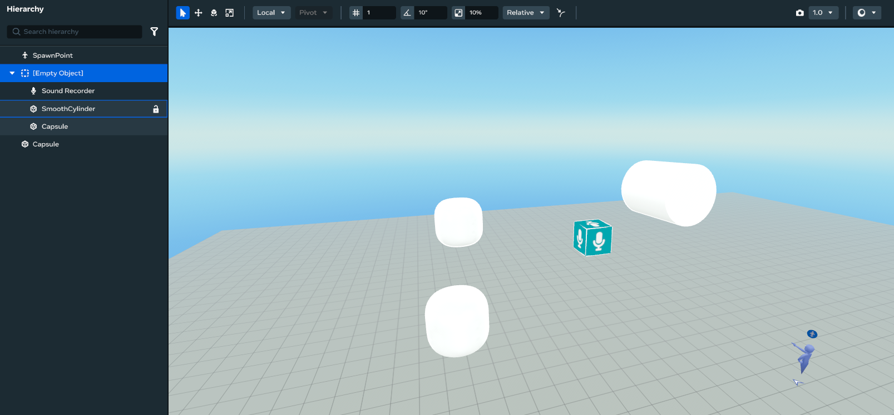

# Object hierarchy and groups

The Meta Horizon Worlds desktop editor provides you with the ability to combine objects so you can select, move, rotate, or scale objects as a single unit. This is achieved through defining object relationships that allow you to set behaviors, such as [collidable](../../Performance/Performance%20best%20practices/Physics%20best%20practices.md#collidable-objects), for all the child objects of the same parent. Additionally, creating nested [parent-child relationships](../Hierarchy%20window/Hierarchy%20panel%20overview.md#features) between objects improves world organization, and object manipulation and management.

**Note**: While creating parent-child relationships between objects, pay attention to the location of the [pivot point](../Hierarchy%20window/Hierarchy%20panel%20overview.md#pivot-around-parent-objects) that defines your rotations and scale transformations.

## Create a parent-child hierarchy between objects

While it’s not necessary to designate an existing object in the scene as the parent of a group, any [object in the hierarchy view](../Hierarchy%20window/Hierarchy%20panel%20overview.md#parent-anything-to-anything) can be dragged and dropped onto any other object to create a parent-child relationship. Alternatively, you can create an intangible [empty object](../Hierarchy%20window/Hierarchy%20panel%20overview.md#empty-objects) as the parent for one or more children. The following steps demonstrates how an empty object is created to be the parent of selected objects.

- Press Ctrl + Click or Shift + Click to select multiple objects.

  
- Create an empty object to be the parent of the selected objects:

  Press Ctrl + G on your keyboard, or right click to select **Create parent object** from the context menu.

## Add an object to an existing hierarchy

- Select the object you want to add to an existing hierarchy.
- Click and drag the object to the hierarchy.

  In the following image, the **Sound Recorder** is dragged to the **Empty Object** hierarchy.

  

## Remove objects from a hierarchy

- Objects can be removed from hierarchies using the same drag-and-drop method as described above.

  You can also right-click the object you’d like to remove from the hierarchy and select **Unparent selection**.

## Unparent all objects in a hierarchy

- Select the parent object of the hierarchy.
- Right-click the parent object to click **Unparent child objects**.
- All child objects are removed from the hierarchy, and the parent object remains.

## Additional object organizations

The four procedures explained above can be combined to create additional object organizations such as the following:

* Add multiple objects to an existing group.
* Remove multiple objects from an existing group.
* Move objects from one group to another group.
* Nest groups.
* Add or remove objects from nested groups.
* Move objects from a nested group to a higher level group.
* Undo or Redo your last operation.

## What’s next?

Learn more about the concepts of object hierarchy and pivot around parent objects in [Hierarchy panel overview](../Hierarchy%20window/Hierarchy%20panel%20overview.md).