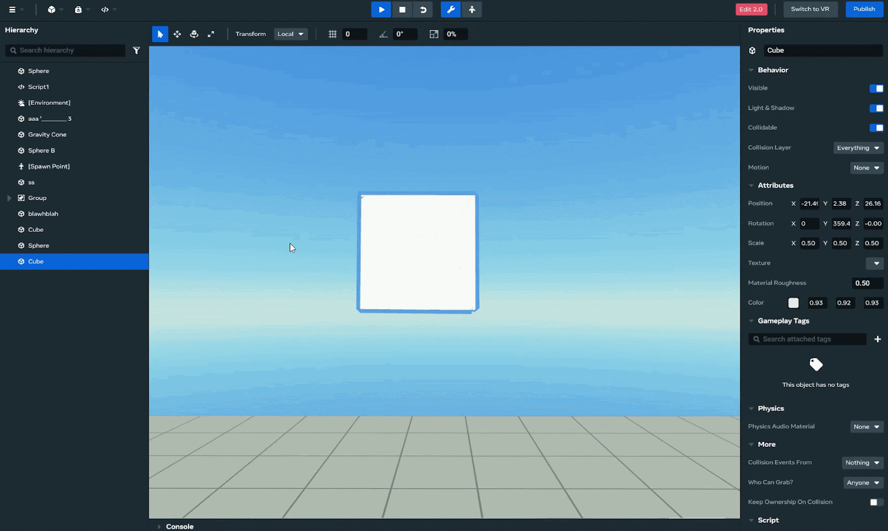
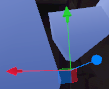

# Using the Object Tools

With the Worlds desktop editor, you can edit objects in your scene easily and intuitively, with easily accessible buttons on a single toolbar to toggle between different tool functions.

## Select object

Keyboard shortcut: **Shift** + **Q**

Select an object by selecting it in the **Hierarchy** panel, or selecting it in the **Scene** view. If another tool has been selected, click the **Select** tool while focus is on the object. You can also select more than one object at a time by holding down the **Shift** or **Ctrl** keys and selecting the objects in either the **Scene** view or the **Hiearchy** panel.

## Move object

Keyboard shortcut: **Shift** + **W**

When you click the **Move** button with an object selected, a small three-dimensional (3D) coordinate system appears on the object.

It has arrows going along the red X (left-right), green Y (up-down), and blue Z (forward-back) directions. You can move the object in any of those directions by clicking and dragging on one of the arrows.You can move the object along the XY, XZ, or YZ planes by dragging one of the planar handles (the squares where the arrows meet in the center).

## Rotate object

Keyboard shortcut: **Shift** + **E**

When you click the **Rotate** button with an object selected, a small three-dimensional (3D) set of angles appears on the object.

Rotate objects around the X, Y, or Z axes by dragging the red (X), green (Y) or blue (Z) angles. These partial circles show the rotation around either the center or the pivot point of the object (whichever you’ve chosen with the **Pivot** tool.) You can rotate the object in any of those directions by clicking the angle and dragging it so that the object rotates the desired amount.

## Scale object

Keyboard shortcut: **Shift** + **R**

Scale objects along the X, Y, or Z axes by dragging the red (X), green (Y) or blue (Z) arrows. Doing this will only change the scale along that single axis. If you want to uniformly scale the object, drag the center gray box, or press **Shift** and drag one of the red, green, or blue handles.

## Global / local coordinates

This option toggles between **Local** and **Global** axes for the **Rotate** and **Move** tools. If this is set to **Local** (the default), any movement or rotation along (or about) an axis will be relative to the current orientation of the object. If it’s set to **Global**, it will move or rotate relative to the world’s X, Y, and Z axes.

## Pivot

By default, objects are positioned based on their center point. You can use the **Pivot** tool to position objects based on their pivot point, which is usually located at the bottom of the object, rather than based on their center point.

## Snapping tools

You can use the **Snapping** tools to precisely translate, rotate, and scale objects in your scene by forcing the object to *snap* to a whole value, into a new position, orientation, or scale.

The following snapping tools are availabe in the Desktop Editor UI:

* [Translation Grid Snap](Using%20the%20Object%20Tools.md#translation-grid-snap)
* [Rotation Angle Snap](Using%20the%20Object%20Tools.md#rotation-angle-snap)
* [Scale Snap](Using%20the%20Object%20Tools.md#scale-snap)
* [Relative or Absolute Snap](Using%20the%20Object%20Tools.md#relative-or-absolute-snap)
* [Snap to Surfaces](Using%20the%20Object%20Tools.md#snap-to-surfaces)

### Translation Grid Snap

**Translation Grid Snap** provides you a way to move objects along a given axis by specific increments called *Grid Snap Units*. They then snap into position along a whole coordinate value. Snapping objects into position helps you place object precisesly in your scene.

The Translation Grid Snap supports both local and global coordinate systems.

### Rotation Angle Snap

Use the **Rotation Angle Snap** tool to rotate an object about its center point in specific increments.

### Scale Snap

Use the **Scale Snap** toggle when you want to change an object’s size, and you want to scale it incrementally using a scaling factor.

### Relative or Absolute Snap

Snapping objects to values helps you align them precisely. By default, the desktop editor uses Relative snapping, but you can change it to use Absolute snapping.

| Snap Type | Description |
| --- | --- |
| Relative | Aligns objects based on their current position relative to other objects. This is useful to maintain consistent spacing or alignment between multiple objects in your scene. |
| Absolute | Aligns objects to a fixed grid or axis, regardless of their current position. This is useful to place objects at exact coordinates, or to align them to a specific grid. |

### Snap to Surfaces

Use the **Snap to surfaces** to snap the pivot point of one object to the collider (surface) of another object in the scene.

## Object tool demonstration

The following video shows use of some of the object tools discussed here:

