# [Preparing Skydome Maps for Meta Horizon Worlds Ingestion](#preparing-skydome-maps-for-meta-horizon-worlds-ingestion)

This section describes the requirements and process for building custom skydome maps for ingestion into Meta Horizon Worlds for use in your worlds.

## [Skydome Asset Requirements](#skydome-asset-requirements)

To upload a custom skydome, you must build the following art assets, listed below in the supported format(s).

1. High Resolution Display Cubemap (`PNG`)
   1. The high-resolution display map must be an equirectangular/latlong source asset.
   2. This asset must be converted to a horizontal strip through your source application.
2. Radiance Map (`PNG` or `EXR`)
3. Reflection Map (`EXR`)
4. Fog Map (`EXR`)

For more information on the requirements for each asset type, please see “Appendix: Skydome Map Reference” below.

**Tip**: You can also download a pre-made assets to upload into Meta Horizon Worlds. See “Download” below.

## [Limitations](#limitations)

- Skybox textures must meet the exact dimensions and type as noted in the UI. Using textures with any other dimensions causes failures.
- You cannot re-upload the skybox textures individually. You must make a new asset or use the Replace Asset feature.
- You cannot spawn a skydome asset via TypeScript.
- Reflection Map assets must be in `EXR` format. `PNG` is not supported.

## [Import Skydome into Horizon](#import-skydome-into-horizon)

After you have prepared assets, the following steps walk through how to create a skydome asset:

1. Open a world in the desktop editor.
2. Click the **Asset Library tab** at the bottom of the screen: 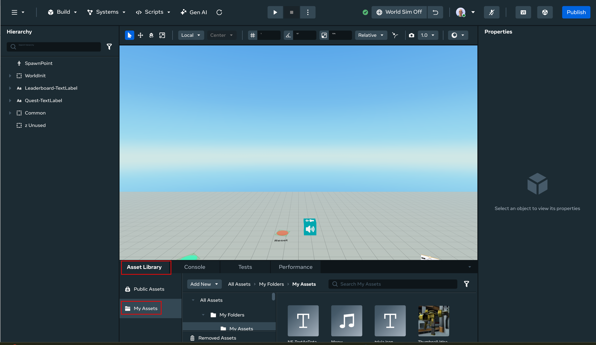
3. In the Asset Library tab, navigate your folder structure to select the folder where you wish to store the uploaded skydome.
4. To begin, click **Add New > Skydome**: 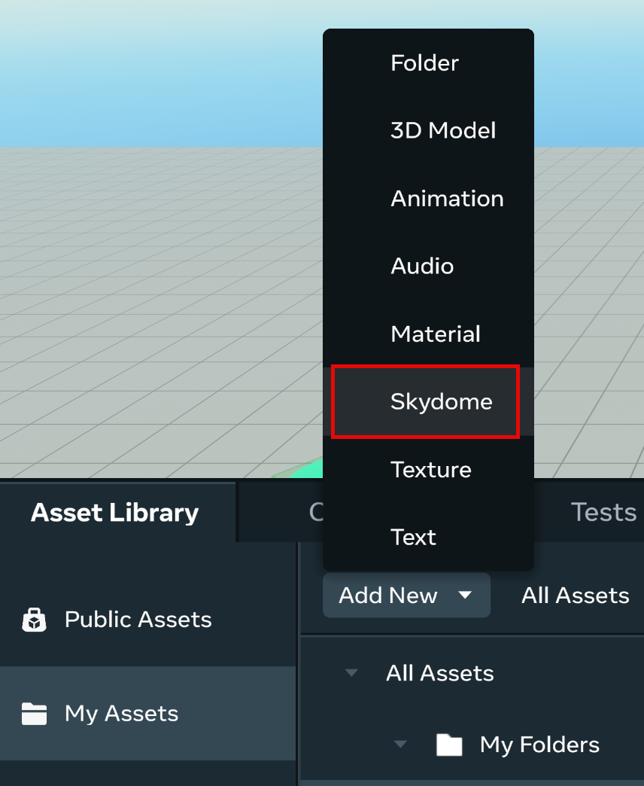
5. Select the art assets that you wish to upload for each of the skydome texture types. Please verify that all assets are in the file format and dimensions listed in the window: 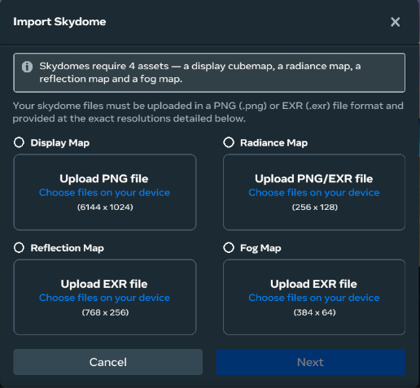
6. Click **Next**. The selected assets are displayed: 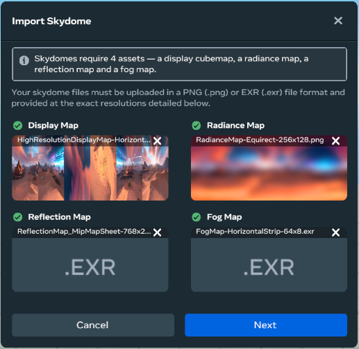
7. Click **Next**. Enter the Name and Description for the skydome. To start creating the asset, click **Done**:
8. The asset is created. This process may take a minute or two to complete. Do not navigate away from the world or create a second skydome until the process has completed.
9. After the asset is created, it is displayed in the Asset Lbrary tab in the folder that you selected for import. 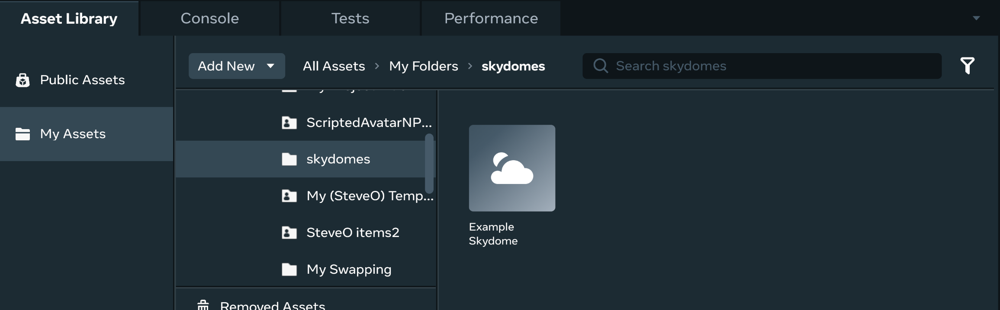

## [Deploy Skydome to Worlds](#deploy-skydome-to-worlds)

After you have created the custom skydome asset, you can deploy it into your world.

**Note**: This process creates a new instance of the Environment gizmo mapped to the custom skydome asset. If you already have an Environment gizmo in your world, you may need to port its settings to the new one that you create here.

1. In the Asset Library tab, locate the skydome asset that you created. Right-click the asset and select **Place**. You may also click and drag it into your world. 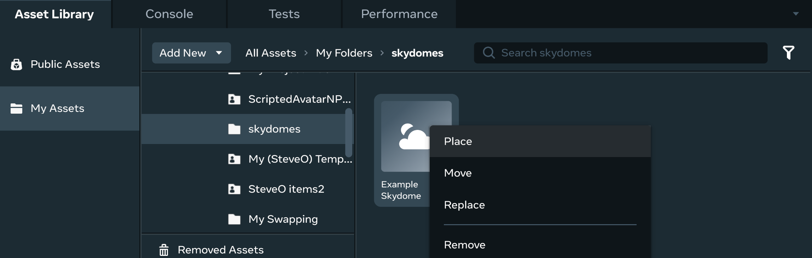
2. An instance of the Environment gizmo is created in the world, and the skydome in the world now matches the one that you uploaded. **Note**: Initially, the skydome is displayed at a lower resolution unitl the high-resolution display finishes downloading. 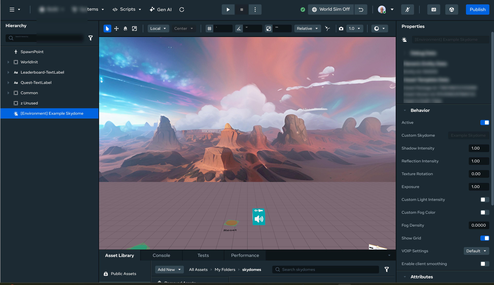
3. Your custom skydome is displayed when you re-enter the world in the Desktop Editor or, after publication, in Visit mode on a supported device.

## [Download Example Assets](#download-example-assets)

You can download example assets for building a custom skydome:

**Download**: [SkydomeCustomSkydomeTestAssets.zip](../_assets/misc/11852418ec702011b5c6826034dd5dc527ac9e5d47da807bdc0342229699a7fe.zip)

## [Appendix: Skydome Map Reference](#appendix-skydome-map-reference)

This section contains reference information on the types of assets that you must generate to create a custom skydome.

### [High Resolution Display Map](#high-resolution-display-map)

The High Resolution Display Map is a high-res display of the world background after it has been downloaded from the CDN. At world startup, this download process may take a few seconds, during which a low-resolution display map is shown to visitors.

**Tip**: During the upload process, the low-resolution map is generated from the high-resolution map that is uploaded. You do not have to create this asset.

This map is just for display purposes. It is not fed into lighting, fog, and reflection calculations.

#### [Format](#format)

**Horizontal Strip**: 6144 x 1024 pixels

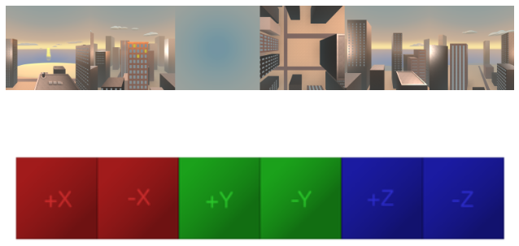

#### [Preparing Image Source](#preparing-image-source)

The skydome can be drawn or created via any image software: 1. The high-resolution display map must be an equirectangular/latlong source asset. 1. This asset must be converted to a horizontal strip through your source application.

For import, its format must be **horizontal strip**: 6144 x 1024 pixels in `PNG` file format. This format is recommended because it is compresses well and is more performant.

Horizon Unity import settings:

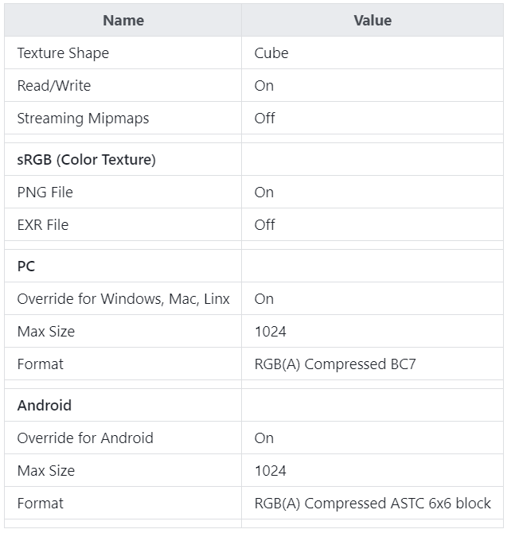

#### [Example: High-Res Display Map](#example-high-res-display-map)

Captured:

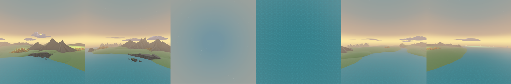

Drawn:

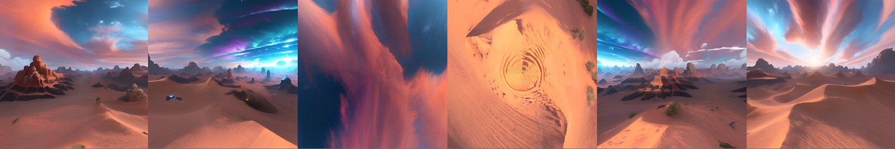

#### [Recommendations](#recommendations)

You can preview your maps using [Unity skybox](https://github.com/TwoTailsGames/Unity-Built-in-Shaders/blob/master/DefaultResourcesExtra/Skybox-Cubed.shader) prior to ingestion to fix any image errors like seams, pinching, noise, and banding. See below.

Pinching example:

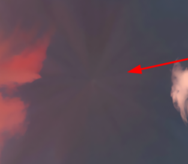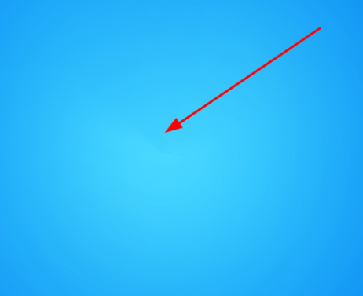

Seam example:

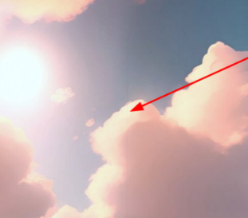

Noise example:

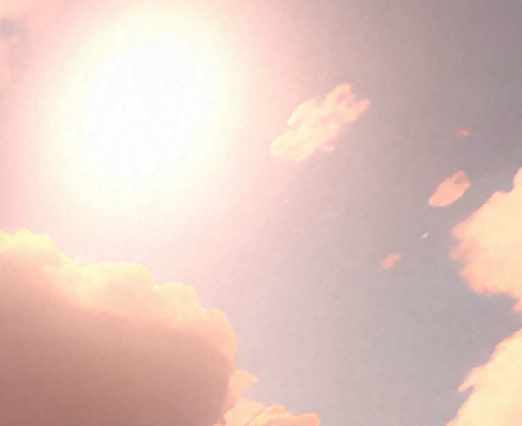

**Note**: Use [Nuke denoise](https://learn.foundry.com/nuke/content/comp_environment/denoise/removing_noise_denoise.html) to remove noise.

### [Radiance Map](#radiance-map)

A radiance map is used for image-based lighting (IBL). A radiance map simulates how the sky lights up a 3D scene. It captures the intensity and color of the ambient light emitted from skydome. The radiance map is used for calculating global illumination.

#### [Format](#format-1)

Radiance map is an **equirect** version of the display map.

- The format is **equirect** 256x128.
- Radiance map can be either `PNG` or `EXR`. Use an `EXR` file if you have HDR values in the radiance map. Otherwise, use a `PNG` file.

You can create a radiance map based on the display map.

1. Convert a copy of the file to **equirect** format.
2. Resize to 256 x 128.

#### [Example: Radiance Map](#example-radiance-map)

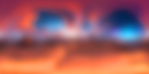

### [Fog Map](#fog-map)

A **fog map** adds atmospheric particle density to your world.

**Note**: A fog map applies color to meshes. It does not apply to the high resolution display map. Fog maps aren’t related to cached global illumination.

For greater distances between camera and mesh, the further away, the mesh is more tinted by the fog map. It’s a non-linear gradual change.

**Tip**: In the Environment gizmo, which is created when you add a custom skydome to your world, you can choose to override the fog map by a constant color, which provides realtime feedback on the fogging effect. You can also build a fog map that is composed of a single color.

#### [Format](#format-2)

The format of the Fog map is the following:

- a **horizontal strip**: 384 x 64.
- A fog map shouldn’t have any near/middle/far ground geometries, just the sky.
- Fog maps are `EXR` format only. Do not use a `PNG`, which yields poor results.

#### [Example: Fog Map](#example-fog-map)

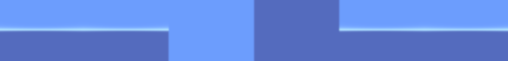

### [Reflection Map](#reflection-map)

A Reflection Map is used for reflection probing and providing view-dependent reflection.

#### [Format](#format-3)

- File format should be a 768 x 256 [convolution](https://learnopengl.com/PBR/IBL/Specular-IBL) mipmaps (8 mip levels) sheet.
- Use an `EXR` file if you have HDR values in the reflection map. Otherwise, use a `PNG` file.

#### [Examples: Reflection Maps](#examples-reflection-maps)

Many skydomes in Meta Horizon Worlds reuse this image because it creates a nice reflection for metallic objects, but it doesn’t represent the world in a physically accurate way.

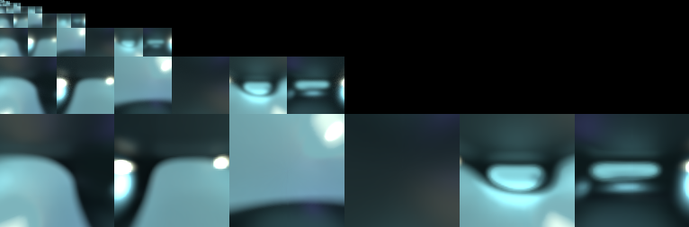

Ideally, you can create a mip a mipmap sheet from a horizontal strip display map, which is more accurate than using the default reflection map from the above example.

In the above example, the default reflection map has some hot spots which produce a nice shiny look, especially on metallic objects. If the reflection map doesn’t have hot spots, the metallic objects look less shiny than using the default reflection map.

However, to get the most PBR accurate reflection, you must re-capture the world with all geometries and the new skydome, and then generate a [convolution](https://learnopengl.com/PBR/IBL/Specular-IBL) mipmaps sheet based on roughness.

### [More examples](#more-examples)

Below you can see some example images of the custom skydome assets.

**Note**: These assets are not suitable for import. They are provided for display purposes only.

|                | Skydome                                                                                     | Radiance Map                                                                                | Fog Map                                                                                     |
| -------------- | ------------------------------------------------------------------------------------------- | ------------------------------------------------------------------------------------------- | ------------------------------------------------------------------------------------------- |
| Daytime        | 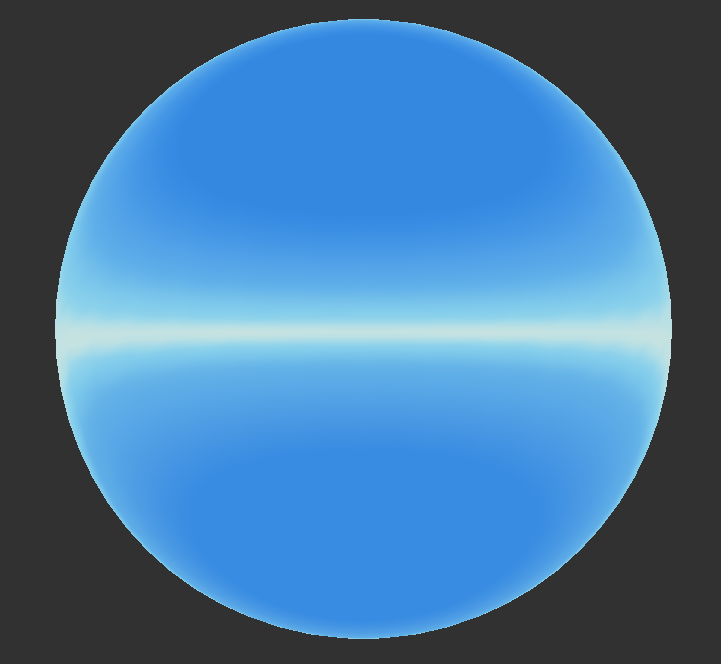 | 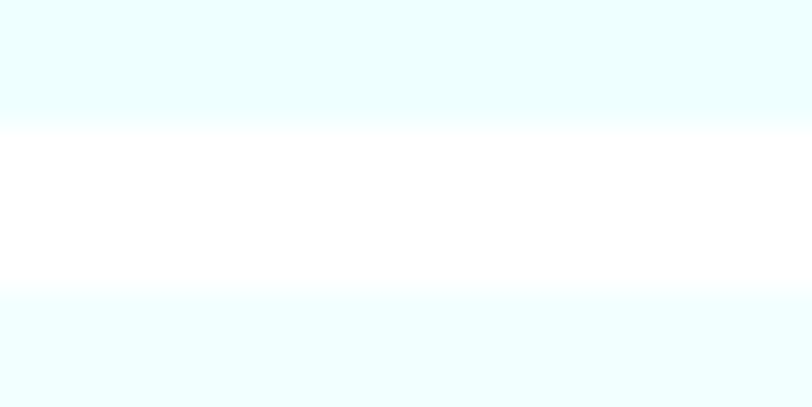 |  |
| Misty Marsh    | 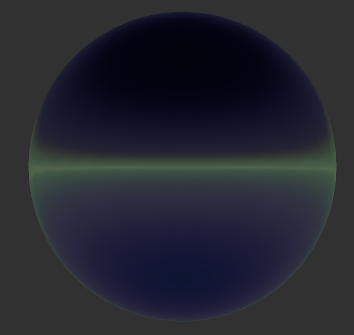 | 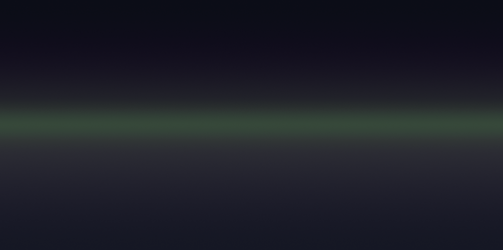 | 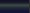 |
| Sunrise        | 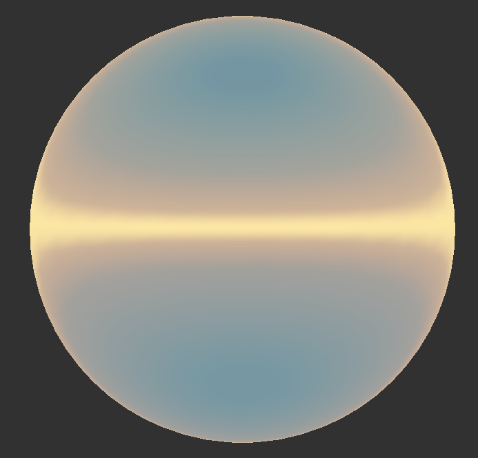 | 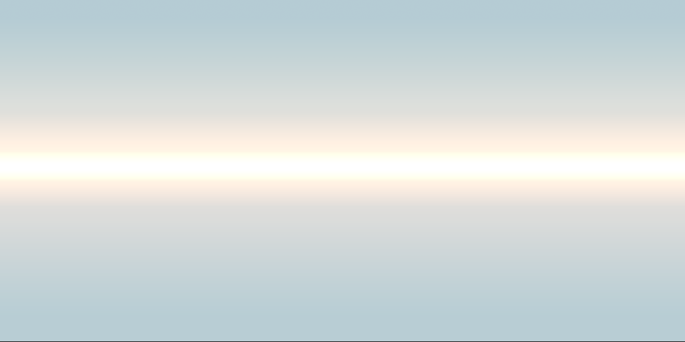 | 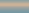 |
| Midnight Black | 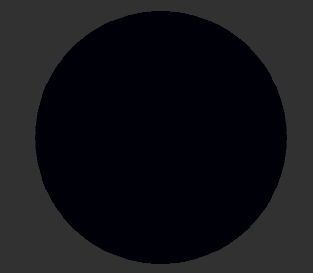 | 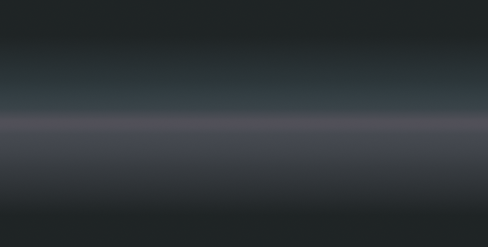 | 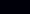 |
| Night          | 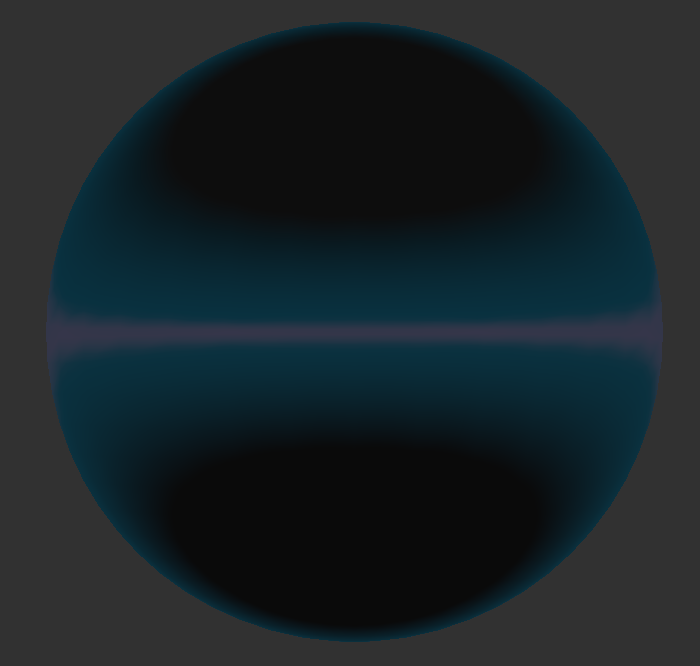 | 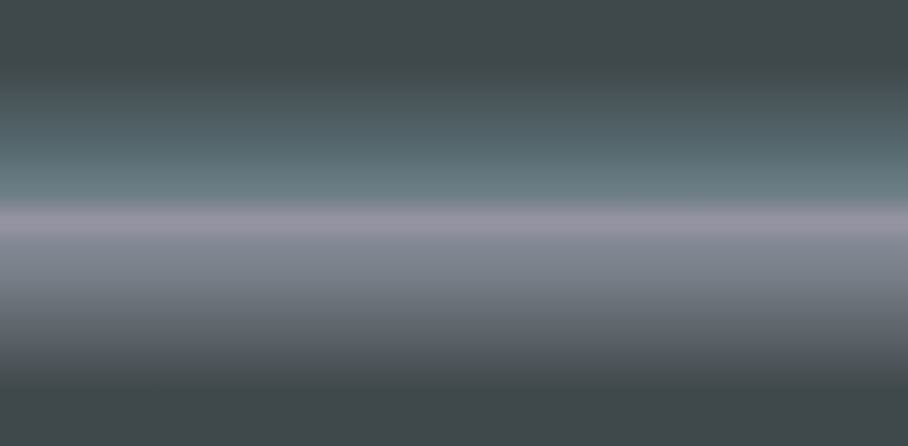 | 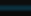 |
| Overcast       | 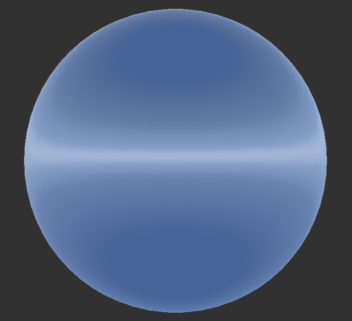 | 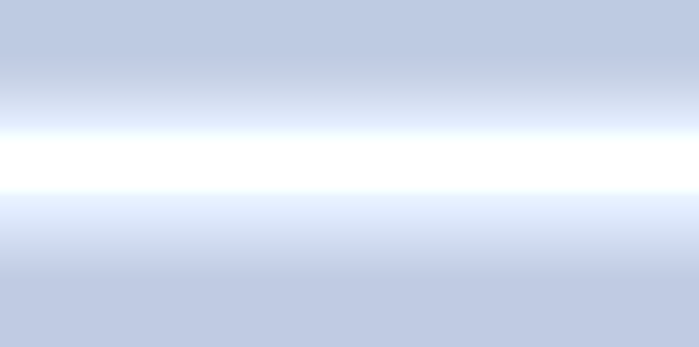 | 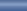 |
| Sunset         | 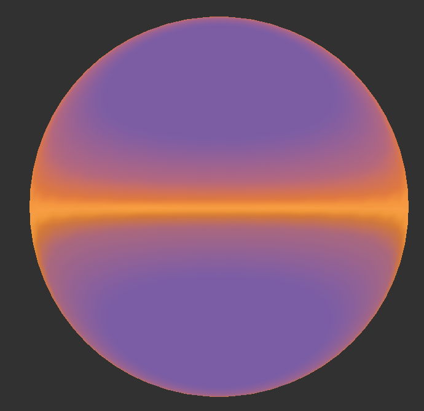 | 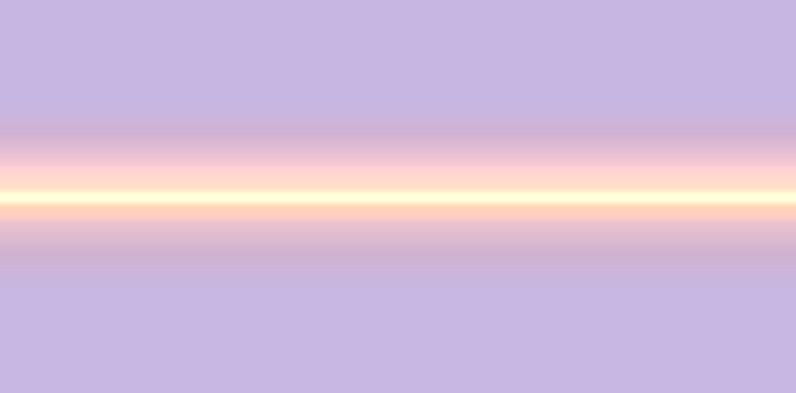 | 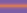 |
| Twilight       | 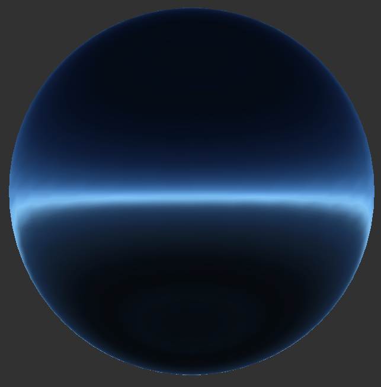 | 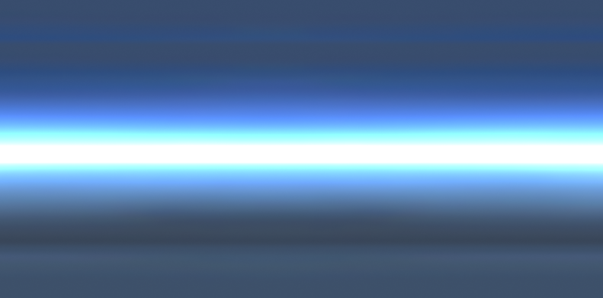 |  |
| Winter         | 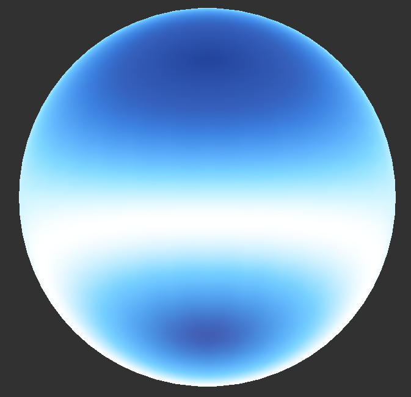 | 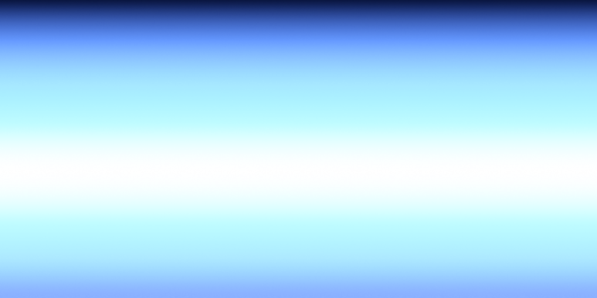 | 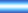 |

