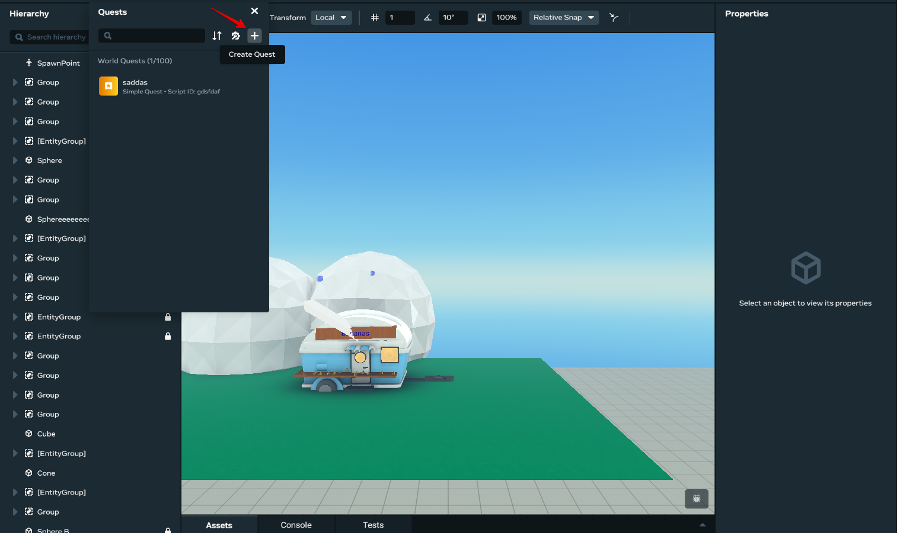
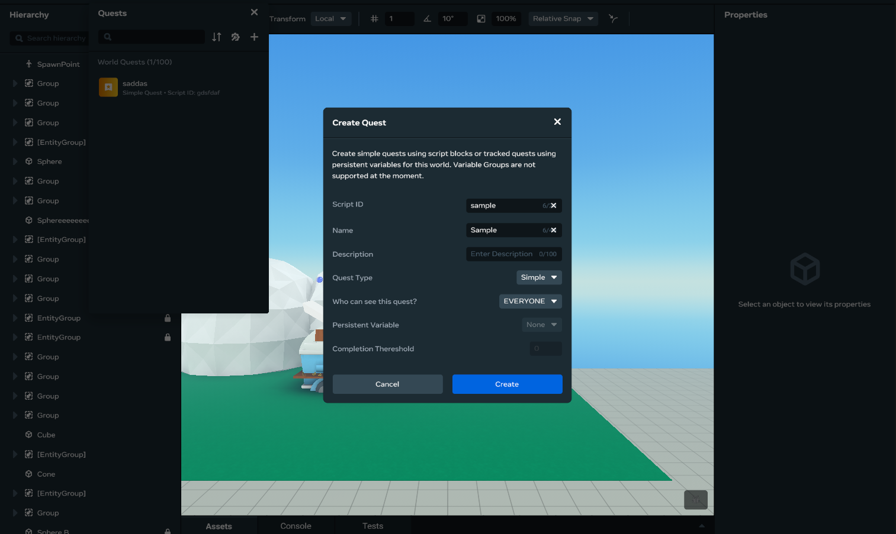
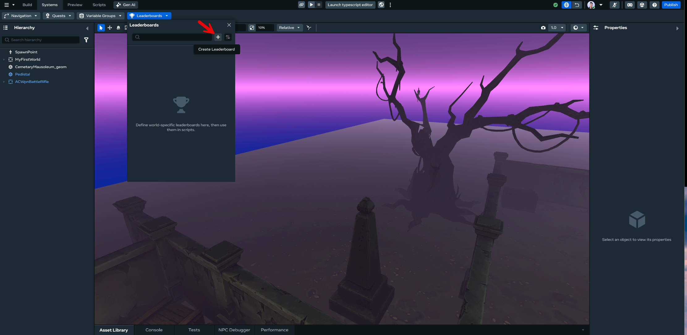
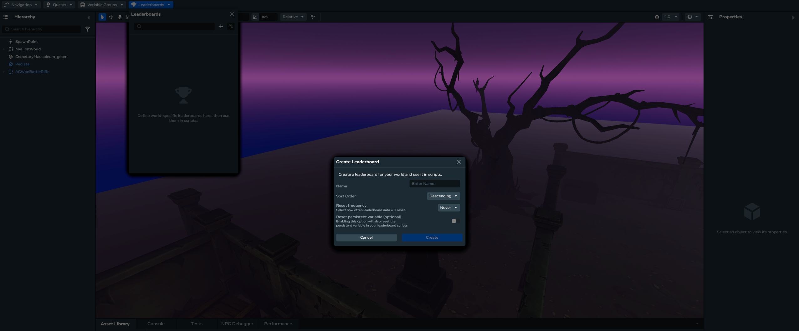
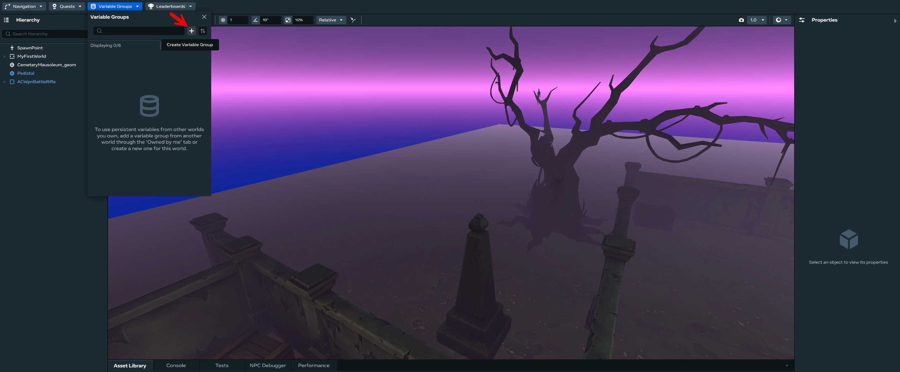
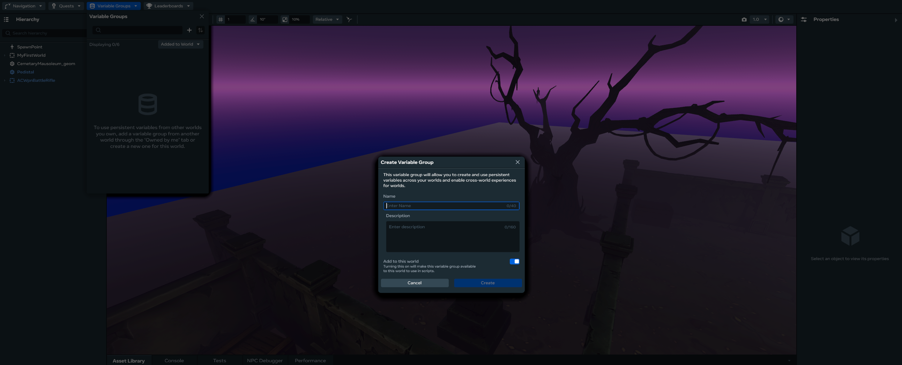

# [Creating Quests/Leaderboard/Variable Groups](#creating-questsleaderboardvariable-groups)

You can use the Desktop Editor to view, create, edit, delete, debug, sort, and search quests, leaderboards, and variable groups, just like you can in VR.

## [Getting Started](#getting-started)

The first step for using all procedures in this article is to open the **systems panel**:

1. Click the **Systems** dropdown in the top bar.
2. Select the feature you want to modify.

## [How to create Quests](#how-to-create-quests)

1. Click the ‘+’ icon from within the Quests panel. 
2. Fill in the information required. 
3. Click ‘Create’. The new Quest appears in the list of Quests.

## [How to create Leaderboards](#how-to-create-leaderboards)

1. Click the ‘+’ icon from within the Leaderboards panel. 
2. Fill in the information required. 
3. Click ‘Create’. The new Leaderboard appears in the list of Leaderboards.

## [How to create Varaiable Groups](#how-to-create-varaiable-groups)

1. Click the ‘+’ icon from within the Variable Groups panel. 
2. Fill in the information required. 
3. Click ‘Create’. The new Variable Group appears in the list of Variable Groups.

