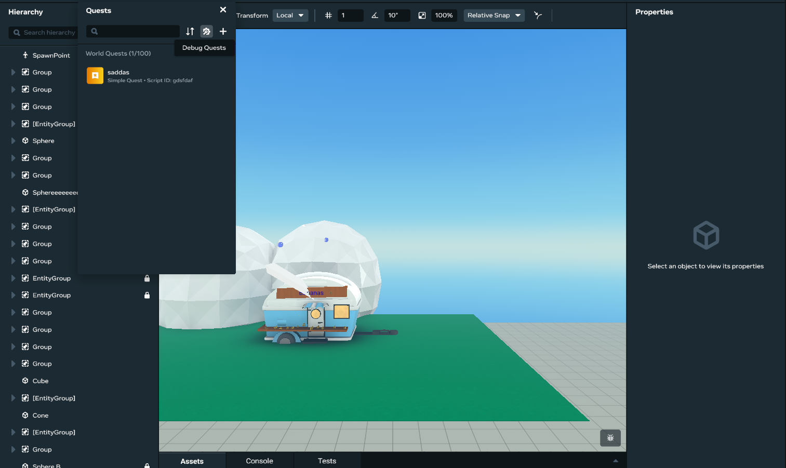
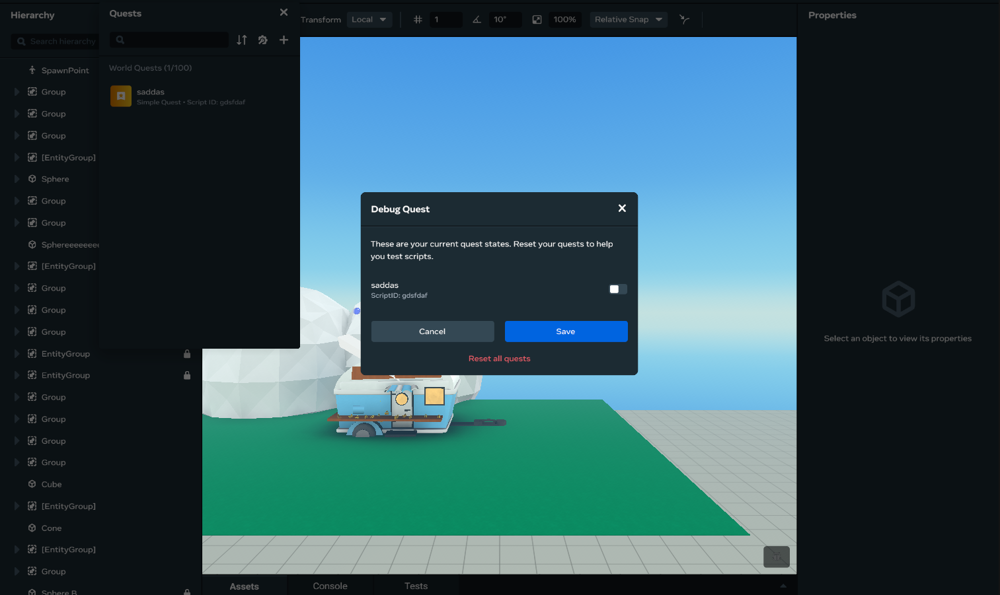

# Debugging Quests/Leaderboards/Variable Groups

You can use the Desktop Editor to view, create, edit, delete, debug, sort, and search quests, leaderboards, and variable groups, just like you can in VR.

## Getting Started

The first step for using all procedures in this article is to open the **systems panel**:

- Click the **Systems** dropdown in the top bar.
- Select the feature you want to modify.

## How to debug quests

- Click the “Debug Quests” icon.
  
- Make any modifications required.
- You can also reset all values back to the default value by clicking “Reset all quests”.
  
- Click ‘Save’.