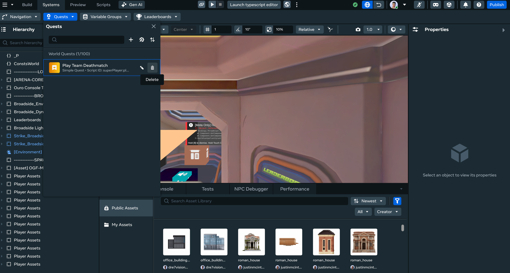
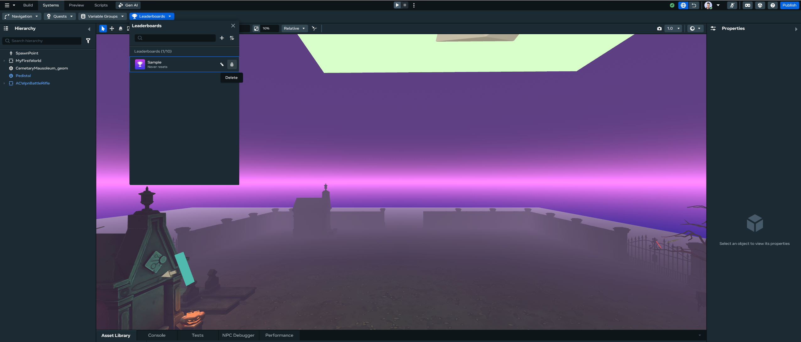
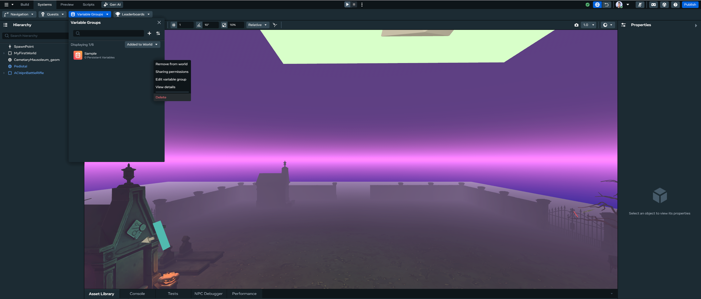

# Deleting Quests/Leaderboard/Variable Groups

You can use the Desktop Editor to view, create, edit, delete, debug, sort, and search quests, leaderboards, and variable groups, just like you can in VR.

## Getting Started

The first step for using all procedures in this article is to open the **systems panel**:

- Click the **Systems** dropdown in the top bar.
- Select the feature you want to modify.

## How to delete quests

- Hover over the quest that you want to delete.
- Click the delete icon.
  
- Click ‘Delete’ on the modal dialog that opens.

## How to delete leaderboards

- Hover over the leaderboard that you want to delete.
- Click the delete icon.
  
- Click ‘Delete’ on the modal dialog that opens.

## How to delete variable groups

- Hover over the variable group that you want to delete.
  
- For variable groups you will need to hover over the variable group, click on the overflow menu, and then select “Delete”.
- Click ‘Delete’ on the modal dialog that opens.