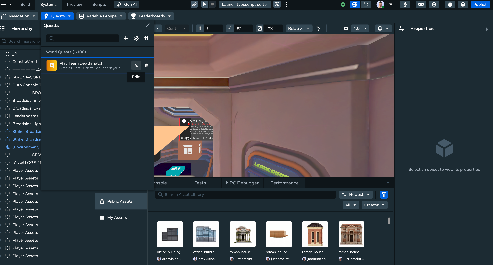
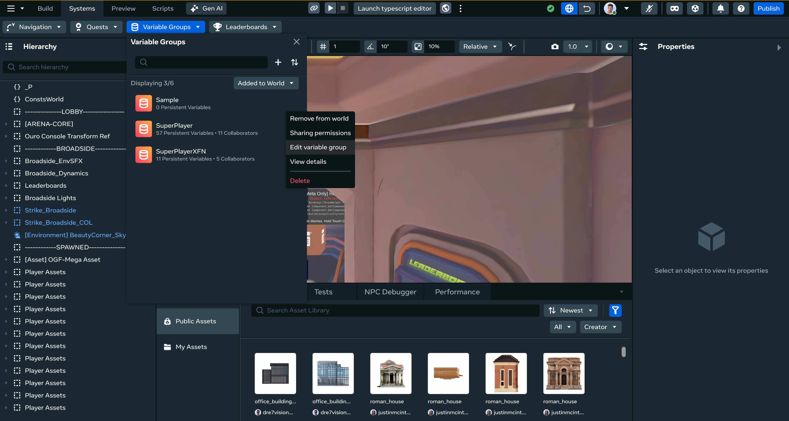

# Editing Quests/Leaderboard/Variable Groups

You can use the Desktop Editor to view, create, edit, delete, debug, sort, and search quests, leaderboards, and variable groups, just like you can in VR.

## Getting Started

The first step for using all procedures in this article is to open the **systems panel**:

- Click the **Systems** dropdown in the top bar.
- Select the feature you want to modify.

## How to edit Quests

- Hover over the Quest that you want to edit.
- Click the edit icon.
  
- Make any changes you want.
- Click ‘Save’.

## How to edit Leaderboards

- Hover over the Leaderboard that you want to edit.
- Click the edit icon.
  
- Make any changes you want.
- Click ‘Save’.

## How to edit Variable Groups

- Hover over the Variable Group that you want to edit.
- For variable groups, you will need to hover over the variable group, click on the overflow menu, and then select “Edit variable group”.
  
- Make any changes you want.
- Click ‘Save’.