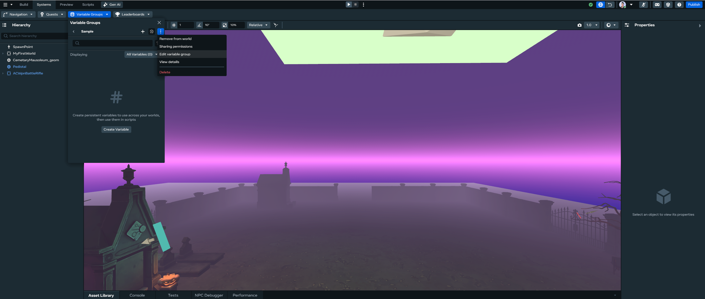

# [Editing Quests/Leaderboard/Variable Groups](#editing-questsleaderboardvariable-groups)

You can use the Desktop Editor to view, create, edit, delete, debug, sort, and search quests, leaderboards, and variable groups, just like you can in VR.

## [Getting Started](#getting-started)

The first step for using all procedures in this article is to open the **systems panel**:

1. Click the **Systems** dropdown in the top bar.
2. Select the feature you want to modify.

## [How to edit Quests](#how-to-edit-quests)

1. Hover over the Quest that you want to edit.
2. Click the edit icon. 
3. Make any changes you want.
4. Click ‘Save’.

## [How to edit Leaderboards](#how-to-edit-leaderboards)

1. Hover over the Leaderboard that you want to edit.
2. Click the edit icon. 
3. Make any changes you want.
4. Click ‘Save’.

## [How to edit Variable Groups](#how-to-edit-variable-groups)

1. Hover over the Variable Group that you want to edit.
2. For variable groups, you will need to hover over the variable group, click on the overflow menu, and then select “Edit variable group”. 
3. Make any changes you want.
4. Click ‘Save’.

