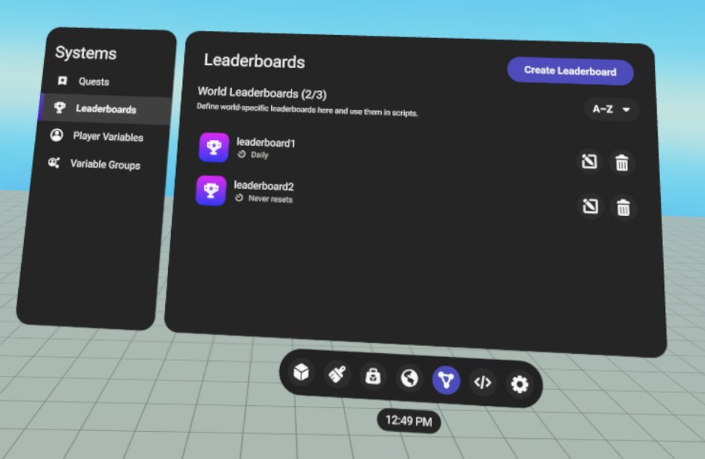
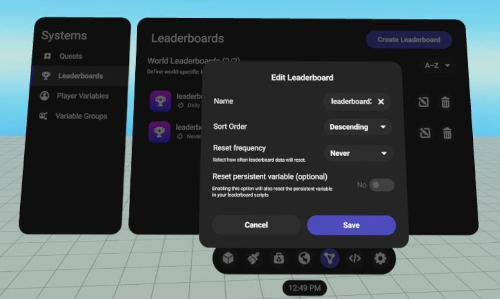
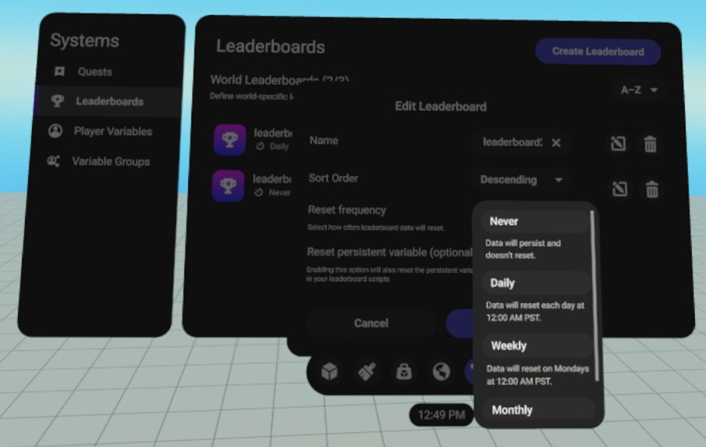
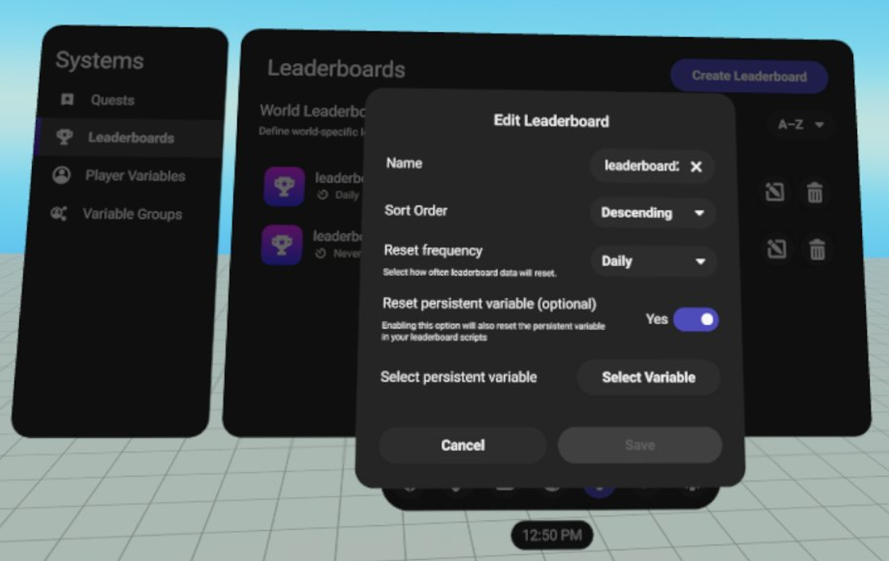
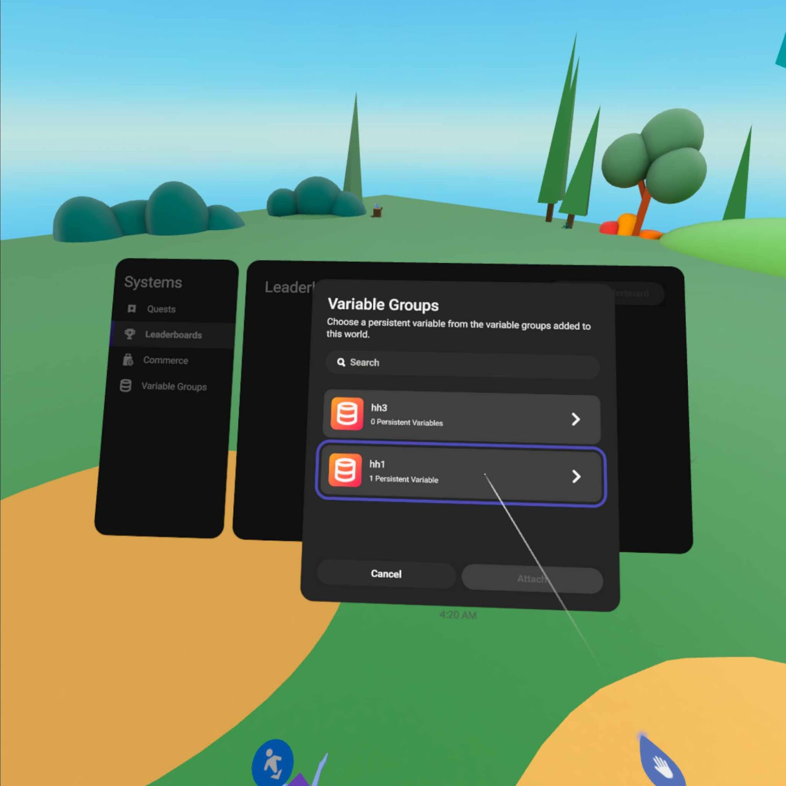
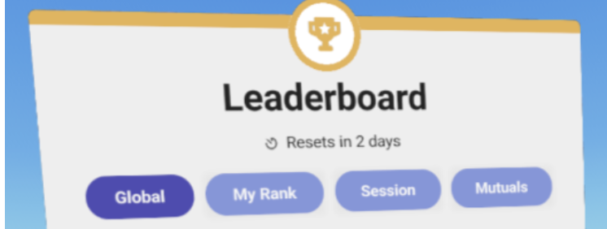

# [Leaderboard Reset Frequency](#leaderboard-reset-frequency)

> [!Important]
>
> This feature is not available to all creators.

## [Overview](#overview)

Horizon’s Leaderboard Reset Frequency feature lets you set an option to reset a leaderboard at periodic intervals. You can configure the reset interval to one of the following values:

- **Daily**: Resets every day at 12:00 AM Pacific Time.
- **Weekly**: Resets every Monday at 12:00 AM Pacific Time (every Sunday night).
- **Monthly**: Resets on the 1st day of every calendar month at 12:00 AM Pacific Time.
- **Never**: Never resets. This is the default setting.

## [Linking persistent variables](#linking-persistent-variables)

If you use a persistent variable to store a player’s scores in the leaderboard, then you can link the persistent variable so that it’s reset along with the leaderboard. In addition, if a player’s persistent variable is linked, all player entries for the persistent variable become zero when the leaderboard resets.

## [How to set the leaderboard frequency](#how-to-set-the-leaderboard-frequency)

Learn the workflow involved in setting the leaderboard frequency by following these steps.

1. Choose a reset cadence for a new or existing leaderboard.
   1. In the CUI, navigate to **Systems** > **Leaderboards**. 
   2. Either create a new leaderboard by selecting **Create Leaderboard**, or edit an existing leaderboard by selecting **Edit**. 
   3. Beside **Reset frequency**, select the interval that you want. This can be Daily, Weekly, or Monthly. The value defaults to Never. 
   4. Save your changes by selecting **Save**.

2. Optional: Link a player’s persistent variable to the leaderboard reset.

   1. Set **Reset persistent variable (optional)** to Yes. 
   2. Select a persistent variable from one of the variable groups attached to this world.
      > [!Note]
      >
      > You can link only persistent variables with a number data type. 
   3. Save your changes by selecting **Save**.

## [How leaderboard frequency affects world visitors](#how-leaderboard-frequency-affects-world-visitors)

- All leaderboard entries are cleared on reset.
- Any user entries to the linked player persistent variable are set to zero.
- The Leaderboard gizmo shows a reset countdown for any leaderboard that periodically resets.

- If there are active users in a world when a leaderboard is scheduled to reset, then all leaderboard(s) scheduled to reset at that time automatically reset.
- If there are no users in the world at the time of the reset, then the reset happens silently, and changes are reflected the next time a player enters the world.

## [Known Issue](#known-issue)

The effect of a leaderboard reset takes time to propagate to the gizmo due to propagation delay. In most cases, this delay goes unnoticed. But in a scenario where there are active players updating their leaderboard scores at reset time, there might be a few second delay before all entries are cleared.

