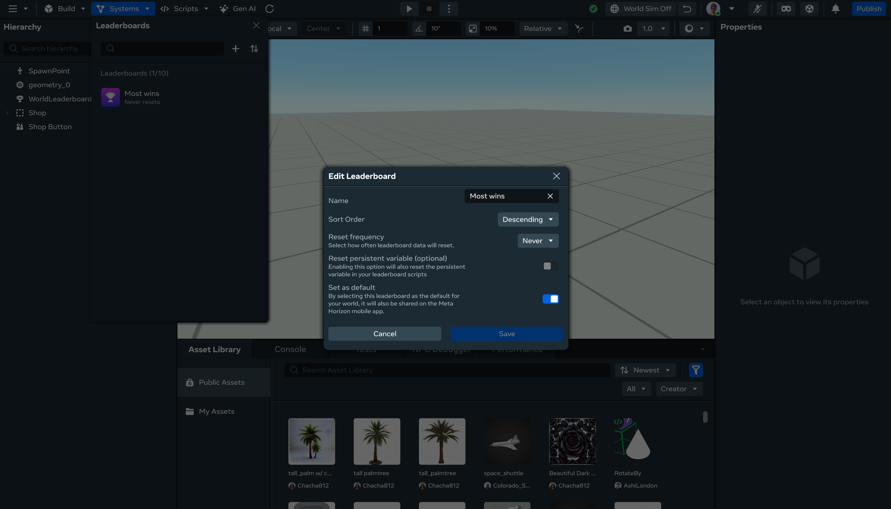
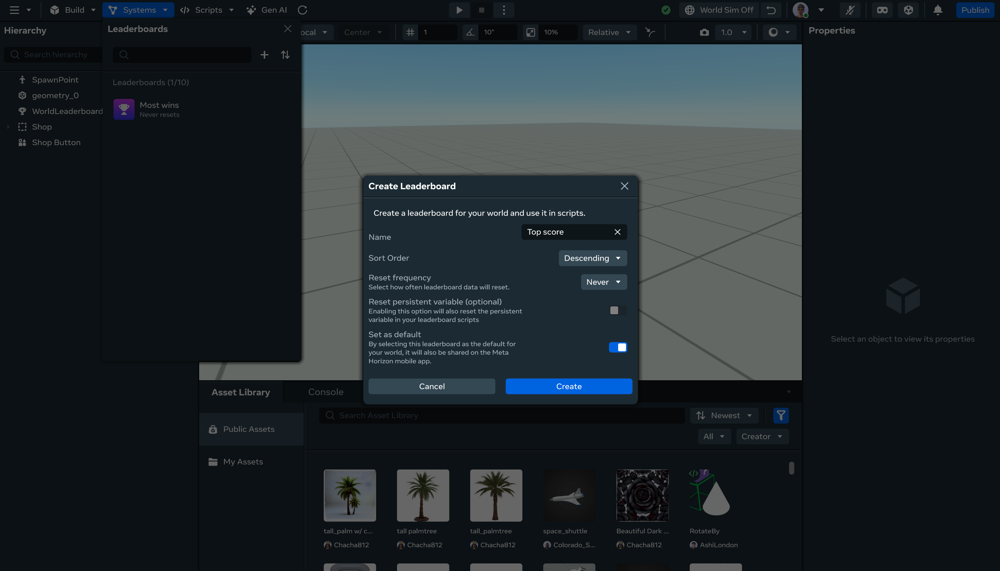

# Showing leaderboards in the Meta Horizon app

You can use the Desktop Editor to select one leaderboard per world to be visible in the Meta Horizon app.

## Sharing an existing leaderboard to Meta Horizon app

- Click the **Systems** dropdown in the top bar.
- Click on **Leaderboards**.
- Click on the pencil icon next to the leaderboard you want to share.
- Click on the **Set as default** toggle.
- Click **Save**.

> **Note:** If a default leaderboard already existed, it won’t be the default anymore.

## Creating a leaderboard and sharing to Meta Horizon app

- Click the **Systems** dropdown in the top bar.
- Click on **Leaderboards**.
- Click on the plus icon to create a new leaderboard.
- Fill in the information for your leaderboard.
- Click on the **Set as default** toggle.
- Click **Save**.

> **Note:** If a default leaderboard already existed, it won’t be the default anymore.

