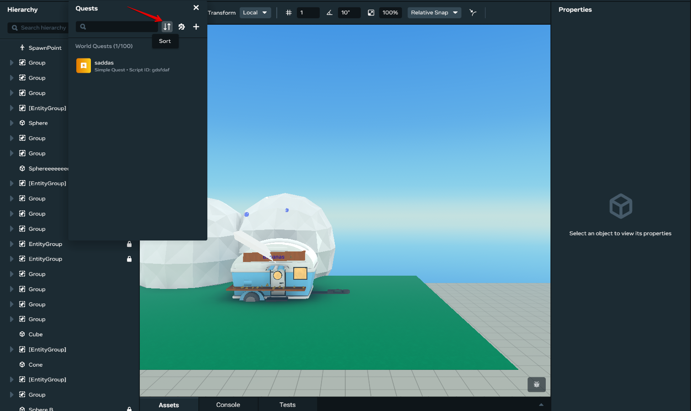
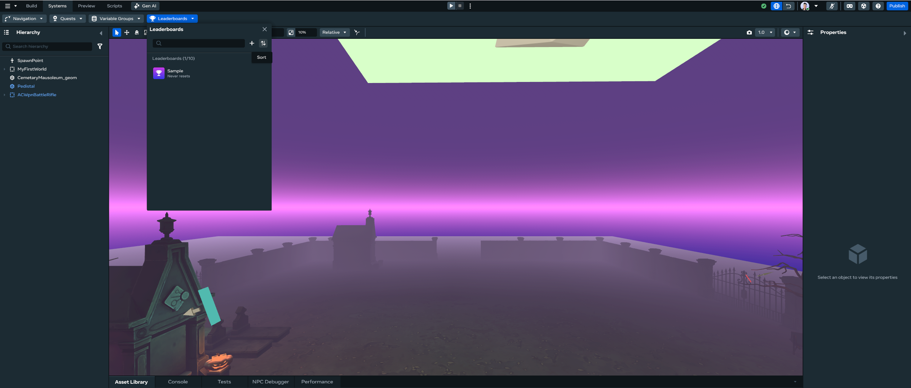
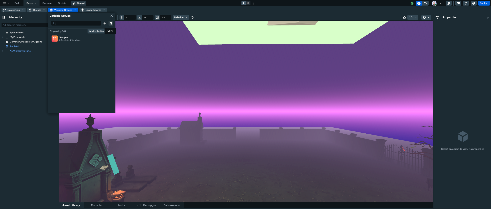

# Sorting and Searching Quests/Leaderboard/Variable Groups

You can use the Desktop Editor to view, create, edit, delete, debug, sort, and search quests, leaderboards, and variable groups, just like you can in VR.

## Getting Started

The first step for using all procedures in this article is to open the **systems panel**:

- Click the **Systems** dropdown in the top bar.
- Select the feature you want to modify.

## How to sort quests

- Click the sort icon.
  
- Select the sort method.
- The list will be updated to match the sort method selected.

## How to sort leaderboards

- Click the sort icon.
  
- Select the sort method.
- The list will be updated to match the sort method selected.

## How to sort variable groups

- Click the sort icon.
  
- Select the sort method.
- The list will be updated to match the sort method selected.

## How to Search

> **Note:** The following instructions focus on quests, but you can use the same steps for leaderboards and variable groups.

- Type your search query in the search bar.
- The list will be filtered to display only the items that match the search query.