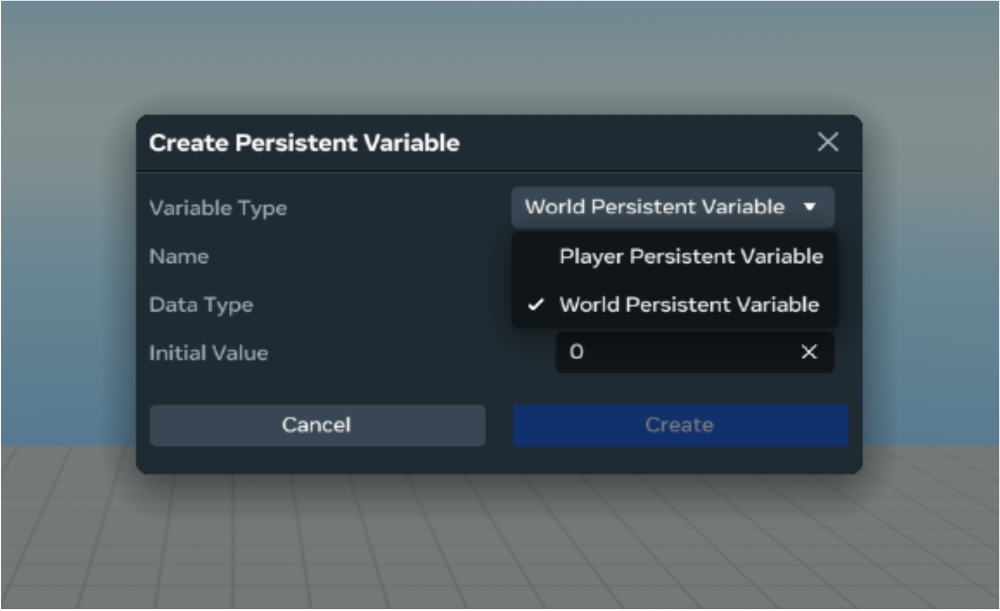

# Create world level variables

World level variables allow you to host group activities or create community persistence in your world and persist that information across multiple instances.

## Set up world level variables

Use the following process to create a world level variable:

- Select **Systems** > **Variable Groups** from the menu bar.
- In the Variable Groups panel, click the **Create Variable Group** button, then name your created variable group.
- After creating the variable group, click the **Create Variable** button. In the **Create Persistent Variable** panel, use the **Variable Type** dropdown to select **World Persistent Variable**.
  
- Next, name your created variable and select the **Data Type**. You can choose from the following data types:
  * Number - used by world counter APIS to save community activity counters
  * Object - used by world variable APIs to save complex world states
- After selecting the **Data Type** input a value for the **Initial Value**.

## Use world level variables

After setting up world level variables, you can use them in your scripts. Reference the following sample scripts to use world level variables in your scripts:

### Import required modules

```
import * as hz from 'horizon/core';
```

### Get a world level variable

```
const value = this.world.persistentStorageWorld.getWorldVariable<string>(
 "VG:WPVar"
);
console.log("World Variable Value: " + value);
```

### Fetch a world variable

```
await this.world.persistentStorageWorld.fetchWorldVariableAsync(
 "VG:WPVar"
).then((value) => {
 console.log("World Variable Value: " + value);
});
```

### Set a world variable

```
await this.world.persistentStorageWorld.setWorldVariableAcrossAllInstancesAsync(
 "VG:WPVar",
 { "key": "value" }
).then((value) => {
 console.log("World Variable Set: " + value);
});
```

> **Note:** When multiple instances update the same world variable simultaneously, race conditions can cause data loss. For scenarios requiring data integrity (like leaderboards or shared inventory), see [Concurrent-safe world level variable updates](../../../Scripting/API%20references%20and%20examples/Concurrent-safe%20world%20level%20variable%20updates.md) to learn about conflict detection and protection.

## Set world-level counters

After creating a world level variable of type number, you can use it to set world-level counters. The counter APIs can be used to bump certain logic in the game such as `make_wish` or `catch_butteryfly` etc.

Reference the following sample scripts to use world level counters in your scripts:

### Get world counter

```
const value = this.world.persistentStorageWorld.getWorldCounter<string>(
 "VG:WPVar"
);
console.log("World Variable Value: " + value);
```

### Increment a world counter

```
await this.world.persistentStorageWorld.incrementWorldCounter(
 "VG:WPVar",
 10
).then((value) => {
 console.log("World Counter: " + value);
});
```