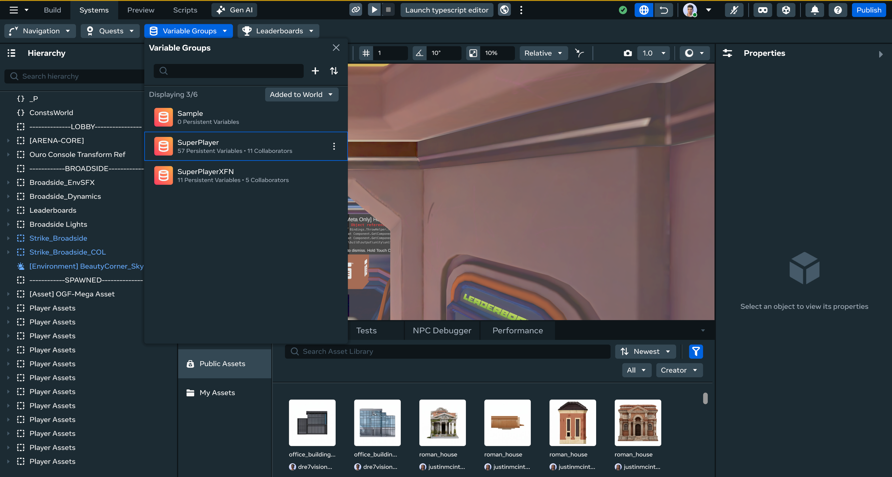
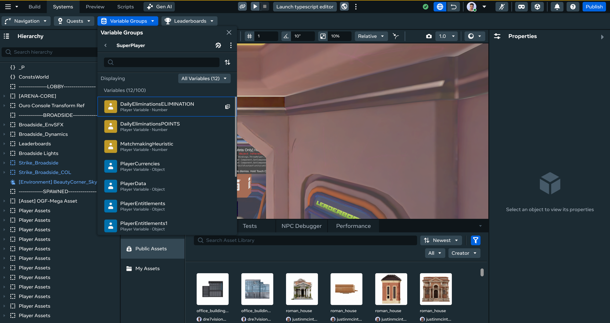

# [Managing Persistent Variables Associated with a Variable Group](#managing-persistent-variables-associated-with-a-variable-group)

You can use the Desktop Editor to view, create, edit, delete, debug, sort, and search quests, leaderboards, and variable groups, just like you can in VR.

## [Getting Started](#getting-started)

The first step for using all procedures in this article is to open the **systems panel**:

1. Click the **Systems** dropdown in the top bar.
2. Select the feature you want to modify.

## [Manage Persistent Variables](#manage-persistent-variables)

1. Open the variable groups panel.
2. Click on the variable group with the persistent variables you want to view. 
3. You will now see the persistent variables associated with this group. 
4. All previously assigned persistent variable actions are now available from this panel.

