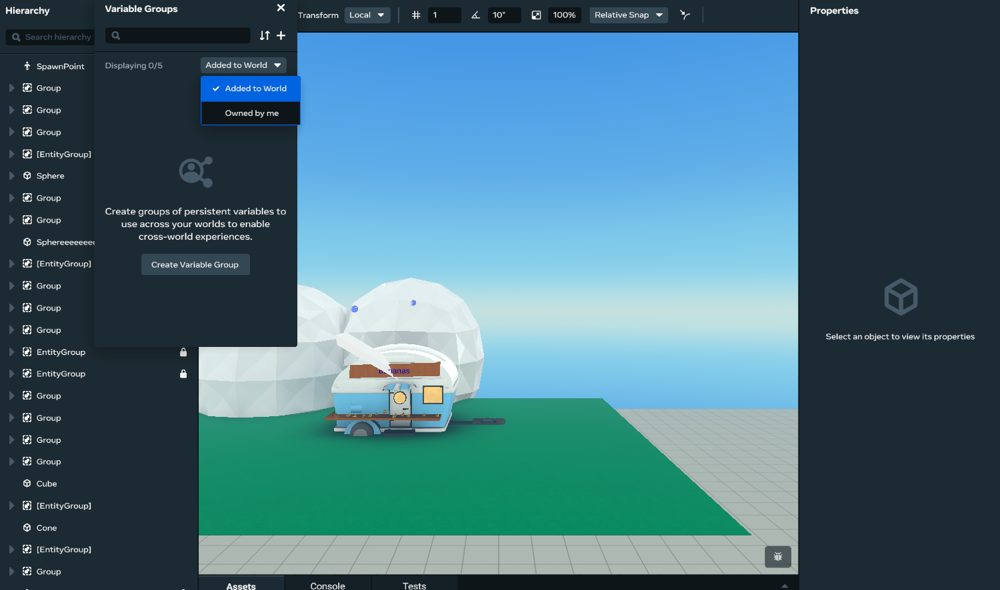
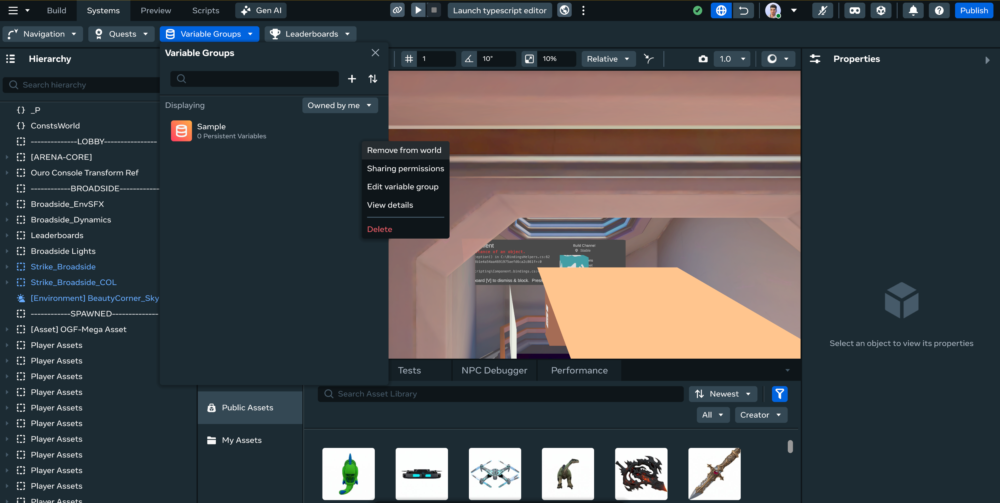

# Removing a Variable Group From a World

You can use the Desktop Editor to view, create, edit, delete, debug, sort, and search quests, leaderboards, and variable groups, just like you can in VR.

## Getting Started

The first step for using all procedures in this article is to open the **systems panel**:

- Click the **Systems** dropdown in the top bar.
- Select the feature you want to modify.

## Remove a Variable Group

- Open the variable group panel.
- Open the dropdown to the right of “Displaying” and select “Added to world”.
  
- Hover over the variable group you want to remove from the world.
- Click the overflow menu, and select “Remove from world”.

