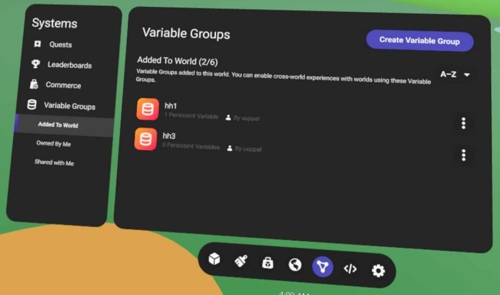
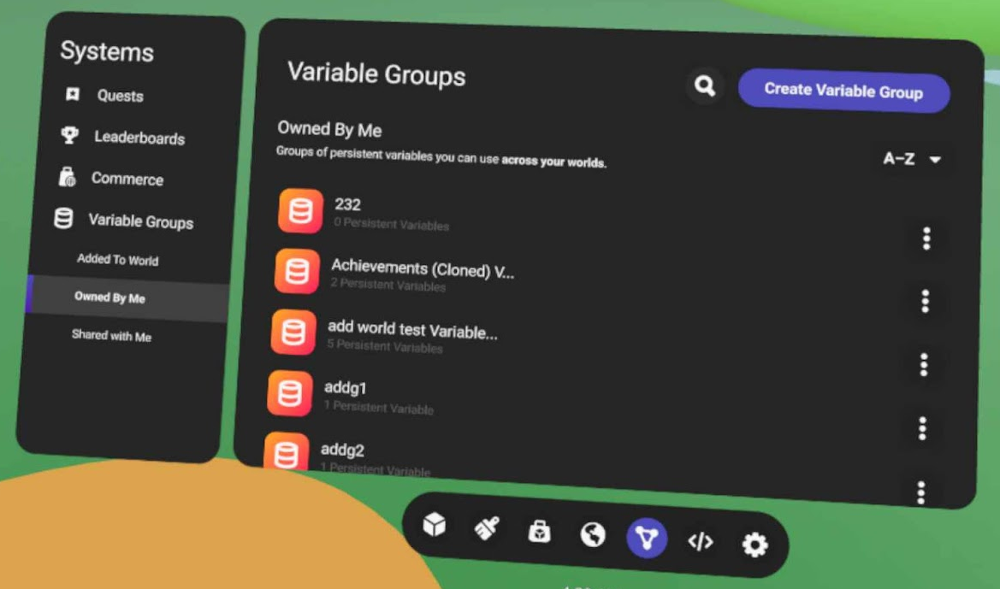
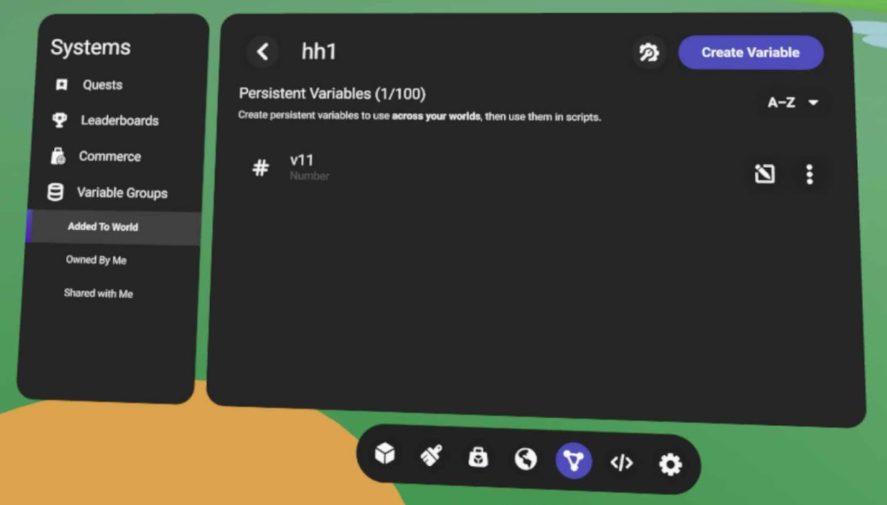
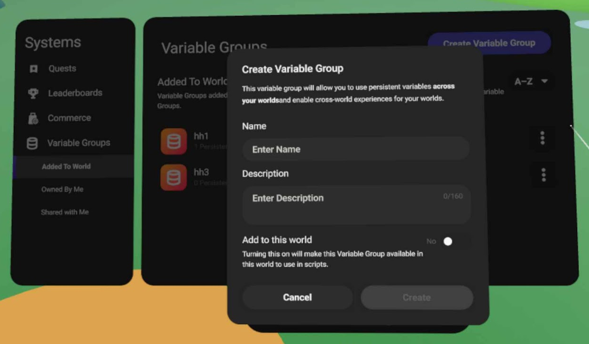
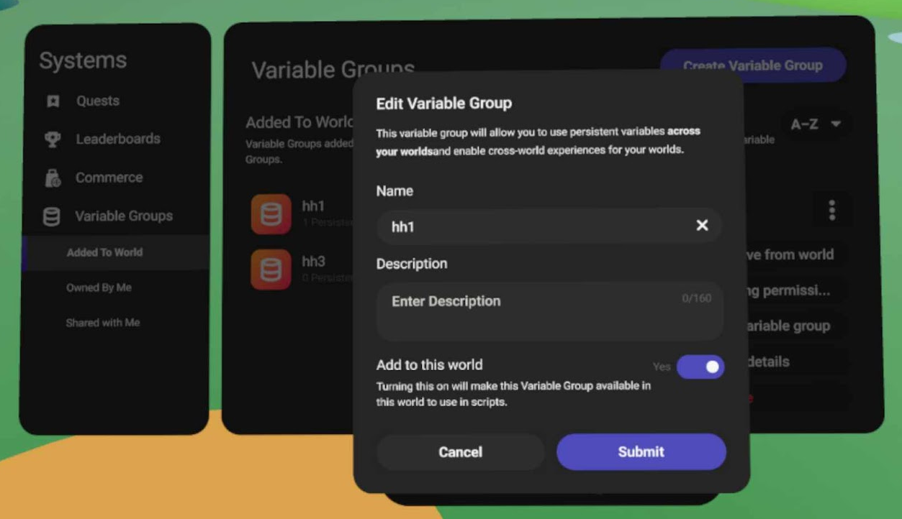
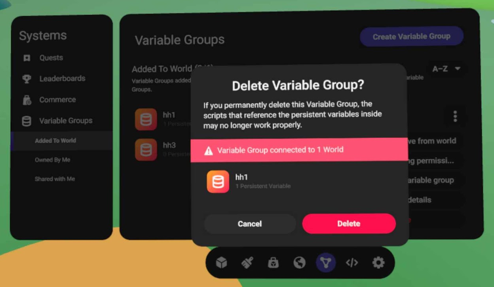
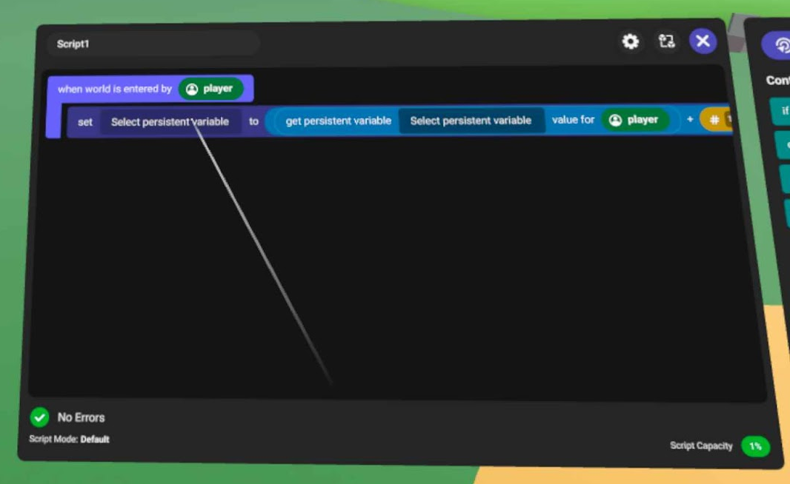
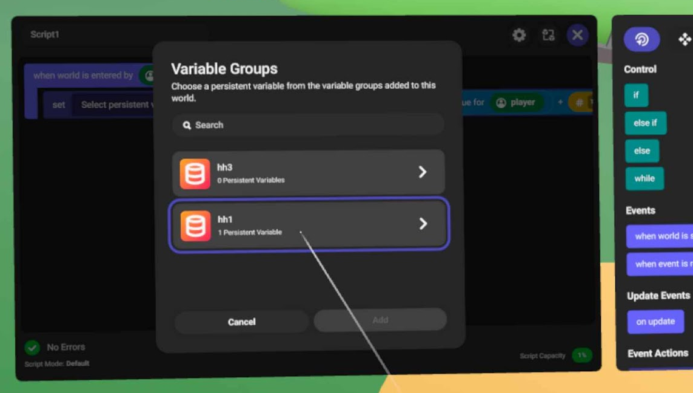

# [Using Variable Groups](#using-variable-groups)

Variable groups let you create sets of persistent variables that you can share across your worlds. This approach lets you build cross-world experiences using persisted information from any of your worlds. You can access the variable groups system from the **Systems** tab of creator tools. On this tab, you’ll find three sub-tabs that display the following types of variable groups. Those:

- **Added to the World**
- **Owned by Me**
- **Shared with Me**

With the introduction of variable groups, you are no longer restricted to using just six variable groups per world; you can create as many variable groups as you want.

> [!Note]
>
> To use the persistent variables from a variable group in your world, you must add that variable group to your world.

When you select a variable group, you’ll see all of the persistent variables that it contains. From here you can create, edit, and delete persistent variables from within a variable group.

> [!Note]
>
> You are limited to adding up to 100 persistent variables to a variable group.

When you create a variable group, you can edit its name and description, and you can also choose whether you want to add it to the current world.

> [!Note]
>
> In order to add the variable group to the current world, you must own that world, and it must have less than six variable groups already.

Once you create a variable group, you can then edit it, or delete it. Be careful when you delete a variable group, and when you edit its name. Editing the name requires that you update all of your scripts that use persistent variables from that variable group. Deleting a variable group also deletes all of its persistent variables, which breaks any scripts using them.

When you add variable groups to your world, you can then access their persistent variables using “set” and “get” persistent player variable code blocks in your scripts.

