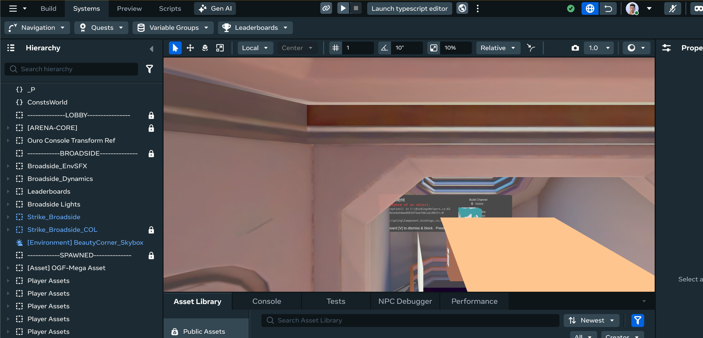
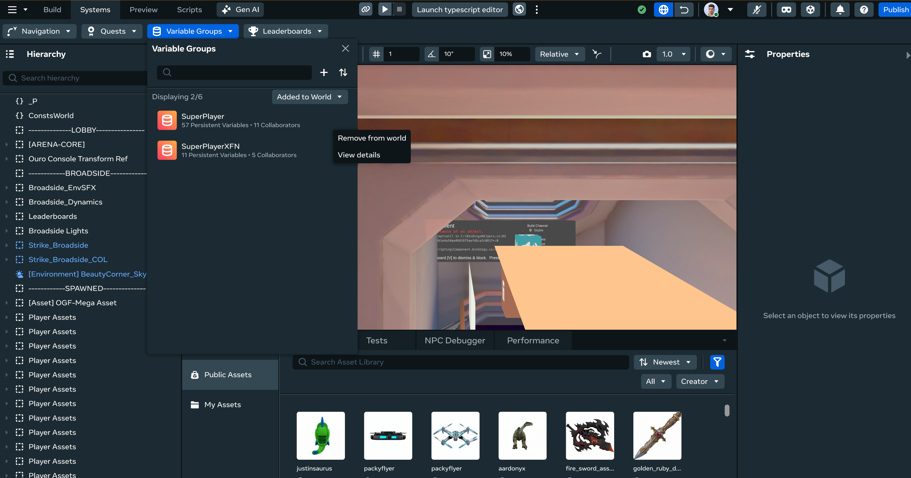

# [Viewing Variable Group Details](#viewing-variable-group-details)

You can use the Desktop Editor to view, create, edit, delete, debug, sort, and search quests, leaderboards, and variable groups, just like you can in VR.

## [Getting Started](#getting-started)

The first step for using all procedures in this article is to open the **systems panel**:

1. Click the **Systems** dropdown in the top bar.
2. Select the feature you want to modify.

## [View Variable Group Details](#view-variable-group-details)

1. Hover over the variable group that you want to view.
2. Click on the overflow menu, and select ‘View Details”. 
3. See the details related to a variable group.

