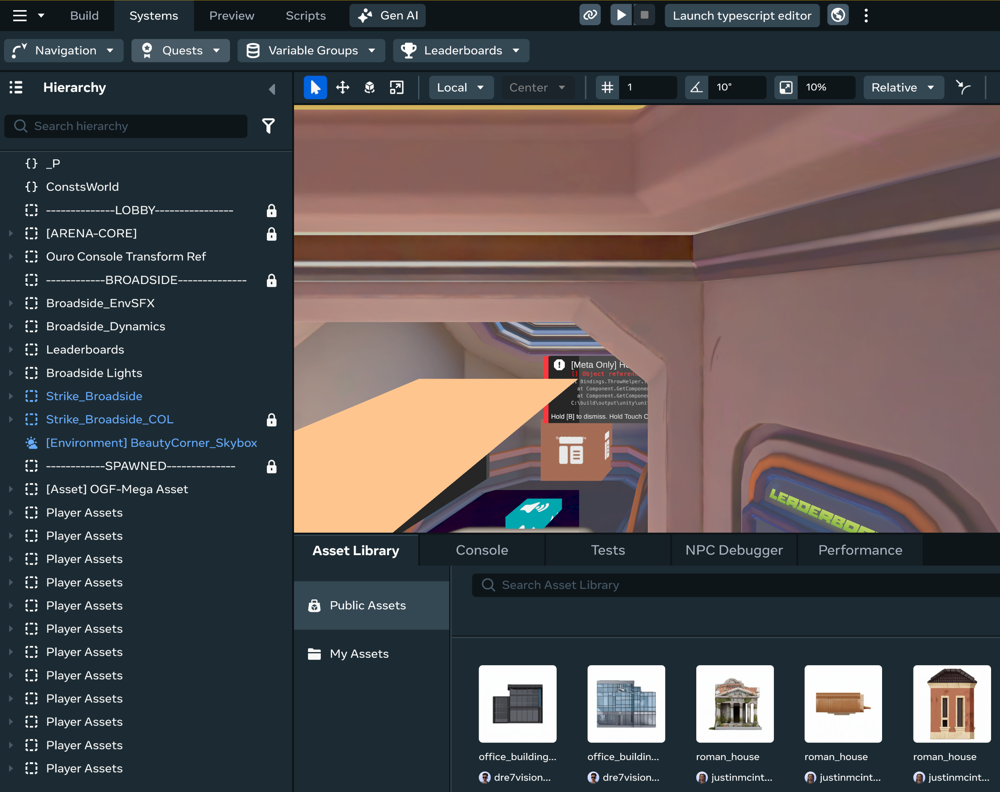
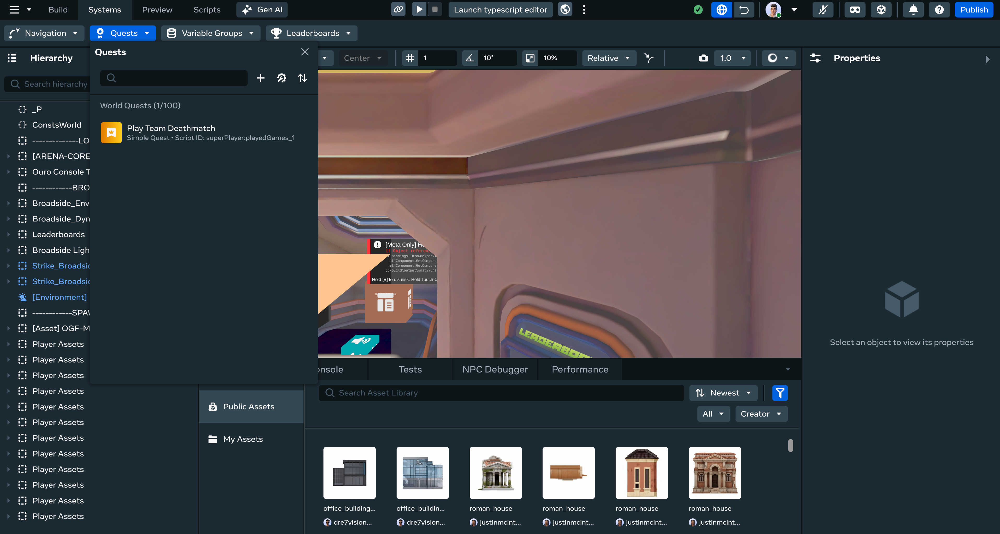
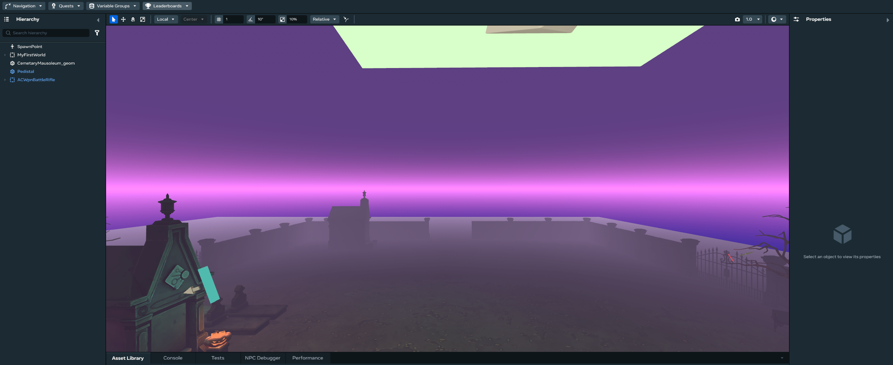
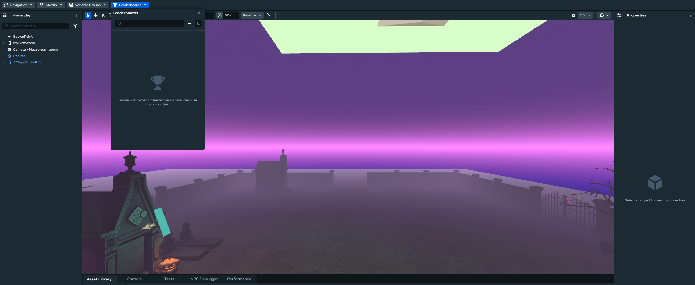
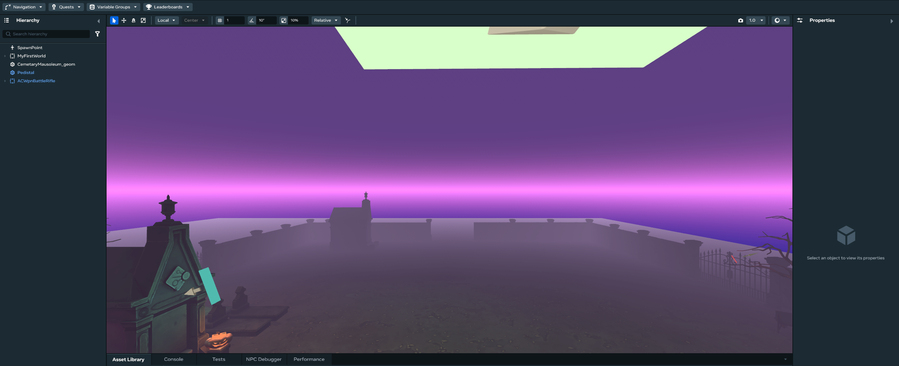
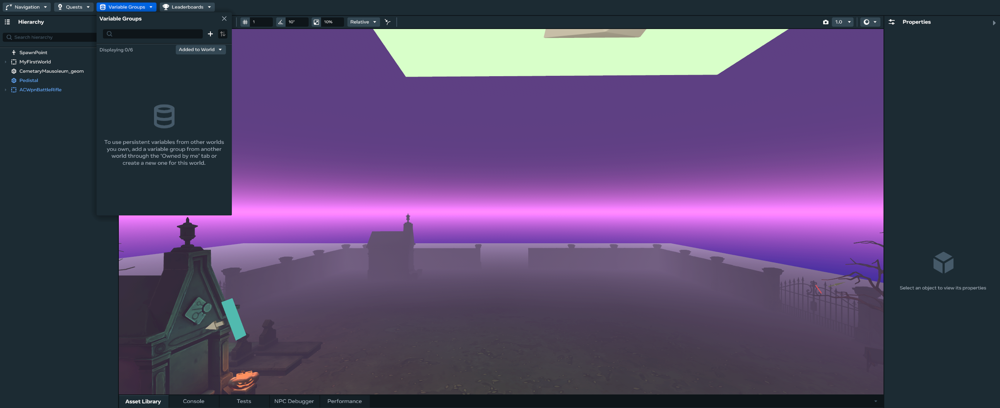

# [Viewing Quests/Leaderboard/Variable Groups](#viewing-questsleaderboardvariable-groups)

You can use the Desktop Editor to view, create, edit, delete, debug, sort, and search quests, leaderboards, and variable groups, just like you can in VR.

## [Getting Started](#getting-started)

The first step for using all procedures in this article is to open the **systems panel**:

1. Click the **Systems** dropdown in the top bar.
2. Select the feature you want to modify.

## [How to View a List of Quests](#how-to-view-a-list-of-quests)

1. Click “Quests” from the systems panel. 
2. You will now see a list of existing Quests. 

## [How to View a List of Leaderboards](#how-to-view-a-list-of-leaderboards)

1. Click “Leaderboards” from the systems panel. 
2. You will now see a list of existing Leaderboards. 

## [How to View a List of Variable Groups](#how-to-view-a-list-of-variable-groups)

1. Click “Variable Groups” from the systems panel. 
2. You will now see a list of existing Variable Groups. 

