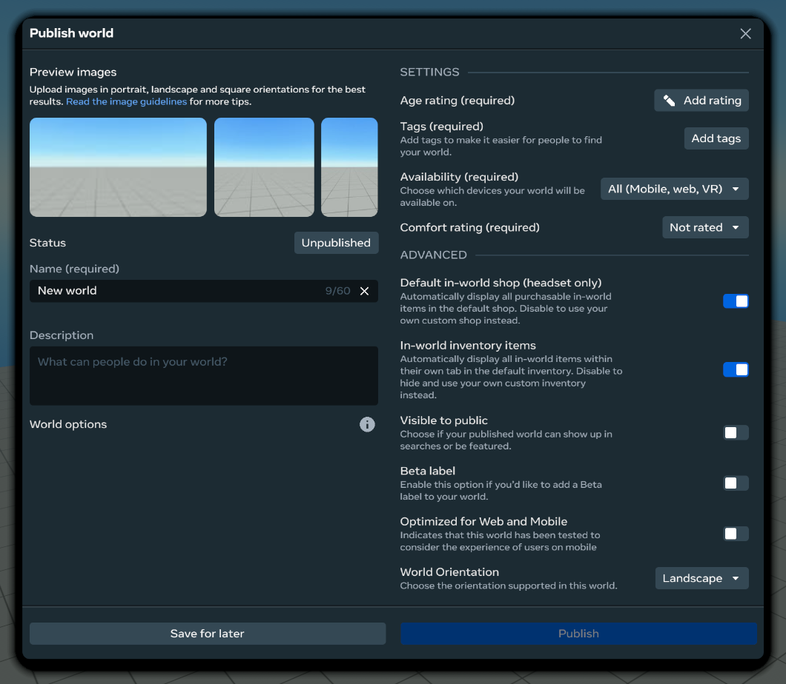
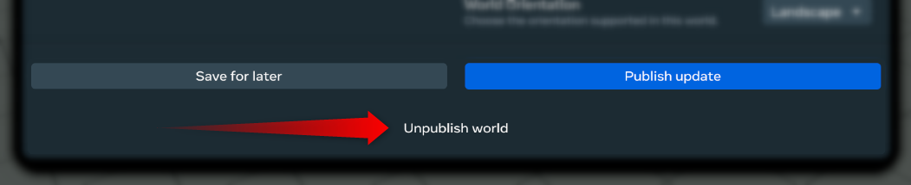

# World Settings Modification

The World Settings Modification feature in the Desktop Editor has the same capabilities to modify world settings as the VR editor. This includes the ability to change the world name, description, thumbnail, and many other settings. In addition, you can also publish or unpublish your world using this feature in the Desktop Editor.

## Opening the world settings panel

- Click the “Publish” button in the top right corner in the toolbar.
- A modal dialog with all of the available world settings will appear. 

## Changing world settings

Open the **World Settings** panel to modify the settings you want to change. Settings include:

### Essential

* **Thumbnail:** An image representing your world. [Click here](../../VR%20tools/Getting%20started/Create%20an%20asset%20thumbnail%20with%20Meta%20Horizon%20Worlds.md) for more information on creating asset thumbnails.
* **Title:** A name for your world.
* **Description:** A short, punchy description of what makes your world special.
* **Age rating:** Select the minimum recommended age for players to access your world. This will guide you through a few questions to determine the appropriate age rating.
* **Tags:** Choose applicable tags from the dropdown menu.
* **Availability:** Choose the platforms where your world will appear. Your choices are: “all”, “VR only”, “mobile & web only”.
* **Comfort Rating:** Choose an appropriate comfort rating from the dropdown menu.

### Advanced

These settings are more complex and optional, however they can be useful for certain use cases.

* **Default in-world shop (headset only):** Automatically display all purchasable in-world items in the default shop. Disable to use your own custom shop instead.
* **In-world inventory items:** Automatically display all in-world items within their own tab in the default inventory. Disable to hide and use your own custom inventory instead.
* **Visible to public:** While on, your world will show up in searches and has the potential to be featured. Note that anyone in Worlds will be able to search for and enter your published world while this toggle is on.
* **Beta label:** While on, your published world will be noted as being ‘in development’.
* **Optimized for Web and Mobile:** Indicates that your world has been tested to consider the experience of users on web and mobile devices.
* **World Orientation:** Choose the orientation supported in your world (landscape or portrait).

### Save and Publish Changes

When you’re done, click **Publish** to save and publish your world.

## Publishing a world

- Open the **World Settings** panel to modify the settings you want to change.
- Click **Publish** when finished. The settings you modified will be saved and your world will be published.

## Unpublishing a world

- Open the **World Settings** panel.
- If a world has been published, then an **Unpublish** button will be displayed near the bottom right corner of the panel.
- Click **Unpublish**. After a short delay, the world will be removed and unpublished.

