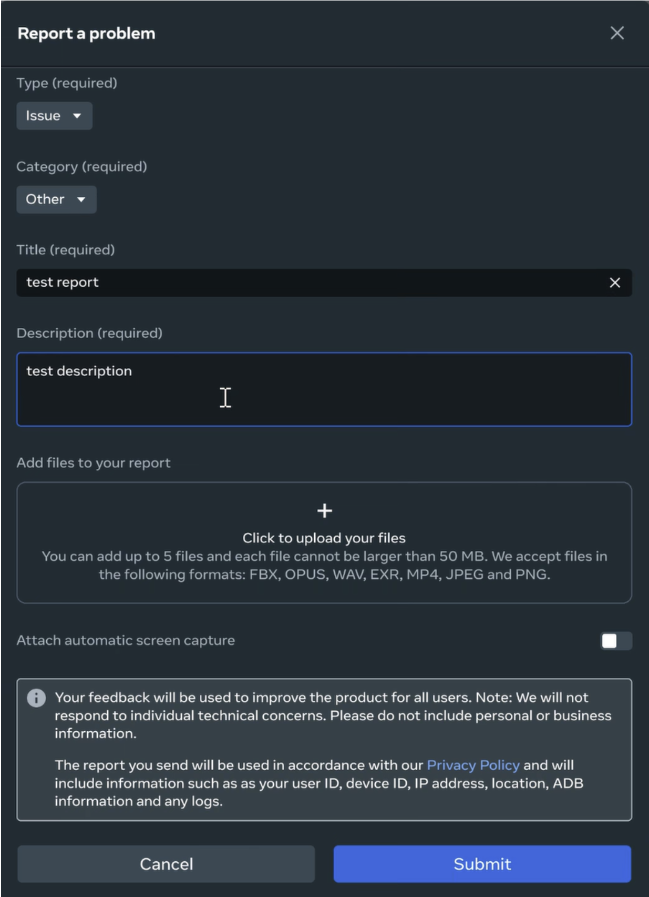
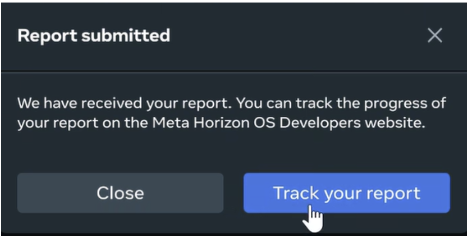
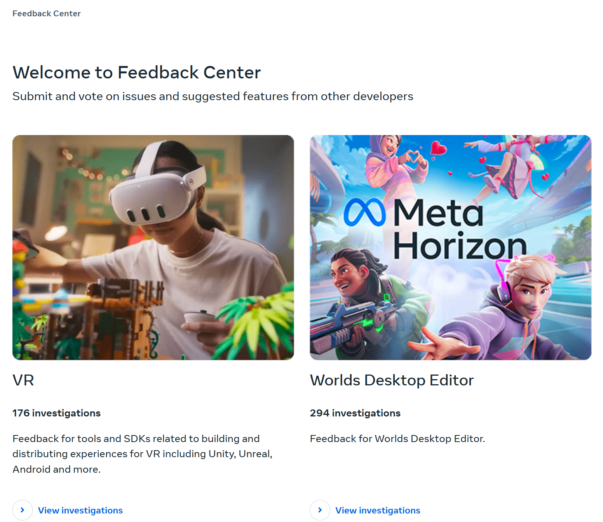
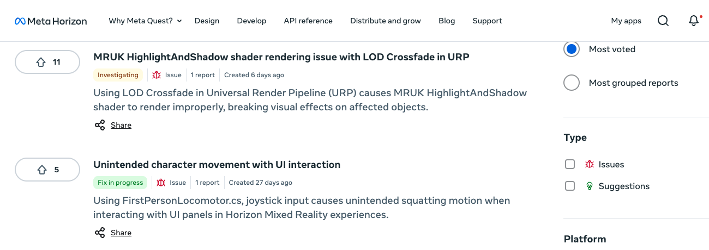

# Feedback tool

With the feedback tool, you can report bugs, submit feedback, and provide suggestions directly to Meta’s product teams, ensuring your input influences product development.

Additionally, the tool provides transparency on how Meta handles your feedback, offering updates as we review, prioritize, and implement your recommendations.

Submit feedback when you:

* Encounter bugs or issues
* Have suggestions for new features and improvements
* Want to leave general feedback about Meta’s tools, SDKs, or services

Your feedback is used to improve the product for everyone. It is not the correct channel to address individual technical concerns, and Meta can’t respond to these. For individual support, use options such as the [Meta Horizon Developer Forums](https://communityforums.atmeta.com/t5/Developer-Forums/ct-p/developer).

All information provided is used in accordance with our [Privacy Policy](https://www.meta.com/legal/privacy-policy/), and includes information such as your user ID, device ID, IP address, location, and any additional information and logs you choose to include.

## Submitting feedback

- From the desktop editor, click the menu icon and select “Report a problem” from the dropdown menu.
- Provide the following information:
  * **Type (required)**: Select whether the query you are making is an issue or a suggestion from the dropdown menu.
  * **Category (required)**: Select the applicable category from the dropdown menu. Options include: Assets, Generative AI, Gizmos, Insights, Performance, Scripting, Settings, User interface, World configuration, and Other.
  * **Title**: Add a brief title for your feedback.
  * **Description**: Add a detailed description of your feedback. Include as much information as possible, including steps to reproduce the issue.
  * **Add files to your report**: If you have any supporting files to assist in remedying your issue, please attach them here. Accepted file formats are JPG, PNG, FBX, OPUS, WAV, EX4, and MP4.
  * **Attach automatic screen capture**: Selecting this option will attach an image of the desktop editor taken before the report option was selected.
- Click “Submit” to send your feedback. You will receive a confirmation message in the desktop editor and an email will be sent to the email address associated with your Meta account.

Feedback submitted via other channels will not necessarily show up on the feedback report.

## Review feedback status

Your feedback and those of other developers are also listed publicly in the [Feedback Center](https://developers.meta.com/horizon/feedback). This is a public voting board where you can view summarized cases of the bugs and feature requests sent to Meta.

Feedback reports you submit are listed in the Feedback Center along with their status such as “Received”, “Investigating”, and so on. When logged into Developer Center, you can upvote items on the public voting board to increase their priority. The public voting board aims to increase transparency, improve creator engagement, and inform product priorities. It provides a clear view of how feedback is handled. Meta teams review the investigations and keep the case information accurate and up to date.

## Edit feedback

The Feedback Center lets you edit, add additional information, or delete a feedback report. Closed reports can not be edited.

**To edit an existing feedback report**:

- In the Feedback Center, select the feedback report you want to update.
- Click **Edit**.
- Amend the report as needed, and then click **Submit**.

Note: Editing is only available for reports not in the the **Closed** status.

**To delete an existing feedback report**:

- In the Feedback Center, locate the feedback report you want to update.
- On the feedback report line, click ... > **Delete**.

### Feedback statuses

| Status label | Message sent in Feedback Tool | Feedback status |
| --- | --- | --- |
| Received | Thanks for your feedback. We are reviewing your report and will reach out if we need more information. | Meta has received your feedback. |
| Investigating | We’re investigating your report. | Meta is actively investigating your feedback. |
| More info needed | We need some more information to keep investigating your report. Please see the requested info below. | Additional details, such as crash logs or reproduction steps, are needed to continue investigating. |
| Fix in progress | Thanks for your feedback. We’re working on making this change. | Meta has identified and is actively working on a fix. |
| Fix complete | Thanks to you we were able to make improvements to our tools. | The fix is complete and will ship in the next release. |
| Backlogged | The team has added this to their backlog, we will update this report when we make changes. | Meta has reviewed the feedback and added it to the roadmap for a future release. |
| External issue | There may be an issue with non-Meta software or you may require technical support. See our notes for more info. | The issue depends on a third-party provider. |
| Expected behavior | We were unable to find a bug and believe the product is working as intended. See our notes for more info. | The functionality works as intended (reasoning provided). |
| Wishlist | Thanks for your feedback. We can’t make this change right now, but we’ve let the team know about this request. | Meta reviewed the feedback and will consider the suggestion in the future. |