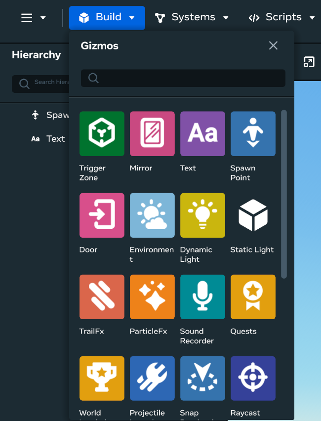

# [About gizmos](#about-gizmos)

In Meta Horizon Worlds, gizmos are helper tools that you, as a creator, can use to enhance the creation and interactivity of worlds. These gizmos feature a range of functionalities such as controlling player spawn points, adding dynamic lights, creating custom skyboxes, and more. Additionally, gizmos can be used to implement interactive elements like raycasts, particle effects, and doors.

In the desktop editor, gizmos are self-contained modules that you can place in your world to create actions or functions. Their respective properties can be configured in the [Properties](../Desktop%20editor/Get%20started%20with%20Desktop%20Editor/User%20interface/Panels%20and%20Tabs%20in%20the%20desktop%20editor.md#properties-pane) panel. You can also define gizmo properties through scripting. Gizmos are extended classes of [Entities](../Reference/core/Classes/Entity.md).

**Note**: While you can access and use gizmos in the Meta Horizon Worlds [VR tool](../VR%20tools/Getting%20started/Create%20a%20new%20world%20in%20Meta%20Horizon%20Worlds.md), the gizmos documentation presented in this section focuses on the creator user experience in the [Meta Horizon Worlds desktop editor](../Get%20started/Install%20the%20desktop%20editor.md). The image below shows you how to access gizmos in the desktop editor.

Much of the dynamic and interactive functionalities of gizmos are achieved through [scripting](https://developers.meta.com/horizon-worlds/reference/2.0.0/). If you’re new to scripting using TypeScript, start with [Build your first game](https://developers.meta.com/horizon-worlds/learn/documentation/tutorial-worlds/build-your-first-game/module-1-build-your-first-game). To further your understanding of gizmos, learn from the completed and annotated samples that are part of [tutorial worlds](../Tutorials/Getting%20started/Getting%20started%20with%20tutorials/Tutorial%20Prerequisites.md), which can be accessed from the [Creation Home page of the desktop editor](../Tutorials/Getting%20started/Getting%20started%20with%20tutorials/Access%20Tutorial%20Worlds.md#in-the-desktop-editor).

Tutorial worlds are finished worlds with fully functional compiled scripts. After you create a copy of the tutorial world, the content, including the script, is stored on your local desktop in a folder. Additionally, code assets that are referenced in these tutorials may also be retrieved from [Meta Horizon Worlds sample scripts](https://github.com/meta-quest/meta-horizon-worlds-sample-scripts).

As you explore the tutorial worlds, use the [companion documentation of these tutorial worlds](../Tutorials/Getting%20started/Getting%20started%20with%20tutorials/Tutorial%20Prerequisites.md) for a more in-depth explanation.

## [What’s next?](#whats-next)

Try the following topics:

- [Use TypeScript in Meta Horizon Worlds](../Scripting/Get%20started%20with%20TypeScript/Using%20TypeScript%20in%20Meta%20Horizon%20Worlds.md)
- [Text gizmos](Text%20gizmo.md)

