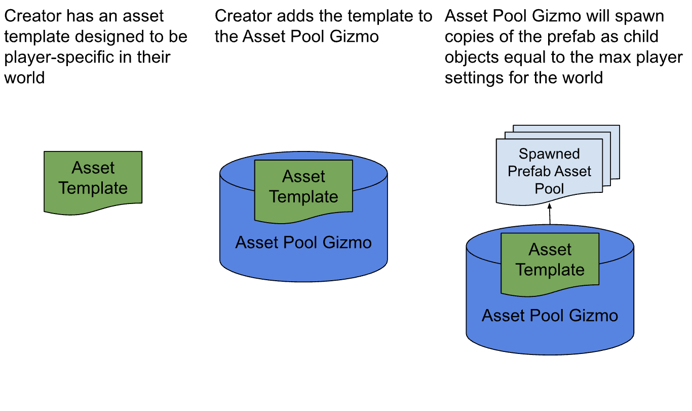
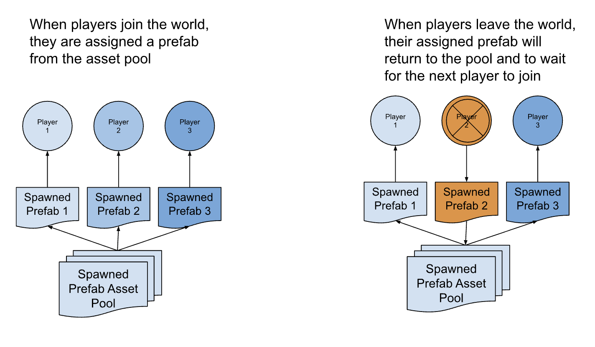
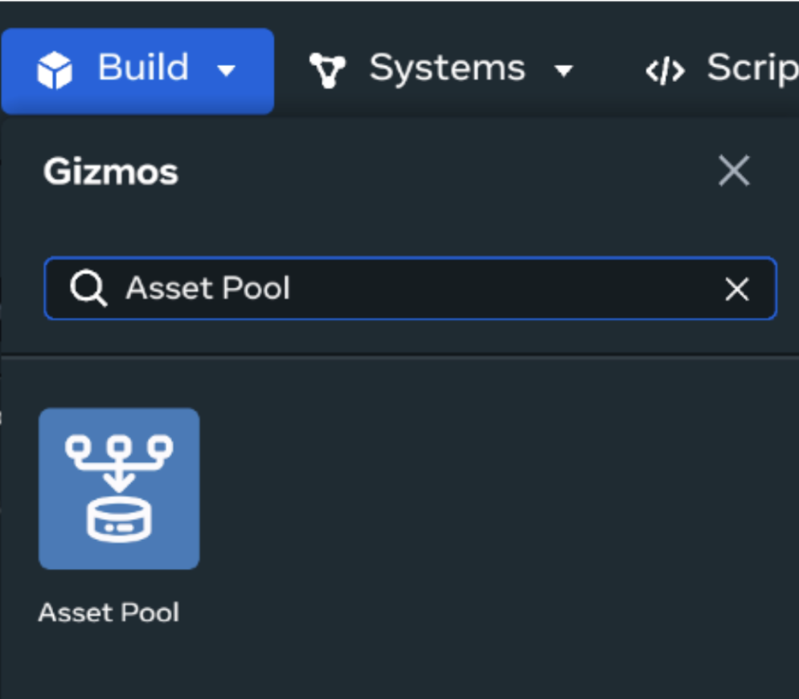
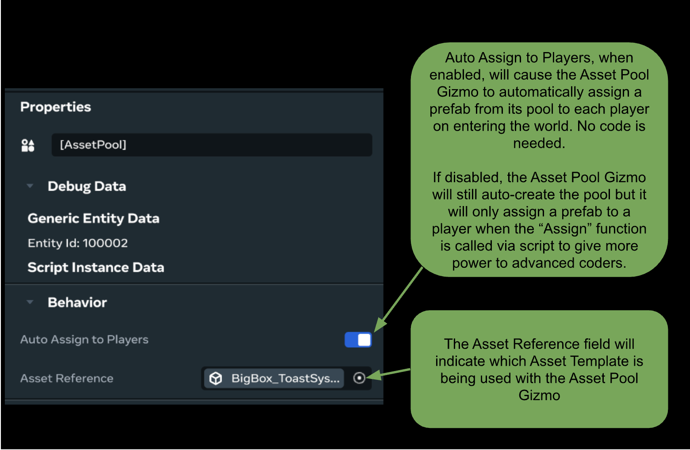
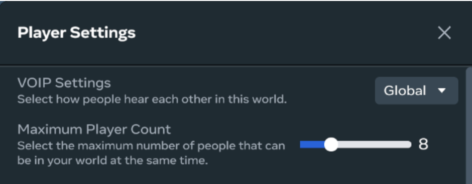
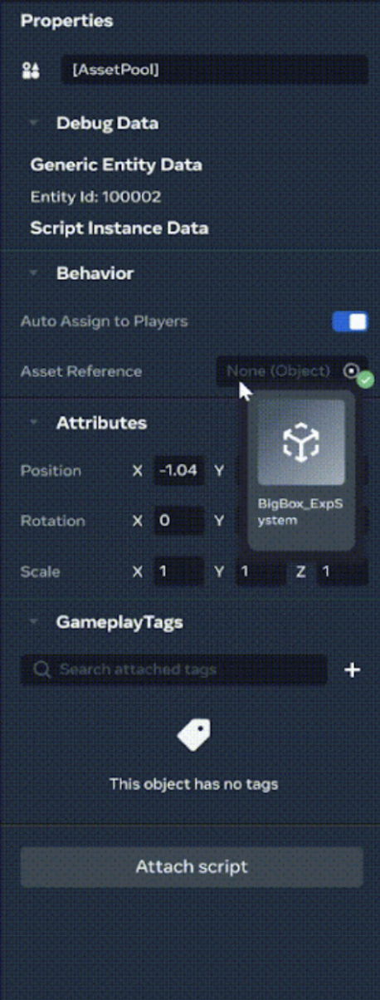
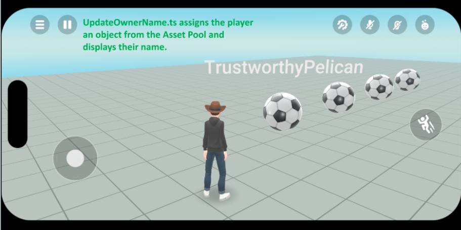
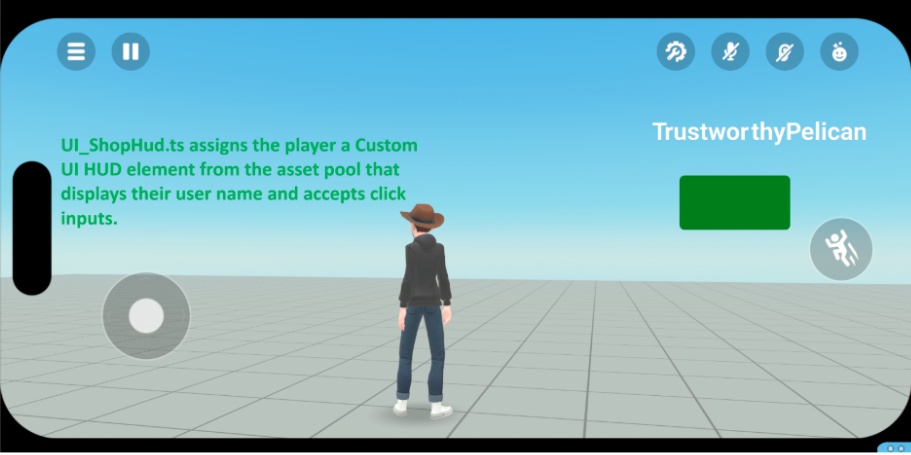

# [Asset pool gizmo](#asset-pool-gizmo)

The asset pool gizmo is a powerful tool for managing objects that should be granted to each player in your World. It automates spawning and assignment of asset template objects to players as they join your World. This is necessary for objects that should have different states per player.

This gizmo is perfect for creating the following in game objects or features on a per player basis:

- HUD and UI
- Starting items
- Particle Effects
- Stats

When using something like a HUD asset, the asset pool gizmo to assign a HUD to each player in your world without needing to create a new HUD per player. Implementing the asset pool gizmo allows you to focus on designing gameplay experiences without writing custom code to manage player-specific objects.

## [Asset pool gizmo overview](#asset-pool-gizmo-overview)



- Each asset pool gizmo manages a single asset template and pools it to be copied as child objects for players.
- You can add additional asset pool gizmos to use additional asset templates for as necessary.
- The asset pool gizmo is able to be used within asset templates.
- When an asset template is assigned to the gizmo, it will automatically create the pool of prefabs based on the maximum player count setting.



**Note**: When deploying the asset pool gizmo in a [non-FBS world](../VR%20tools/Scripting/Use%20file-backed%20scripts.md), avoid connecting asset templates that contain scripts. When the asset pool gizmo spawns the asset template, the scripts will be spawned as separate instances that must be maintained.

## [Use the asset pool gizmo](#use-the-asset-pool-gizmo)

To get started using the asset pool gizmo you will first need to have an asset template available that you plan to use on a player-specific basis. This can be an asset template you created or one that was shared with you by another creator.

Access the asset pool gizmo via **Build Menu** > **Gizmos** > **Asset Pool**.



Once the asset pool gizmo is added, you can set whether to **Auto Assign to Players** and set the **Asset Reference** for the gizmo.



Once the asset pool gizmo is added to your world, use the following process to manage it:

1. Navigate to **Player Settings** in the top left menu and adjust the **Maximum Player Count** slider for your world’s expected max player count.

   

2. Drag the **Asset Pool** gizmo into your scene.

3. Locate the **Asset Template** you plan to use in your **Asset Library**.

4. Drag and drop the **Asset Template** into the **Asset Reference** field of the **Asset Pool** gizmo.

   

5. Use the drop down menu in the **Asset Reference** field of the **Asset Pool** gizmo’s properties window to search for your asset.

6. The **Asset Pool** gizmo will automatically create child prefabs equal to the **Maximum Player Count** setting.

7. If auto-assign is enabled in the properties window, players entering the world will receive a prefab from the asset pool.

## [Example scripts and assets](#example-scripts-and-assets)

Example #1: `UpdateOwnerName.ts` This script can be attached to a mesh object with a child Text gizmo. When an owner is assigned to the object, the text gizmo will update with that player’s name.



```
// Import the necessary components from the 'horizon/core' module.


import
 
*
 
as
 hz 
from
 
'horizon/core'
;


// This class will control the behavior of updating the owner's name.


class
 
UpdateOwnerName
 
extends
 hz
.
Component
<
typeof
 
UpdateOwnerName
>
 
{


  
// Defines the properties, `ownerNameTextEntity` will be set to an Entity.

  
static
 propsDefinition 
=
 
{

    ownerNameTextEntity
:
 
{
type
:
 hz
.
PropTypes
.
Entity
}

  
};


  start
()
 
{


    
// Retrieve the owner of the current entity (the entity this component is attached to).

    
let
 owner 
=
 
this
.
entity
.
owner
.
get
();


    
// Get a `TextGizmo` which displays text, associate it with the `ownerNameTextEntity` property.

    
let
 ownerGizmo 
=
 
this
.
props
.
ownerNameTextEntity
?.
as
(
hz
.
TextGizmo
);


    
// Clear the text in the `TextGizmo`

    ownerGizmo
?.
text
.
set
(
""
);


    
// Check if the current owner is set to a current player or the server.

    
if
 
(
owner 
===
 
this
.
world
.
getServerPlayer
())
 
{

      
// If the owner is the server, clear the text, this occurs if no player owns the object or an owning player drops the object and leaves the session.

      ownerGizmo
?.
text
.
set
(
""
);

    
}

    
else
 
{

      
// If the owner is not the server, set the text to the owner's name.

      ownerGizmo
!.
text
.
set
(
owner
.
name
.
get
());

    
}


  
}


}


// Register the `UpdateOwnerName` component with the Horizon engine.

hz
.
Component
.
register
(
UpdateOwnerName
);
```

Example #2: `UI_ShopHud.ts` This script can be attached to a custom UI gizmo, and when pooled will display a HUD element with a clickable button and the owning player’s name. This also sends some logs to Console when ownership is assigned.



```
// Import necessary components from the Horizon core and UI libraries


import
 
{
 
CodeBlockEvents
,
 
Component
,
 
Player
,
 
World
 
}
 
from
 
'horizon/core'
;


import
 
{
 
Binding
,
 
Pressable
,
 
Text
,
 
UIComponent
,
 
UINode
,
 
View
,
 
ViewStyle
 
}
 
from
 
'horizon/ui'
;


// Define the class `UI_ShopHud`, which extends `UIComponent` for custom UI in Horizon Worlds


class
 UI_ShopHud 
extends
 
UIComponent
<
typeof
 UI_ShopHud
>
 
{


  
// Define props definition

  
static
 propsDefinition 
=
 
{};


  
// Define bindings for UI elements (to make them reactive)

  
private
 titleText
!:
 
Binding
<string>
;
  
// Title text binding (e.g., shop name)

  
private
 shopText
!:
 
Binding
<string>
;
   
// Text for the shop label

  
private
 shopTextColor
!:
 
Binding
<string>
;
 
// Binding for the shop text color

  
private
 buttonColor
!:
 
Binding
<string>
;
 
// Binding for the button color


  
// Configurations for UI layout and styles

  
private
 
readonly
 featuredTextSize 
=
 
36
;
 
// Fixed size for featured text

  
private
 debounce
:
 
boolean
 
=
 
false
;
 
// Flag to prevent multiple button clicks in a short period


  
// The `start` method is called when the component is initialized

  start
()
 
{

    
// Retrieve the server player and local player

    
let
 serverPlayer 
=
 
World
.
prototype
.
getServerPlayer
();

    
let
 owner 
=
 
this
.
world
.
getLocalPlayer
();


    
// Check if the current player is neither the server player nor null

    
let
 currentPlayer 
=
 owner 
===
 
null
 
||
 owner 
===
 serverPlayer 
?
 
null
 
:
 owner
;


    
// If there is a valid current player, make the shop UI visible

    
if
 
(
currentPlayer 
!==
 
null
)
 
{

      console
.
log
(
`UI_ShopHud CONNECTED to ${currentPlayer.name.get()}`
);

      
this
.
entity
.
visible
.
set
(
true
);
  
// Set the UI entity to visible

    
}

    
else
 
{

      
// Otherwise, hide the shop UI

      
this
.
entity
.
visible
.
set
(
false
);

    
}

  
}


  
// Method to handle when a slot (button) is clicked

  
private
 onSlotClicked
()
 
{

    
// Prevent multiple clicks within a short time frame using debounce

    
if
 
(!
this
.
debounce
)
 
{

      
this
.
debounce 
=
 
true
;
  
// Set debounce flag to true (no further clicks allowed)


      
// Change the button color to grey when pressed

      
this
.
buttonColor
.
set
(
'grey'
,
 
[
this
.
world
.
getLocalPlayer
()]);


      console
.
log
(
"Shop Button Pressed"
);


      
// After a short delay, reset the debounce flag and set the button color back to green

      
this
.
async
.
setTimeout
(()
 
=>
 
{

        
this
.
debounce 
=
 
false
;
  
// Reset debounce flag

        
this
.
buttonColor
.
set
(
'green'
,
 
[
this
.
world
.
getLocalPlayer
()]);
  
// Reset button color

      
},
 
200
);
 
// 200 milliseconds delay

    
}

  
}


  
////////////////////////////////////////////////////////////////////////

  
// UI Formatting Section: This part handles the layout and design of the UI

  
////////////////////////////////////////////////////////////////////////


  
// Method to initialize and layout the UI components

  initializeUI
()
 
{

    
// Skip UI creation if the local player is the server player (since they should not see the UI)

    
if
 
(
this
.
world
.
getLocalPlayer
()
 
===
 
this
.
world
.
getServerPlayer
())
 
{

      
return
 
new
 
UINode
();
  
// Return an empty node if server player

    
}


    
// Set up bindings for dynamic UI content (e.g., player name, shop name)

    
this
.
titleText 
=
 
new
 
Binding
<string>
(
this
.
world
.
getLocalPlayer
().
name
.
get
());

    
this
.
shopText 
=
 
new
 
Binding
<string>
(
'Shop'
);
  
// Static text for "Shop"

    
this
.
shopTextColor 
=
 
new
 
Binding
<string>
(
'white'
);
 
// Default text color for shop text

    
this
.
buttonColor 
=
 
new
 
Binding
<string>
(
'green'
);
 
// Default color for the button


    
// Define the style for the root panel (container) of the UI

    
const
 rootPanelStyle
:
 
ViewStyle
 
=
 
{

      width
:
 
"60%"
,
  
// Width of the root panel (60% of the screen width)

      height
:
 
"80%"
,
 
// Height of the root panel (80% of the screen height)

      left
:
 
"35%"
,
   
// Position the panel 35% from the left edge of the screen

      position
:
 
"absolute"
,
 
// Use absolute positioning

      justifyContent
:
 
"center"
,
 
// Vertically center the content inside the panel

      alignContent
:
 
"center"
,

      alignSelf
:
 
"center"
,

      alignItems
:
 
"flex-end"
,
 
// Align content to the bottom (flex-end) horizontally

    
};


    
// Define the style for the button

    
const
 buttonStyle
:
 
ViewStyle
 
=
 
{

      backgroundColor
:
 
this
.
buttonColor
,
  
// Dynamic button color

      borderRadius
:
 
8
,
  
// Rounded corners for the button

      height
:
 
48
,
       
// Button height

      padding
:
 
'5%'
,
    
// Padding inside the button

      margin
:
 
'5%'
,
     
// Margin around the button

      width
:
 
'80%'
,
     
// Button takes up 80% of the panel's width

      justifyContent
:
 
'center'
,
  
// Center the button text vertically

      alignContent
:
 
"center"
,

      alignItems
:
 
'center'
,
      
// Center the button text horizontally

    
};


    
// Create a pressable button element with custom styling and text

    
const
 buttonOption 
=
 
Pressable
({

      children
:
 
[

        
View
({

          children
:
 
[

            
Text
({

              text
:
 
this
.
shopText
,
 
// Text content for the button (shop name)

              style
:
 
{

                fontFamily
:
 
"Roboto"
,
   
// Font for the button text

                color
:
 
this
.
shopTextColor
,
 
// Dynamic text color for the shop name

                fontWeight
:
 
"700"
,
      
// Bold text

                fontSize
:
 
this
.
featuredTextSize
,
 
// Featured text size

                alignItems
:
 
"center"
,
   
// Center the text vertically

                textAlign
:
 
"center"
,
    
// Center the text horizontally

              
}

            
}),

          
],

          style
:
 
{

            flexDirection
:
 
"row"
,
  
// Arrange children in a row

            justifyContent
:
 
"center"
,
  
// Horizontally center the text

          
},

        
})

      
],

      style
:
 buttonStyle
,
  
// Apply the defined button style

      onClick
:
 
()
 
=>
 
this
.
onSlotClicked
(),
  
// Handle button click event

    
});


    
// Define and return the root view that contains all UI components

    
return
 
View
({

      children
:
 
[

        
// The button container (including title and button)

        
View
({

          children
:
 
[

            
Text
({

              text
:
 
this
.
titleText
,
 
// Display the title text (player's name)

              style
:
 
{

                fontFamily
:
 
"Roboto"
,
 
// Font style for the title text

                color
:
 
this
.
shopTextColor
,
 
// Dynamic color for the title text

                fontWeight
:
 
"700"
,
    
// Bold text for the title

                fontSize
:
 
this
.
featuredTextSize
,
 
// Set the size of the title text

                alignItems
:
 
"center"
,
 
// Center the title text vertically

                textAlign
:
 
"center"
,
  
// Center the title text horizontally

              
}

            
}),

            buttonOption
,
 
// Add the button as a child of the root view

          
],

        
})

      
],

      style
:
 rootPanelStyle
,
 
// Apply the root panel's styles

    
});

  
}


}


// Register the `UI_ShopHud` component so it can be used in Horizon Worlds


Component
.
register
(
UI_ShopHud
);
```

