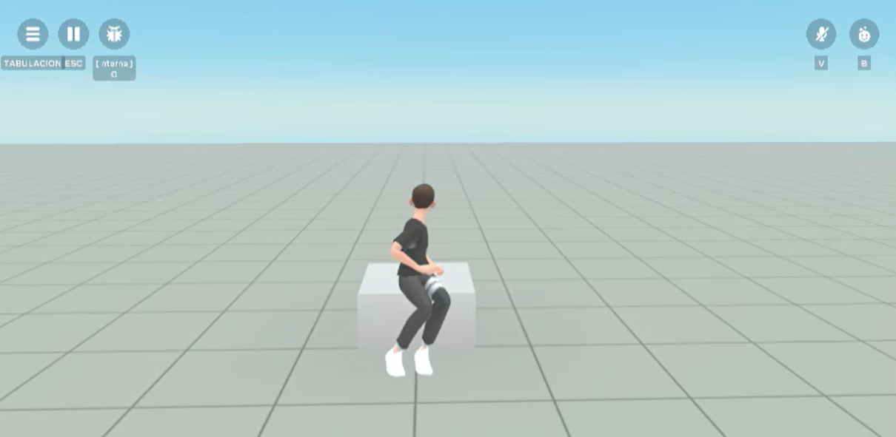
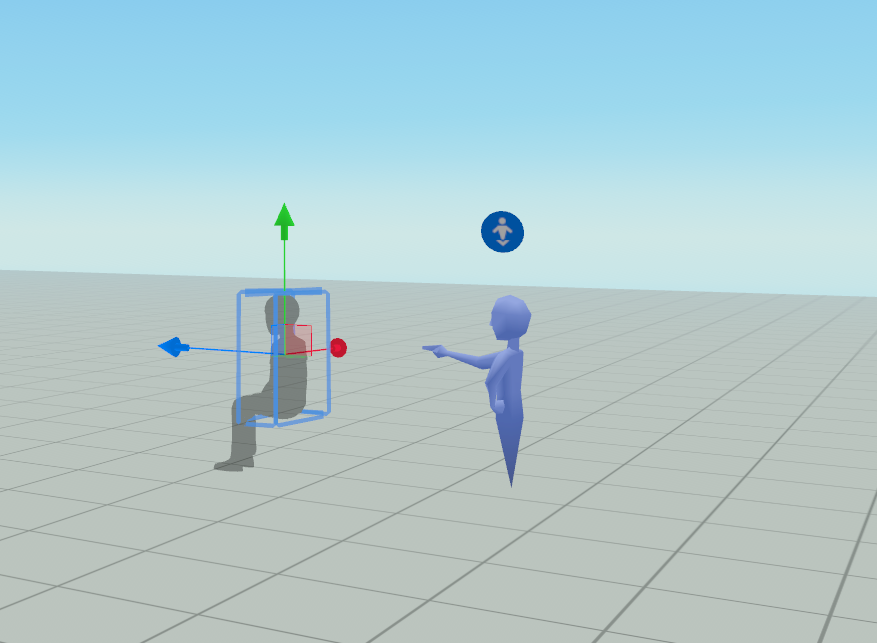
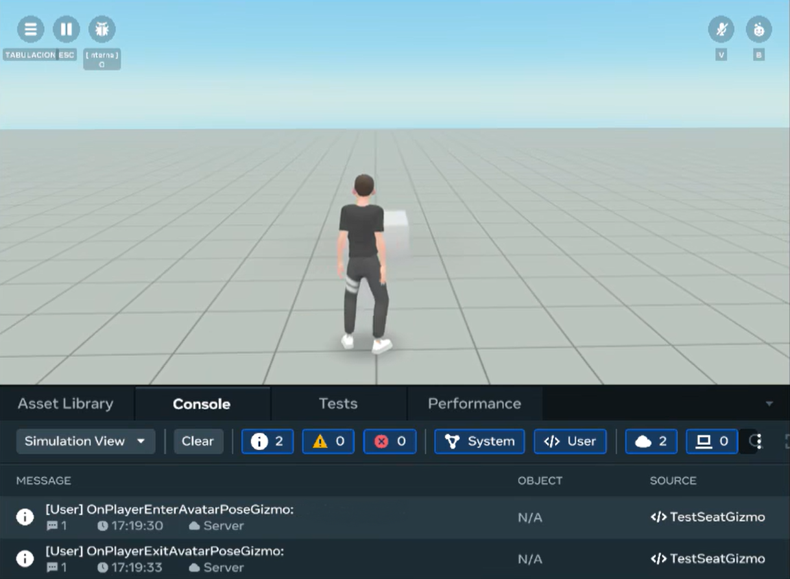

# Avatar pose gizmo

The avatar pose [gizmo](About%20gizmos.md) is a helper tool that allows creators to position avatars in the virtual world in a sitting pose. Avatars can sit on a variety of stationary objects like chairs or moving objects such as roller coasters and bicycles. When the player is near the [avatar pose gizmo](../Reference/core/Classes/AvatarPoseGizmo.md), the player can press E to sit down on the gizmo object or [entity](../Reference/core/Classes/Entity.md), and then stand up using the [movement controls](../Desktop%20editor/Help%20and%20reference/Desktop%20Editor%20Creation%20Tools%20Keyboard%20Shortcuts.md). The gizmo supports animations and locomotion mechanics, allowing avatars to move naturally into seated positions as shown in the image below.



## Prerequisites

* [TypeScript API version 2.0.0 or later](../Scripting/Upgrade%20World%20to%20TypeScript%20API%20v2.0.0.md).
* [The API is available in horizon/core/AvatarPoseGizmo](../Reference/core/Classes/AvatarPoseGizmo.md).
* [Enable the API module](../Scripting/Upgrade%20World%20to%20TypeScript%20API%20v2.0.0.md#upgrading-your-world).

## Limitations and best practices

There may be some amount of clipping through the object’s geometry from the avatar’s legs. This can vary depending on the body shape of the avatar. You may need to modify your objects and adjust the avatar pose gizmo to reduce clipping. To help assist with this, a shadow avatar is available on the avatar pose gizmo while in the Build mode to preview if the placement will create clipping. You can also use the Worlds camera and try out different avatar bodies to see how avatars will look using the seat. The sitting animation is procedurally adjusted to account for the avatar’s body shape which reduces clipping for larger bodies.



Emotes are available while sitting, but only the upper body will move.

Features have been added for player comfort and security, such as preventing overlapping pose gizmos, only allowing one person in a seat at a time, and preventing the ability to jump on someone while seated.

Players can sit on moving objects. A control is available to notify players if they are automatically placed on moving objects when they enter a world.

## Access the avatar pose gizmo

While you can access and use gizmos in the [VR tool](../VR%20tools/Getting%20started/Create%20a%20new%20world%20in%20Meta%20Horizon%20Worlds.md), this topic focuses on the creator experience in the [desktop editor](../Get%20started/Install%20the%20desktop%20editor.md).

In the desktop editor, do the following to access the avatar pose gizmo:

- In the desktop editor while in Build mode, select **Build** > **Gizmos** from the menu bar, search for “avatar pose” in the search field.
- Select the avatar pose gizmo and drag it into the scene.
- You can now edit the new gizmo properties in the **Properties** panel.

## Properties

This section describes the properties of the avatar pose gizmo in the [**Properties**](../Desktop%20editor/Get%20started%20with%20Desktop%20Editor/User%20interface/Panels%20and%20Tabs%20in%20the%20desktop%20editor.md#properties-pane) panel.

The avatar pose gizmo is an extended class of [entity](../Reference/core/Classes/Entity.md). All objects in a world are represented by entities. Entities have their respective properties such as position, rotation, and scale. In the Properties panel, edit the avatar pose gizmo’s transformation fields to configure its **Position**, **Rotation**, and **Scale**.

**Pose**: Selecting the **Seat** option enables the player to enter a sitting pose on an entity.

Toggle on the **Use Custom Exit Direction** to input a custom **Exit Direction** vector to specify the direction that the player is facing when exiting the pose. For example, you may specify exit directions for avatar pose gizmos to control where a player returns to their upright position to avoid awkward positioning in crowded environments.

## Scripting

Through scripting, the [AvatarPoseGizmo class](../Reference/core/Classes/AvatarPoseGizmo.md) allows you to customize the player experience. The following are examples of what the API can do:

* Specify which players can use an avatar pose gizmo.
* Place a player in an avatar pose gizmo.
* Specify if the player is allowed to exit the gizmo.
* Listen to [enter/exit events when a player enters/exits the avatar pose gizmo](../Reference/core/Variables/CodeBlockEvents.md) as shown in the image below.



The following example shows how to use the [AvatarPoseGizmo class](../Reference/core/Classes/AvatarPoseGizmo.md) to specify which players can use an avatar pose gizmo while using [`CodeBlockEvents`](../Reference/core/Variables/CodeBlockEvents.md) to listen for players enter/exit events. See also [`CodeBlockEvent`](../Reference/core/Classes/CodeBlockEvent.md).

```
import * as hz from 'horizon/core';
class TestSeatGizmo extends hz.Component<typeof TestSeatGizmo> {
  static propsDefinition = {};

  start() {
    this.connectCodeBlockEvent(
      this.entity,
      hz.CodeBlockEvents.OnPlayerEnterWorld,
      (player: hz.Player) => {
      this.entity.as(hz.AvatarPoseGizmo).setCanUseForPlayers([player],
      hz.AvatarPoseUseMode.AllowUse);
      this.entity.as(hz.AvatarPoseGizmo).player.set(player);
    });

    this.connectCodeBlockEvent(
      this.entity,
      hz.CodeBlockEvents.OnPlayerEnterAvatarPoseGizmo,
      (player: hz.Player) => {
      console.log("OnPlayerEnterAvatarPoseGizmo: " + player.name.get());
    });

    this.connectCodeBlockEvent(
      this.entity,
      hz.CodeBlockEvents.OnPlayerExitAvatarPoseGizmo,
      (player: hz.Player) => {
      console.log("OnPlayerExitAvatarPoseGizmo: " + player.name.get());
    });
  }
}
hz.Component.register(TestSeatGizmo);
```

## What’s next?

Try the following topics to further your learning:

* [Avatar poses](../Mobile%20and%20web/Grabbable%20entities/Avatar%20Poses.md)
* [Tutorial worlds customize avatar interaction](../Tutorials/Feature%20samples/Developing%20for%20web%20and%20mobile%20players%20tutorial/Module%206%20-%20Room%20A-%20The%20Magic%20Wand.md#customize-avatar-interactions)