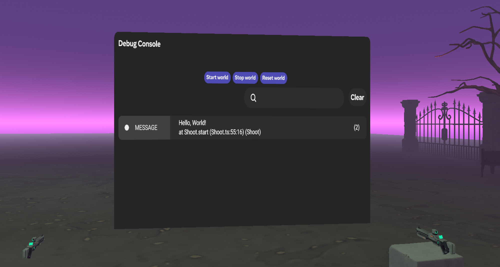
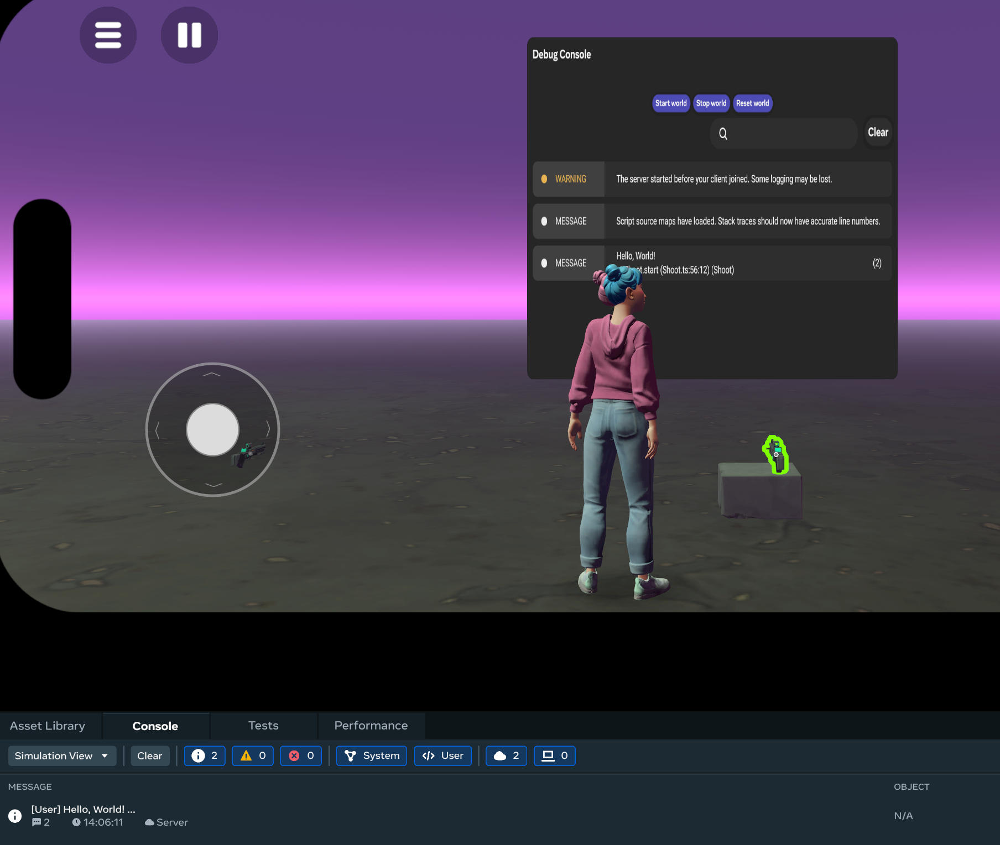
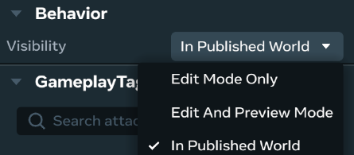

# [Debug console gizmo](#debug-console-gizmo)

When you create your world, there are helpful development tools for [debugging and optimization](../Tutorials/Getting%20started/Getting%20started%20with%20tutorials/Developer%20Tools%20for%20Tutorials.md). One such tool is the debug console [gizmo](About%20gizmos.md), which allows you to debug scripts in real time while you’re in the virtual environment with the headset on. This is often referred to as in-world debugging. It is designed to display script messages with an in-world interface for viewing debug information, making it more suitable for interactive and real-time debugging scenarios. You can see logs and debug information as you interact with the world. In comparison, the standard console displays similar information in the log viewer in the [desktop editor](../Desktop%20editor/Desktop%20Editor.md) under the tab **Console**.

The following image shows the [debug console](../Scripting/Get%20started%20with%20TypeScript/The%20Debug%20Console.md) gizmo while you have the headset on, providing an immersive debugging experience. As shown, the **Start world**, **Stop world**, and **Rest world** buttons control the executing states of the scripts.

The following image shows the debug console gizmo while you are using the desktop editor without the headset. The log messages are also displayed under the desktop editor **Console** tab.

The following sections show you how to access and configure the gizmos so you can start debugging in VR.

## [Access the debug console gizmo](#access-the-debug-console-gizmo)

While you can access and configure the gizmos in the [VR tool](../VR%20tools/Getting%20started/Create%20a%20new%20world%20in%20Meta%20Horizon%20Worlds.md), the following steps show you how to access the debug console gizmo from the desktop editor and add it to the [scene pane](../Desktop%20editor/Get%20started%20with%20Desktop%20Editor/User%20interface/Panels%20and%20Tabs%20in%20the%20desktop%20editor.md#scene-pane).

1. In the desktop editor while in the Build mode, select **Build** > **Gizmos** from the menu bar, search for “debug console” in the search field.
2. Select the debug console gizmo and drag it into the scene. You can now edit the new gizmo properties in the Properties panel.

## [Properties](#properties)

All objects in a world are represented by [entities](../Reference/core/Classes/Entity.md). Entities have their respective properties such as position, rotation, and scale. In the **Properties** panel, edit the debug console gizmo’s transformation fields to configure its **Position**, **Rotation**, and **Scale**.

The visibility of the debug console is configured under [**Visibility**](../Scripting/Get%20started%20with%20TypeScript/The%20Debug%20Console.md#controlling-visibility-of-the-debug-console). The options are **Edit Mode Only**, [**Edit and Preview Mode**](../Desktop%20editor/Get%20started%20with%20Desktop%20Editor/User%20interface/Build%20and%20Preview%20Modes.md) , or [**In Published World**](../Tutorials/Getting%20started/Create%20your%20first%20world%20tutorial%2C%20part%201.md#section-4-play-in-your-world-on-mobile). Be aware that the gizmo is only visible in the Build mode when **Visibility** is in the default **Edit Mode Only**.

**Note**: The Edit Mode that the Properties panel refers to is also known as the [Build mode](../Desktop%20editor/Get%20started%20with%20Desktop%20Editor/User%20interface/Build%20and%20Preview%20Modes.md). See also the [Build mode](../VR%20tools/Getting%20started/Use%20your%20controllers%20in%20Build%20Mode%20of%20Meta%20Horizon%20Worlds.md) in VR.

## [What’s next?](#whats-next)

Now you’ve been introduced to the debug console gizmo, further your learning with tutorial worlds with completed samples, and developer guides:

- [Meta Horizon Creator Program creators manual on the debug console gizmo](https://github.com/MHCPCreators/horizonCreatorManual/blob/main/HorizonTechnicalDoc.md#debug-console-gizmo)
- [Developer tools for tutorials](../Tutorials/Getting%20started/Getting%20started%20with%20tutorials/Developer%20Tools%20for%20Tutorials.md)
- [The debug console](../Scripting/Get%20started%20with%20TypeScript/The%20Debug%20Console.md)
- [Roof top racer tutorial worlds on testing tools](../Tutorials/Genre%20samples/Horizon%20traversal%20sample%20world/Module%202%20-%20Overall%20Game%20Manager%20Systems.md#testing-tools)
- [TypeScript Tutorial](../Scripting/Get%20started%20with%20TypeScript/TypeScript%20Tutorial.md)

