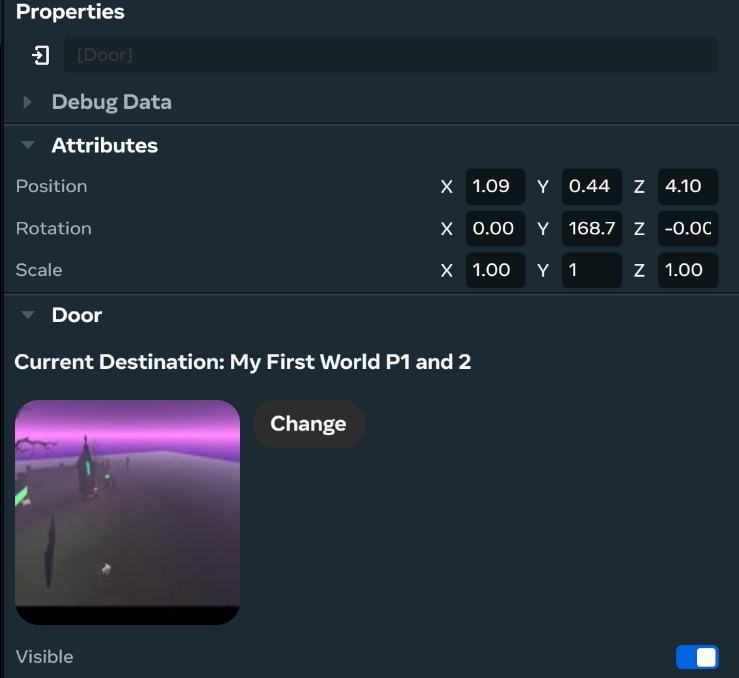
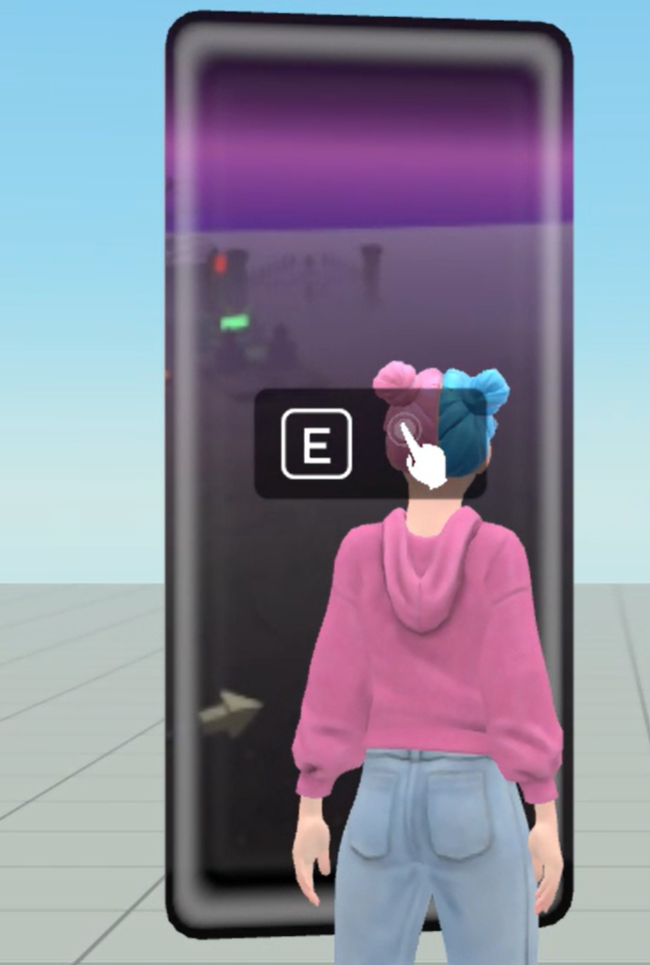

# [Door gizmo](#door-gizmo)

The door gizmo is part of a suite of tools called [gizmos](About%20gizmos.md), which are designed to enhance the creation and interaction capabilities within Meta Horizon Worlds.

The door gizmo in Meta Horizon Worlds allows you to place a door in the virtual world, configure its properties to link your world with another published world, and as a result, enables players to interact with the door and travel from one world to another.

**Note**: While you can access and use the door gizmo in the [VR tool](../VR%20tools/Getting%20started/Create%20a%20new%20world%20in%20Meta%20Horizon%20Worlds.md), this topic focuses on the creator experience in the [desktop editor](../Desktop%20editor/Get%20started%20with%20Desktop%20Editor/Introduction%20to%20the%20desktop%20editor.md).

## [Access the door gizmo](#access-the-door-gizmo)

In the Meta Horizon Worlds desktop editor, do the following to access the door gizmo:

1. In the desktop editor while in Build mode, select **Build** > **Gizmos** from the menu bar, search for “Door” in the search field.
2. Select the door gizmo and drag it into the scene.
3. You can now edit the new door gizmo properties in the **Properties** panel.

## [Properties](#properties)

The door gizmo is an entity. All objects in a world are represented by [entities](../Reference/core/Classes/Entity.md). Entities have their respective properties such as position, rotation, and scale.

In the **Properties** panel, edit the door gizmo’s transformation fields to configure its **Position**, **Rotation**, and **Scale**.

Additionally, the door gizmo displays the destination world’s name, its thumbnail image, and a **Change** button for changing the destination.

To change the door’s destination, click **Change**. Search for public worlds as the door’s destination.

The **Visible** toggle controls the visibility of the gizmo in the world.

## [Travel to another world using the door gizmo](#travel-to-another-world-using-the-door-gizmo)

While using the door gizmo, keep in mind of the following:

- Both worlds must be published.
- Ensure to enter the exact name of the destination world.
- Ensure that the two worlds do not have the same name.
- Players need to press the trigger on the door and then press **Go** to initiate the travel.

The following outlines the steps to travel to another world using the door gizmo:

1. After you’ve configured the door gizmo in the desktop editor, [publish](../Save%2C%20optimize%2C%20and%20publish/Publish%20your%20world.md) the world. For an example of publishing a world on mobile, see [Play in your world on mobile](../Tutorials/Getting%20started/Create%20your%20first%20world%20tutorial%2C%20part%201.md#section-4-play-in-your-world-on-mobile).
2. Visit the published world with the door gizmo on mobile, web or VR.
3. Approach the door gizmo and interact with it by clicking the trigger.
4. Click the **Go** button on the door gizmo to travel to the linked world. Wait for the new world to load. This may take a few seconds.
5. Once the loading is complete, you’ll arrive in the new world and start exploring.

The following image shows the player in front of the door gizmo. Pressing the trigger, and then **Go** will teleport the player to the designated world.

**Note**: Travel is not supported when you’re in the play mode of the desktop editor.

## [What’s next?](#whats-next)

Try the following related topic:

- [Travel via doors and links](https://github.com/MHCPCreators/horizonCreatorManual/blob/main/HorizonTechnicalDoc.md#travel-doors-and-links)
- [Meta Horizon Creator Program creator manual](https://github.com/MHCPCreators/horizonCreatorManual/blob/main/HorizonTechnicalDoc.md#door-gizmo)

