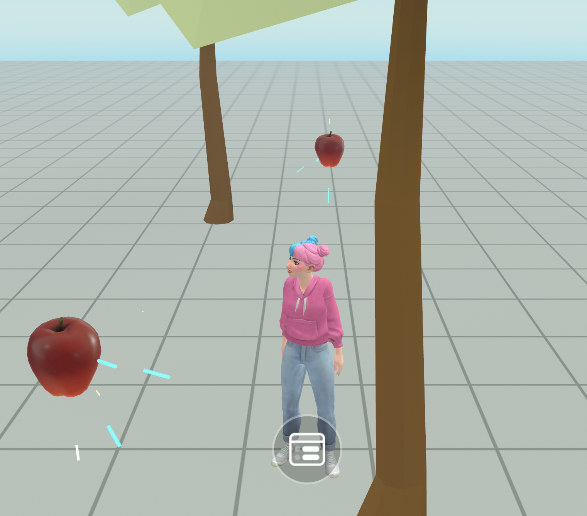

# [Dynamic light gizmo](#dynamic-light-gizmo)

The dynamic light [gizmo](About%20gizmos.md) allows creators to add dynamic lighting effects such as moving and changing lights. Some common use cases include enhancement of atmosphere and [highlighting important areas or objects](../Tutorials/Feature%20samples/Economy%20world%20tutorial/Module%203%20-%20Configuring%20Gameplay%20Entities.md#configuring-the-apple-spawners).

The following image is taken from the [tutorial world](../Tutorials/Getting%20started/Getting%20started%20with%20tutorials/Access%20Tutorial%20Worlds.md) called [Economy world](../Tutorials/Feature%20samples/Economy%20world%20tutorial/Module%203%20-%20Configuring%20Gameplay%20Entities.md) where the dynamic light gizmos are at work. The dynamic light is used to draw attention to the apple.

## [Limitations](#limitations)

While using the dynamic light gizmo, there are [limitations](https://github.com/MHCPCreators/horizonCreatorManual/blob/main/HorizonTechnicalDoc.md#dynamic-light-gizmo). For example, the number of lights permitted and its impact on [performance](../Performance/Designing%20a%20performant%20world.md).

## [Access the dynamic light gizmo](#access-the-dynamic-light-gizmo)

While you can access and use gizmos in the [VR tool](../VR%20tools/Getting%20started/Create%20a%20new%20world%20in%20Meta%20Horizon%20Worlds.md), this topic focuses on the creator experience in the desktop editor.

1. In the desktop editor while in the Build mode, select **Build** > **Gizmos** from the menu bar, search for “dynamic light” in the search field.
2. Select the dynamic light gizmo and drag it into the scene.
3. You can now edit the new gizmo properties in the [**Properties** panel](../Desktop%20editor/Get%20started%20with%20Desktop%20Editor/User%20interface/Panels%20and%20Tabs%20in%20the%20desktop%20editor.md#properties-pane).

## [Properties](#properties)

The dynamic light gizmo is an [entity](../Reference/core/Classes/Entity.md). All objects in a world are represented by entities. Entities have their respective properties such as position, rotation, and scale. In the Properties panel, you can edit the gizmo’s transformation fields to configure its **Position**, **Rotation**, and **Scale**. Additionally, like the transformation, [**Color**](../Reference/core/Classes/Color.md) can be edited in the UI panel or controlled through scripting.

In the **Light** section, additional properties are available to customize and manage dynamic lights.

The **Enabled** toggle turns the light on or off.

The **Color** and **Intensity** fields let you configure the light’s appearance and intensity.

**Light Type** specifies the type of light sources such as **Point** (omnidirectional light) or **Spot** (cone-shaped light).

**Falloff Distance** specifies the decline in light intensity with distance.

**Spread** specifies the spread of spotlight, which is the width of the light beam.

For more information on the dynamic light gizmo properties, see [MHCP creator’s manual](https://github.com/MHCPCreators/horizonCreatorManual/blob/main/HorizonTechnicalDoc.md#dynamic-light-gizmo) and the [DynamicLightGizmo](../Reference/core/Classes/DynamicLightGizmo.md) API.

## [Scripting](#scripting)

To control the gizmo through scripting, see the [DynamicLightGizmo](../Reference/core/Classes/DynamicLightGizmo.md) API.

## [What’s next?](#whats-next)

Now that you’ve been introduced to the dynamic light gizmo, further your learning with hands-on tutorials and guides:

- [Meta Horizon Worlds creator’s manual on the dynamic light gizmo](https://github.com/MHCPCreators/horizonCreatorManual/blob/main/HorizonTechnicalDoc.md#dynamic-light-gizmo)
- [Tutorial worlds on dynamic lights](../Tutorials/Feature%20samples/Economy%20world%20tutorial/Module%203%20-%20Configuring%20Gameplay%20Entities.md)
- [Material asset user guide](https://developers.meta.com/horizon-worlds/learn/documentation/desktop-editor/assets/material-asset-user-guide)

