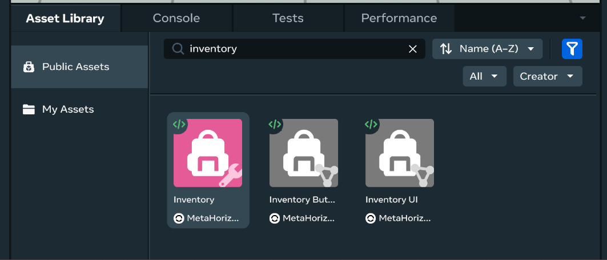

# [Inventory Asset Template](#inventory-asset-template)

> [!Note]
>
> You will need to be a member of MHCP and have accepted the terms in the Developer Dashboard in order to create in-world items and currency. Find out more about monetization [here](../MHCP%20program/Monetization/Monetization%20opportunities.md).

The Inventory Asset Template allows creators to easily list the items a player owns or can own within a world. The items displayed and their configuration can be set up using the props element of the included Inventory script. An arbitrary number of items can be listed here, and if the content is larger than the screen there’ll be a scroll bar for the player to navigate through it.

The Inventory Asset Template can be configured to display in-world items created in the **Systems > Commerce** menu. For more information on creating in-world items, visit the [In-World Purchase Guide](../MHCP%20program/Monetization/In-world%20purchase%20guide.md#creating-an-item).

Behind the scenes, the world inventory stores how many of each in-world item is owned by each player. While the Inventory Asset Template interfaces with the world inventory automatically, you can use [World Inventory TypeScript APIs](../Reference/core/Classes/WorldInventory.md) to manually query, grant, and consume in-world items in a player’s world inventory.

## [Access the Inventory Asset Template](#access-the-inventory-asset-template)

To access the Inventory Asset Template: In the desktop editor, enter the Build mode and select **Asset Library > Public Assets** from the bottom menu bar. Next, search for “Inventory” in the search field. Finally, select the Inventory Asset Template and drag it into the scene. You can now edit the new asset template properties in the **Properties** panel.

## [Inventory Asset Template properties](#inventory-asset-template-properties)

The Inventory Asset Template properties can be configured in the **Properties** panel or through scripting.

### [Visual and interaction](#visual-and-interaction)

Here you can change the following:

- **ID**: ID of the Inventory. Used to differentiate between multiple inventories in the same world.
- **Displayed Title**: Name of the Inventory, which is displayed in the top-left corner of the Inventory UI.
- **Displayed Title Icon**: Select an icon to display next to the Inventory title.
- **Item SKU**: The SKU of an item you want to display in this Inventory.
- **Item Thumbnail**: The thumbnail of an item you want to display in this Inventory.

### [Inventory items](#inventory-items)

To use the Inventory Asset Template, you will need to create in-world items through the **Systems > Commerce** menu. Once you have done this, you can add these items to the Inventory using the Inventory Asset Template properties.

You can use the Inventory Asset Template properties to configure which in-world items to display.

## [Scripting](#scripting)

You can interface with the Inventory Asset Template directly through TypeScript and fully customize the Inventory’s behavior. Please refer to the [World Inventory TypeScript APIs](https://developers.meta.com/horizon-worlds/reference/2.0.0/experimental_worldinventory) documentation for more information on the economy APIs.

