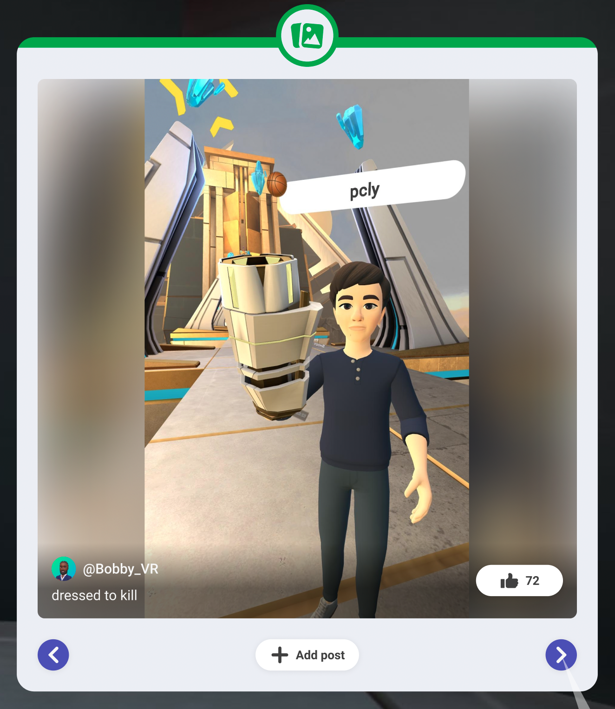

# [Media board gizmo](#media-board-gizmo)

> [!Note]
>
> You will need to be a member of [Meta Horizon Creator Program](../MHCP%20program/Welcome%20to%20the%20Meta%20Horizon%20Creator%20Program.md) to access the media board gizmo.

The media board [gizmo](About%20gizmos.md) allows you to display the top 30 photos from a world. Adding a media board can show players how others have interacted with the world and encourage players to post their own photos to the world. The media board auto-rotates through photos unless a player is interacting with it.

Players in a world can react to media displayed on the media board with the **Like** button, which triggers a thumbs up emote. They can also share their own photos with the **Add post** button. The following image illustrates the description of the media board gizmo.

Each player sees a personalized set of 30 photos, selected from photos that are included in the approved world posts. Photos from others that the player follows and photos with a high **Like** count are prioritized for the media board.

## [Access the media board gizmo](#access-the-media-board-gizmo)

While you can access and configure the gizmos in the [VR tool](../VR%20tools/Getting%20started/Create%20a%20new%20world%20in%20Meta%20Horizon%20Worlds.md), the following steps show you how to access the media board gizmo from the desktop editor and add it to the [scene pane](../Desktop%20editor/Get%20started%20with%20Desktop%20Editor/User%20interface/Panels%20and%20Tabs%20in%20the%20desktop%20editor.md#scene-pane).

1. In the desktop editor while in the Build mode, select **Build** > **Gizmos** from the menu bar, search for “media board” in the search field.
2. Select the media board gizmo and drag it into the scene.
3. You can now edit the new gizmo properties in the [**Properties panel**](../Desktop%20editor/Get%20started%20with%20Desktop%20Editor/User%20interface/Panels%20and%20Tabs%20in%20the%20desktop%20editor.md#properties-pane).

**Note:** There is a known issue where media boards appear smaller than expected in desktop. The size in VR is correct.

## [Properties](#properties)

The media board gizmo is an entity. All objects in a world are represented by entities. [Entities](../Reference/core/Classes/Entity.md) have their respective properties such as position, rotation, and scale. In the Properties panel, you can edit the gizmo’s transformation fields to configure its **Position**, **Rotation**, and **Scale**.

In the **Behavior** section, additional properties are available to customize the media board gizmo.

**Pinned Page** controls the number of photos that can be listed; up to 30 photos can be listed.

**Panel UI Mode** controls the gizmo’s appearance and style.

**LoD radius** controls the distance, in meters, that the media board appears for players. If set to 0, the panel always appears. Otherwise, the panel appears when a player is within the specified radius.

**Deterministic Ranking** ranks photos by recency rather than likes.

For more information on the media board gizmo properties, see the [MHCP creator’s manual](https://github.com/MHCPCreators/horizonCreatorManual/blob/main/HorizonTechnicalDoc.md#media-board-gizmo).

## [Approve or reject photos](#approve-or-reject-photos)

Once you approve a photo, it becomes available on the media board and visible to the public. The following steps show you how to approve photos for a world from the [VR tool](../VR%20tools/Getting%20started/Create%20a%20new%20world%20in%20Meta%20Horizon%20Worlds.md).

1. Open the Creation page.
2. Click on **Posts & feedback**.
3. You see a list of posts. Use the dropdown menu on the top right to filter to only pending posts.
4. Pending posts have 3 buttons: **Approve**, **Reject**, and **Report**.
5. Select the **Approve** button to makes a photo visible on a media board.

Conversely, to remove a photo from the media board once it’s been approved, follow these steps to reject it from the approved posts.

1. Open the Creation page.
2. Click on **Posts & feedback**.
3. Once you see a list of posts, use the dropdown menu on the top right to filter to approved posts.
4. Click the **Reject** button, which appears to the left of the three-dot menu.

## [What’s next?](#whats-next)

Now that you’ve been introduced to the media board gizmo, further your learning with related developer guides:

- [Meta Horizon Creator Program’s creator manual on the media board gizmo](https://github.com/MHCPCreators/horizonCreatorManual/blob/main/HorizonTechnicalDoc.md#media-board-gizmo)

