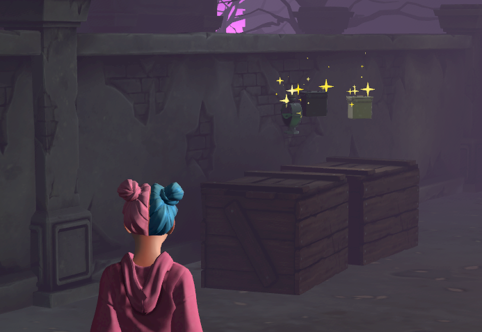
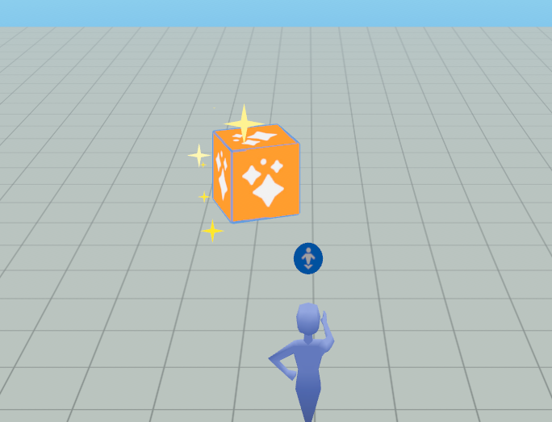
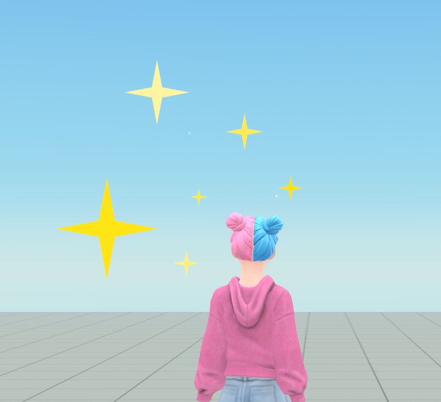

# [ParticleFx gizmo](#particlefx-gizmo)

The ParticleFX [gizmo](About%20gizmos.md) is a helper tool that allows you to easily add visual effects such as smoke, sparks, and confetti, making worlds more dynamic and visually engaging. Some use cases of particle effects include adding game event feedback with explosions and hit sparks, or enhance immersion with confetti bursts and water splashes.

The following image is taken from the [sample world](../Tutorials/Getting%20started/Getting%20started%20with%20tutorials/Tutorial%20Prerequisites.md) called [Chop-n-pop](../Tutorials/Genre%20samples/Chop%20N%20Pop%20sample%20world/Module%201%20-%20Setup.md) where the ParticleFX gizmos provide the sparkles around the loot.

## [Limitations](#limitations)

[Performance](../Performance/Performance%20best%20practices/CPU%20and%20TypeScript%20optimization%20and%20best%20practices.md) can be impacted if too many complex effects are used at once.

## [Access the ParticleFx gizmo](#access-the-particlefx-gizmo)

While you can access and configure the gizmos in the [VR tool](../VR%20tools/Getting%20started/Create%20a%20new%20world%20in%20Meta%20Horizon%20Worlds.md), the following steps show you how to access the ParticleFx gizmo from the desktop editor and add it to the [scene pane](../Desktop%20editor/Get%20started%20with%20Desktop%20Editor/User%20interface/Panels%20and%20Tabs%20in%20the%20desktop%20editor.md#scene-pane).

1. In the desktop editor while in the Build mode, select **Build** > **Gizmos** from the menu bar, search for “particle” in the search field.
2. Select the ParticleFx gizmo and drag it into the scene.
3. You can now edit the new gizmo properties in the [**Properties panel**](../Desktop%20editor/Get%20started%20with%20Desktop%20Editor/User%20interface/Panels%20and%20Tabs%20in%20the%20desktop%20editor.md#properties-pane).

## [Properties](#properties)

The ParticleFx gizmo is an entity. All objects in a world are represented by entities. [Entities](../Reference/core/Classes/Entity.md) have their respective properties such as position, rotation, and scale. In the **Properties** panel, you can edit the gizmo’s transformation fields to configure its **Position**, **Rotation**, and **Scale**.

In the **Emission** section, additional properties are available to customize the ParticleFx gizmo.

**Play on Start** controls whether the ParticleFx gizmo auto-starts the effect when the world starts.

**Looping** sets the effect to loop or play once.

**Preset** allows you to select from an array of particle effects in its dropdown menu.

**Preview** allows creators to see how the effect will look while still in the [Build Mode](../Desktop%20editor/Get%20started%20with%20Desktop%20Editor/User%20interface/Build%20and%20Preview%20Modes.md). This feature is particularly useful for fine-tuning the particle effect during the building phase. Click **Play** to start the preview. Click **Stop** to stop the preview.

For more information on the ParticleFx gizmo properties, see the [MHCP creator’s manual](https://github.com/MHCPCreators/horizonCreatorManual/blob/main/HorizonTechnicalDoc.md#particlefx-gizmo).

The following image shows the ParticleFx gizmo is at work in the [Build mode](../Desktop%20editor/Get%20started%20with%20Desktop%20Editor/User%20interface/Build%20and%20Preview%20Modes.md).

**Note**: Once the configuration is complete in the **Properties** panel, you can immediately see the effect in either the [Build Mode](../Desktop%20editor/Get%20started%20with%20Desktop%20Editor/User%20interface/Build%20and%20Preview%20Modes.md) by clicking **Play** next to **Preview** or enter the [Preview mode](../Desktop%20editor/Get%20started%20with%20Desktop%20Editor/Preview%20mode.md).

The following image shows the ParticleFx gizmo is at work in the [Preview mode](../Desktop%20editor/Get%20started%20with%20Desktop%20Editor/Preview%20mode.md).

## [Scripting](#scripting)

The ParticleFX Gizmo can also be controlled using [ParticleGizmo](../Reference/core/Classes/ParticleGizmo.md) API, allowing you to play, stop, and configure effects programmatically. For additional resources, see the [sample world](../Tutorials/Getting%20started/Getting%20started%20with%20tutorials/Tutorial%20Prerequisites.md) called [Chop-n-pop module 11 loot system](../Tutorials/Genre%20samples/Chop%20N%20Pop%20sample%20world/Module%2011%20-%20Loot%20System.md). You can find this world in [**Creation Home**](../Desktop%20editor/Get%20started%20with%20Desktop%20Editor/Create%20a%20New%20World.md).

## [What’s next?](#whats-next)

Now that you’ve been introduced to the ParticleFx gizmo, further your learning with hands-on tutorials and related developer guides:

- [Chop-n-pop module 11 loot system](../Tutorials/Genre%20samples/Chop%20N%20Pop%20sample%20world/Module%2011%20-%20Loot%20System.md)
- [Meta Horizon Creator Program’s creator manual on the ParticleFx gizmo](https://github.com/MHCPCreators/horizonCreatorManual/blob/main/HorizonTechnicalDoc.md#particlefx-gizmo)
- [Example scripts library](../Scripting/API%20references%20and%20examples/Example%20scripts%20library.md#particlefx-gizmo-example-script)
- [Scripting using TypeScript](../Scripting/Scripting%20using%20TypeScript.md)

