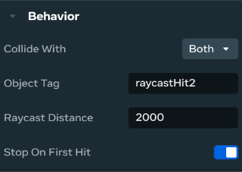

# [Raycast gizmo](#raycast-gizmo)

The raycast gizmo is one of many gizmos in Meta Horizon Worlds that’s designed to enhance the creator’s ability to build interactive and dynamic worlds. This topic focuses on the experience of using a raycast gizmo in the [desktop editor](../Get%20started/Install%20the%20desktop%20editor.md), introduces the gizmo’s properties and expected behavior, and then highlights the [Raycast gizmo APIs](../Reference/core/Classes/RaycastGizmo.md).

First of all, raycasting is the act of projecting a virtual laser beam from a location towards a direction and finding the first thing that it collides with such as a player or an object. If a collision is detected, information about the collision is returned. The act of casting a ray into the world is called raycast.

To cast a ray in Meta Horizon Worlds, use a raycast gizmo that projects a beam into the world. Whenever the ray collides with an object, information about the object is returned. While commonly used in shooting games, raycast gizmos can also be used for other purposes such as determining line of sight.

## [Limitations](#limitations)

Raycasting too often in a short period of time can hurt performance.

## [Access the raycast gizmo](#access-the-raycast-gizmo)

In the Meta Horizon Worlds desktop editor, do the following to access the raycast gizmo:

1. In the desktop editor while in **Build** mode, select **Build** > **Gizmos** from the menu bar, search for “Raycast” in the search field.
2. Select **Raycast** to drag it into the scene.
3. You can now edit the new gizmo properties in the **Properties** panel.

## [Raycast gizmo properties](#raycast-gizmo-properties)

Whenever a collision event occurs when the ray is projected into the world, the information returned about the object depends on the configuration in **Properties**. You can filter collision events by configuring **Collide With**, or by adding an additional condition when using **Object Tagged**.



In the **Collide With** field, you can choose between **Players**, **Object Tagged** or **Both**. Remember that whenever **Object Tagged** is chosen, the [tag](../Reference/core/Classes/Entity.md#properties) needs to be provided in the **Object Tag** field. The raycast will then return hits for objects with matching tags.

The following lists the types of target that the raycast will return depending on the level of filtering you’ve configured for your collision events:

- If you choose **Players**, the raycast returns a hit when it collides with a player.
- If you choose **Object Tagged**, the raycast returns a hit when it collides with an object with the matching tag.
- If you choose **Both**, the raycast returns a hit when it collides with both players and objects with matching tags.

The **Raycast Distance** field specifies the maximum distance, in meters, within which the raycast can register a hit.

If **Stop On First Hit** is enabled when the ray collides with an object that does not have the tag specified in **Object Tagged**, the raycast registers the hit as a miss by returning a static empty hit. This simulates how collision events would naturally occur, and the ray would appear as blocked. If **Stop On First Hit** is disabled, the ray will continue within its maximum distance until it hits an object that satisfies the specified conditions.

You can also use [Raycast gizmo API](../Reference/core/Classes/RaycastGizmo.md) to define the properties.

| Property          | Type                                   | Description                                                                                                                                                                          |
| ----------------- | -------------------------------------- | ------------------------------------------------------------------------------------------------------------------------------------------------------------------------------------ |
| Collide With      | `Players`, `Objects Tagged`, or `Both` | Sets which [collision layer(s)](../Reference/core/Enumerations/LayerType.md) the raycast will interact with.                                                                         |
| Object Tag        | `string`                               | When the **Collide With** property is **Objects Tagged** or **Both** this specifies which [entity tag](../Reference/core/Classes/Entity.md#properties) the raycast will activate on. |
| Raycast Distance  | `number`                               | The maximum distance, in meters, that the ray should travel before concluding it didn’t hit anything.                                                                                |
| Stop On First Hit | boolean                                | When enabled, the raycast stops upon colliding with the first object.                                                                                                                |

Raycast gizmos are referenced using the [as()](../Reference/core/Classes/Entity.md#methods) method, for example:

```typescript
    const laserGizmo = this.props.laserProjector.as(RaycastGizmo);
```

The result of the raycast collision is [RaycastHit](../Reference/core/Type%20Aliases/RaycastHit.md) with the [target types](../Reference/core/Enumerations/RaycastTargetType.md), Entity, Player, and Static, during the raycast collision.

## [What’s next?](#whats-next)

Try the following tutorial worlds with code samples and related guides:

- [Simple shooting mechanics](../Tutorials/Feature%20samples/Simple%20shooting%20mechanics%20tutorial/Module%204%20-%20Laser%20Gun.md#raycast-gizmo)
- [Use tap inputs to interact with a keypad](../Tutorials/Feature%20samples/Developing%20for%20web%20and%20mobile%20players%20tutorial/Module%207C%20-%20Use%20tap%20inputs%20to%20interact%20with%20a%20keypad.md)
- [Meta Horizon Creator Program creators manual](https://github.com/MHCPCreators/horizonCreatorManual/blob/main/HorizonTechnicalDoc.md#raycast-gizmo)

