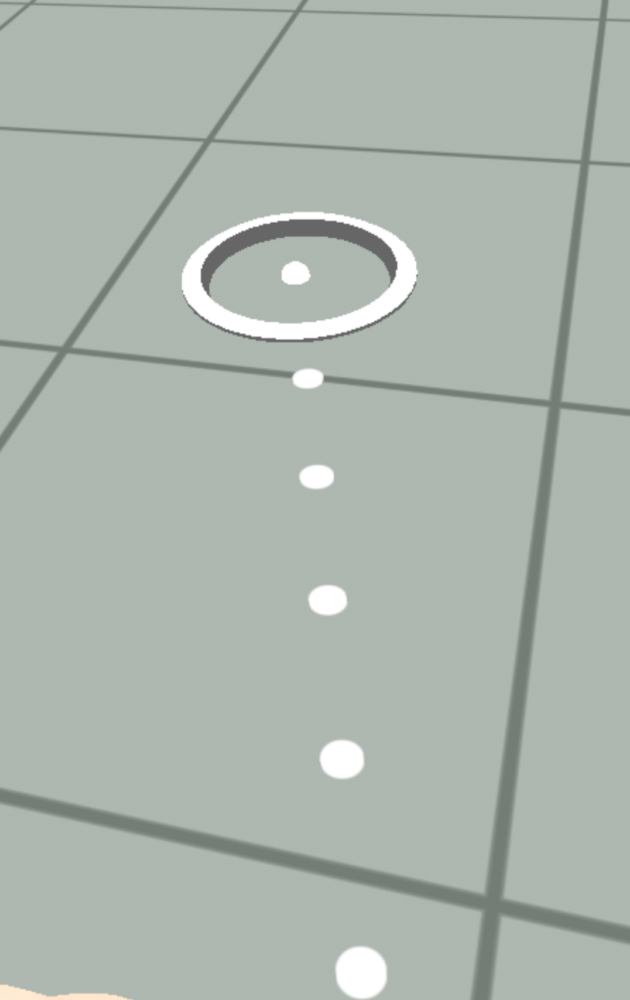

# [Snap destination gizmo](#snap-destination-gizmo)

The snap destination [gizmo](About%20gizmos.md) is a helper tool used by creators to designate specific locations where players’ avatars can snap into place. When players use teleport movement, the aiming circle will automatically snap to the center of the gizmo when the area covered by the gizmo is detected.

The following image shows the aiming circle in [VR](../VR%20tools/Getting%20started/Create%20a%20new%20world%20in%20Meta%20Horizon%20Worlds.md) when the **Movement style** is set to **Teleport** in the Worlds app settings.

## [Access the snap destination gizmo](#access-the-snap-destination-gizmo)

While you can access and configure the gizmos in the [VR tool](../VR%20tools/Getting%20started/Create%20a%20new%20world%20in%20Meta%20Horizon%20Worlds.md), the following steps show you how to access the snap destination gizmo from the desktop editor and add it to the [scene pane](../Desktop%20editor/Get%20started%20with%20Desktop%20Editor/User%20interface/Panels%20and%20Tabs%20in%20the%20desktop%20editor.md#scene-pane).

1. In the desktop editor while in the [Build mode](../Desktop%20editor/Get%20started%20with%20Desktop%20Editor/User%20interface/Build%20and%20Preview%20Modes.md), select **Build** > **Gizmos** from the menu bar, search for “snap destination” in the search field.
2. Select the snap destination gizmo and drag it into the scene.
3. You can now edit the new gizmo properties in the [Properties panel](../Desktop%20editor/Get%20started%20with%20Desktop%20Editor/User%20interface/Panels%20and%20Tabs%20in%20the%20desktop%20editor.md#properties-pane).

## [Properties](#properties)

The snap destination gizmo is an entity. All objects in a world are represented by entities. [Entities](../Reference/core/Classes/Entity.md) have their respective properties such as position, rotation, and scale. In the **Properties** panel, you can edit the gizmo’s transformation fields to configure its **Position**, **Rotation**, and **Scale**.

**Apply Orientation** controls whether the player’s final orientation will be aligned with the gizmo’s orientation.

**Note**: To validate that the snap destination gizmo is working, visit the world with the snap destination gizmo in [VR](../VR%20tools/Getting%20started/Create%20a%20new%20world%20in%20Meta%20Horizon%20Worlds.md). Ensure to set **Movement style** to **Teleport** by going to the Worlds app’s **Settings** > **Gameplay** > **Movement style** > **Teleport**.

When players use teleport movement, the aiming circle will automatically snap to the center of the gizmo when the area covered by the gizmo is detected.

## [What’s next?](#whats-next)

Now that you’ve been introduced to the snap destination gizmo, further your learning with more developer guides:

- [Meta Horizon Creator Program’s creator manual on the snap destination gizmo](https://github.com/MHCPCreators/horizonCreatorManual/blob/main/HorizonTechnicalDoc.md#snap-destination-gizmo)

