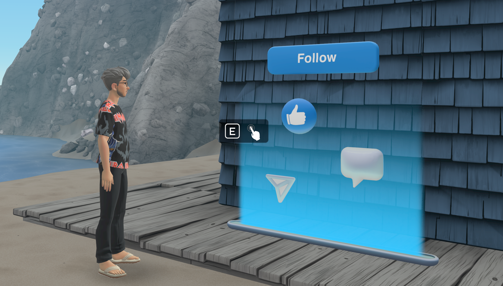
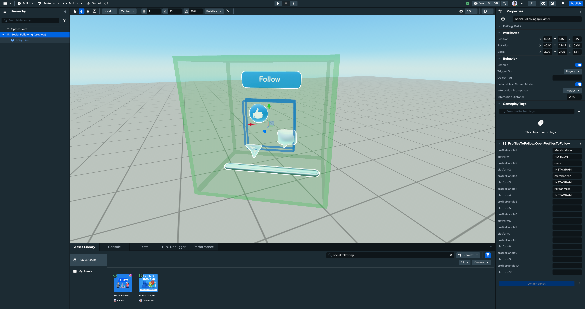
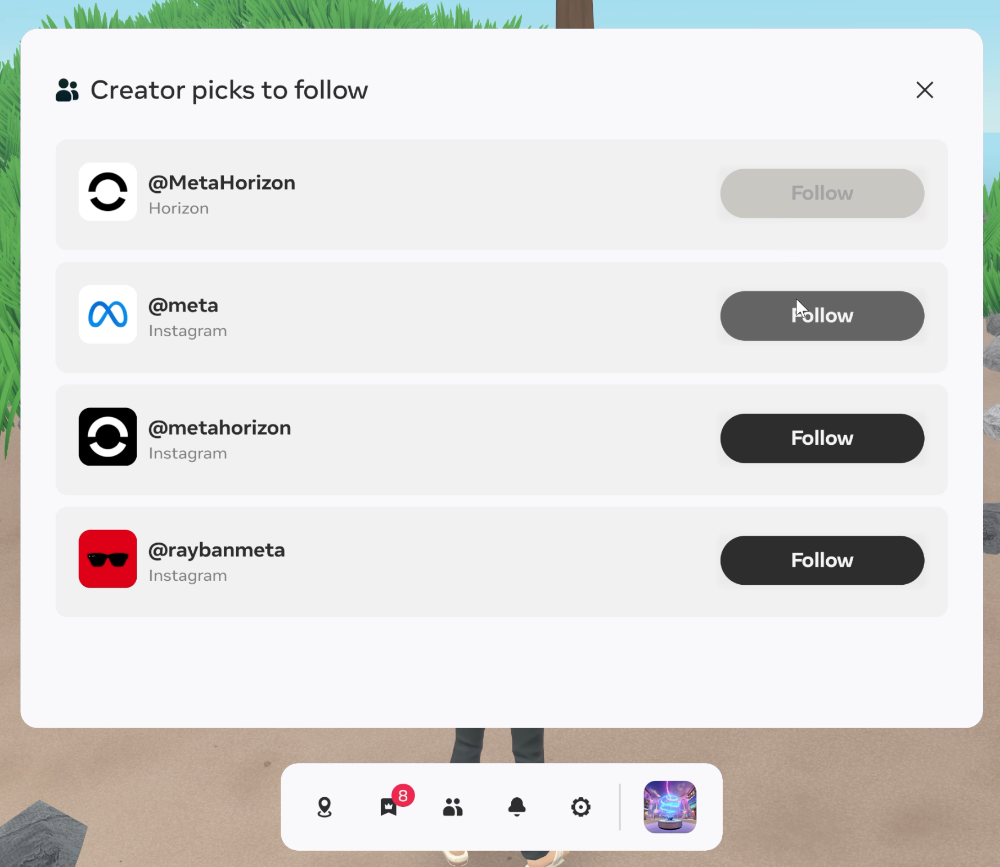

# [Social Following for Instagram and Horizon](#social-following-for-instagram-and-horizon)

## [Overview](#overview)

The new Social Following feature enables Horizon World creators to seamlessly connect and promote their Instagram and Horizon profiles to their Worlds. This allows visitors to easily follow creators’ social accounts directly from within Horizon Worlds, reducing friction and enhancing creator engagement.



## [Key benefits](#key-benefits)

- Increases creators’ social followers and engagement.
- Reduces friction for users to follow creators (no need to remove headset or switch devices).
- Provides a standardized, privacy-respecting way to display and interact with social handles.

## [Feature highlights](#feature-highlights)

- **Asset Template for Social Handles:** Creators can add their Instagram handles and Horizon profiles via an asset template in the HUR editor.
- **In-World Follow Panel:** Users can interact with the asset template in a World, opening a Panel UI (PUI) that displays the creator’s social handles. From here, users can click “Follow” to follow the creator on Instagram or Horizon.

## [How it works](#how-it-works)

### [For creators](#for-creators)

There are 2 ways you can make use of the Social Following feature:

- Using the ready made Social Following asset template, which can be customized.
- Using the [`showProfilesToFollow`](../Reference/social/Classes/Social.md) API in your own assets.

### [Use the Social Following asset template](#use-the-social-following-asset-template)

You can add social handles to your World using the Social Following asset template. To do so, use the following process:

1. In the HUR editor, go to the **Asset Library**.
2. Search for **Social Following** and add the asset to your World.
3. Enter your Instagram handles and/or Horizon profiles in the asset configuration.
4. Save and publish your World.



Once added, the asset template appears as a standardized UI element in your World. Users can view your linked social accounts and follow you with a single click.

### [Use the TypeScript API](#use-the-typescript-api)

For creators who want more control or wish to build custom social experiences, the [`showProfilesToFollow`](../Reference/social/Classes/Social.md) method from `horizon/social` API is now publicly available. This API allows you to show a panel with follow buttons for your social profiles in Instagram and Horizon.

To use the TypeScript API:

1. Import the required modules from `horizon/social`:
   ```
   import
    
   {
    
   Social
   ,
    
   SocialPlatformType
   ,
    
   ProfileToFollow
    
   }
    
   from
    
   "horizon/social"
   ;
   ```
2. Define the profiles you want to promote:
   ```
   const
    profilesToFollow
   :
    
   Array
   <
   ProfileToFollow
   >
    
   =
    
   [

     
   {

       profileHandle
   :
    
   "yourInstagramUsername"
   ,

       platform
   :
    
   SocialPlatformType
   .
   INSTAGRAM
   ,

     
   },

     
   {

       profileHandle
   :
    
   "yourHorizonAlias"
   ,

       platform
   :
    
   SocialPlatformType
   .
   HORIZON
   ,

     
   }


   ];
   ```
3. Show the follow panel to the local player:
   ```
   const
    result 
   =
    
   await
    
   Social
   .
   showProfilesToFollow
   (
   this
   .
   world
   .
   getLocalPlayer
   (),
    profilesToFollow
   );

   console
   .
   log
   (
   `Success: ${result.success}`
   );
   ```

### [For users](#for-users)

Users can follow creators’ social profiles directly from within a World. To do so, use the following process:

1. Approach the Social Following asset in a World.
2. Click the asset to open the follow panel.
3. Click **Follow** for the Instagram or Horizon account you want to follow.



Users will follow the Instagram accounts using their linked Instagram in their Meta Accounts.

## [Frequently Asked Questions](#frequently-asked-questions)

**Q: Can I link more than one social account?**\
**A:** Yes, you can link both Instagram and Horizon accounts. Only public accounts are supported.

**Q: What if a user doesn’t have a linked social account?**\
**A:** Following is only available for users who have linked their accounts (Instagram and Horizon) in their Meta Account center.

**Q: Is this feature available on all platforms?**\
**A:** The feature is available to all users in VR, desktop, and mobile (via the Meta Horizon App).

**Q: Can I link Facebook accounts or pages, or Discord servers, so users can follow those?**\
**A:** We are actively exploring other links to support to help creators build their communities.

