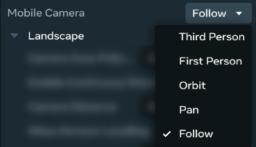
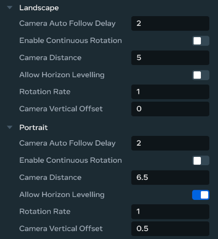

# Spawn point gizmo

In Meta Horizon Worlds, a spawn point refers to a designated location within a virtual environment where [entities](../Reference/core/Classes/Entity.md) such as players, enemies, and NPCs appear or spawn when they enter the world. These spawn points are important for managing entities’ entry and movement within the game.

The spawn point [gizmo](About%20gizmos.md), is a helper tool that you can use to enhance the creation and interactivity of worlds. In the desktop editor, it is a visual representation of a spawn point with editable options for adjusting properties such as position, rotation, and scale. You can also use the [SpawnPointGizmo API](../Reference/core/Classes/SpawnPointGizmo.md) to facilitate the management of spawn points such as [respawn](../MHCP%20program/Community%20guides/CodeBlocks%20to%20TypeScript.md#simplerespawnscriptts). Additionally, when developing for mobile and web platforms, the spawn point gizmo can be configured to control [player camera’s point of view](../Tutorials/Feature%20samples/Developing%20for%20web%20and%20mobile%20players%20tutorial/Module%204%20-%20Camera%20Manager.md#spawnpoint-camera-control).

**Note:** While you can access and use spawn point gizmo in the [VR tool](../VR%20tools/Getting%20started/Create%20a%20new%20world%20in%20Meta%20Horizon%20Worlds.md), this introductory topic to spawn point gizmo focuses on the creator experience in the [desktop editor](../Get%20started/Install%20the%20desktop%20editor.md).

## Limitations

When the entity is teleported to another location, a transition scene may be included. The use of this gizmo may also affect camera view, player gravity, and speed.

## Access and use the spawn point gizmo

In the Meta Horizon Worlds desktop editor, do the following to access the spawn point gizmo:

- In the desktop editor while in Build mode, select **Build** > **Gizmos** from the menu bar, search for “spawn point” in the search field.
- Select the spawn point gizmo and drag it into the scene.
- You can now edit the new gizmo properties in the **Properties** panel.

## Spawn point properties

The spawn point gizmo properties can be configured in the [Properties panel](../Desktop%20editor/Get%20started%20with%20Desktop%20Editor/User%20interface/Panels%20and%20Tabs%20in%20the%20desktop%20editor.md#properties-pane) of the desktop editor or through [scripting](../Scripting/Get%20started%20with%20TypeScript/Using%20TypeScript%20in%20Meta%20Horizon%20Worlds.md).

### Mobile camera options

The spawn point gizmo includes enhanced camera options for mobile and web platforms. These options enable fine-tuning of the camera behavior based on how players will be viewing the world, ensuring optimal visual presentation regardless of device orientation.

* **Mobile Camera**: A mobile-specific setting which allows you to configure camera behavior. This can greatly improve the accessibility to your world for mobile users.

  
* **Portrait/Landscape separation**: You can define different visual parameters for each orientation to optimize the player experience across different device orientations

  

## Preview and publishing configuration

### Preview orientation simulation

When testing your world in the desktop editor, you can simulate different device orientations:

- In [**Preview Configuration**](../Desktop%20editor/Get%20started%20with%20Desktop%20Editor/Preview%20mode.md#setting-the-preview-device) options, locate the **Preview orientation** setting under **Mobile and Web device simulations**.
- Change the setting to **Portrait** to simulate how the world appears in portrait orientation.
- This allows you to test and validate your spawn point camera configurations before publishing.

### World orientation publishing

When publishing your world, you can specify the target orientation:

- In the [**Publish World**](../Desktop%20editor/Settings/World%20Settings%20Modification.md#changing-world-settings) panel, navigate to the **Advanced** section.
- Set the **World Orientation** option to **Portrait** to mark your world for portrait orientation.
- Use **Save for later** to prepare your world configuration without immediately publishing.

**Note:** Setting the world orientation to **Portrait** will automatically expand the Portrait orientation options in the **Spawn point Gizmo** properties by default.

## Scripting

To govern entity lifecycles throughout the game and implement more complex and dynamic behaviors, use Meta Horizon Worlds [SpawnPointGizmo API](../Reference/core/Classes/SpawnPointGizmo.md). See [tutorial worlds](../Tutorials/Getting%20started/Getting%20started%20with%20tutorials/Tutorial%20Prerequisites.md) for complete code samples and follow the [companion documentation](../Tutorials/Getting%20started/Getting%20started%20with%20tutorials/Access%20Tutorial%20Worlds.md#in-the-desktop-editor) for an in-depth explanation of the implementation details.

### Portrait camera API

For advanced orientation-based camera control, you can use the experimental Portrait Camera API through scripting:

- In **Script Settings**, access the `horizon/portrait_camera` API module.
- The `PortraitCamera` class extends the standard `Camera` class with a `currentOrientation` property.
- This property returns either **PORTRAIT** or **LANDSCAPE** based on the current simulation settings.

**Note:** This is an experimental module that will be merged into the core Camera API when fully released.

#### Example usage

```
import * as hz from 'horizon/core';
import {CameraOrientation, PortraitCamera} from 'horizon/portrait_camera';

class OrientationChecker extends hz.Component<typeof OrientationChecker> {
  static propsDefinition = {};

  start() {
    this.connectCodeBlockEvent(
      this.entity,
      hz.CodeBlockEvents.OnPlayerEnterWorld,
      (player: hz.Player) => {
        this.entity.owner.set(player);
      },
    );

    if (this.entity.owner.get().id != this.world.getServerPlayer().id) {
      this.setUpCamera();
    }
  }

  setUpCamera() {
    let cam = new PortraitCamera();
    if (cam.currentOrientation.get().toString() == 'PORTRAIT') {
      // Configure portrait-specific camera behavior
      console.log('Portrait Options');
    } else {
      // Configure landscape-specific camera behavior
      console.log('Landscape Options');
    }
  }
}
hz.Component.register(OrientationChecker);
```

**Important:** Scripts using this API must be set to Local execution mode and owned by the target player, similar to existing camera checks.

## What’s next?

Now you’ve been introduced to the spawn point gizmo, further your learning with hands-on tutorials, tutorial worlds with completed samples, and developer guides:

* [Create your first world tutorial: designate a spawn point](../Tutorials/Getting%20started/Create%20your%20first%20world%20tutorial,%20part%201.md#section-2-place-assets-in-the-scene)
* [Simple respawn script](../MHCP%20program/Community%20guides/CodeBlocks%20to%20TypeScript.md#simplerespawnscriptts)
* [Multiplayer lobby entering the match](../Tutorials/Feature%20samples/Multiplayer%20lobby%20tutorial/Module%205%20-%20Entering%20the%20Match.md)
* [Chop’N pop](../Tutorials/Genre%20samples/Chop%20N%20Pop%20sample%20world/Module%201%20-%20Setup.md)
* [Rooftop racer](../Tutorials/Genre%20samples/Horizon%20traversal%20sample%20world/Module%201%20-%20Setup.md)
* [Set initial PlayerCamera point of view](../Tutorials/Feature%20samples/Camera%20api%20examples%20tutorial/Module%202%20-%20PlayerCamera%20Overview.md#set-initial-playercamera-point-of-view)
* [Meta Horizon Creator Program creators manual](https://github.com/MHCPCreators/horizonCreatorManual/blob/main/HorizonTechnicalDoc.md#spawn-point-gizmo)
* [Object spawning](../Tutorials/Feature%20samples/Spawning%20and%20pooling%20in%20typescript/Module%201%20-%20Setup.md)