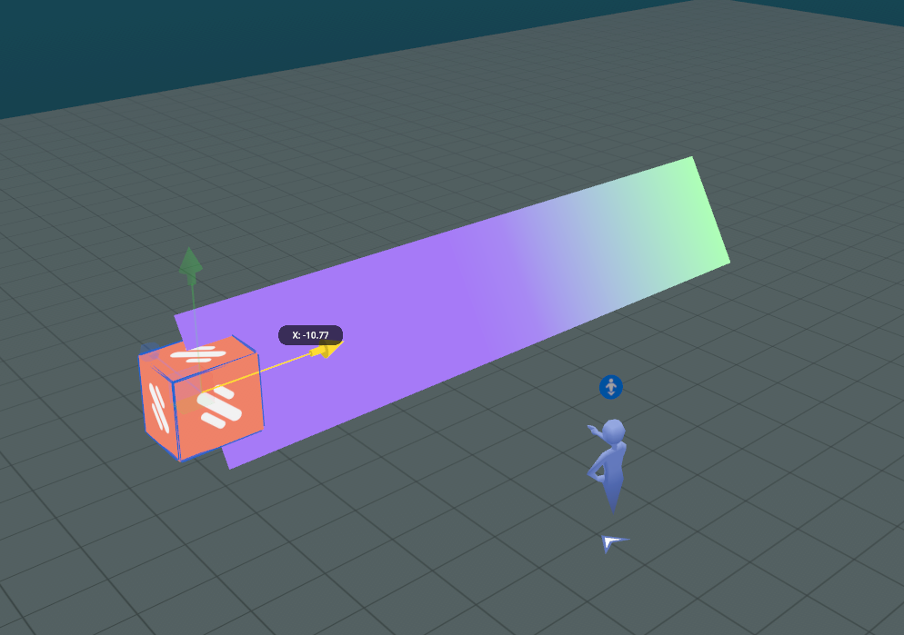
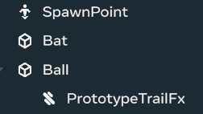
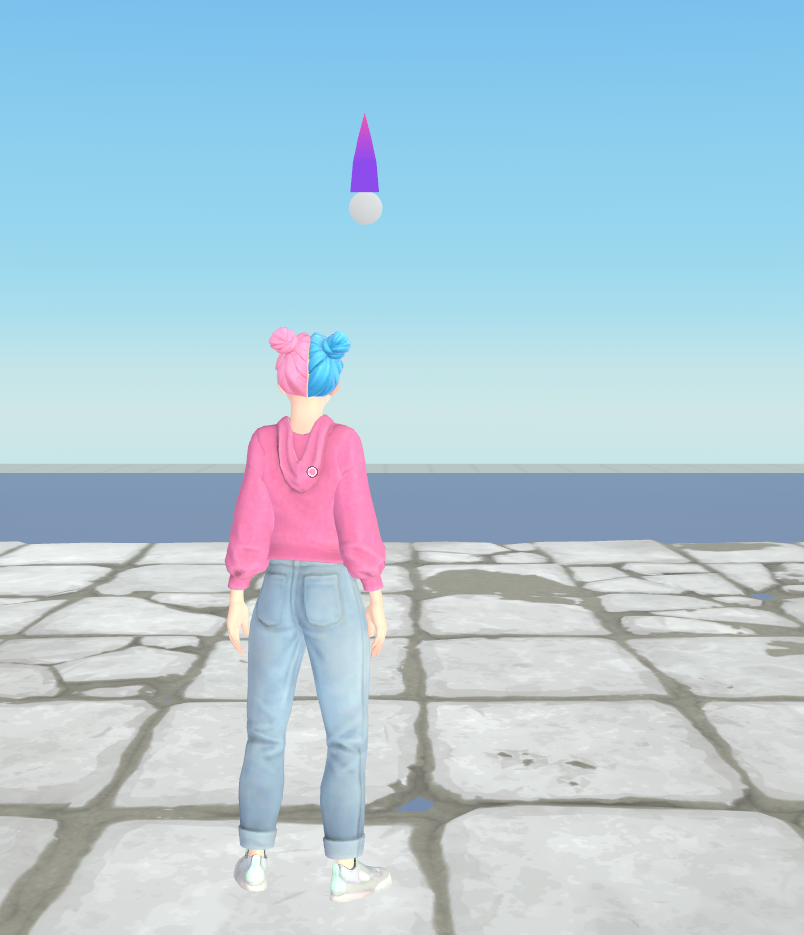

# [TrailFx gizmo](#trailfx-gizmo)

The TrailFx [gizmo](About%20gizmos.md) is a tool designed to simplify the addition of visual effects, specifically trailing effects to moving objects in a virtual world. When the TrailFX gizmo is active, it creates a visual trail that follows the gizmo as it moves. This gizmo is intended to enhance the visual effects, making worlds more immersive and engaging.

## [Limitations](#limitations)

There are [limitations](https://github.com/MHCPCreators/horizonCreatorManual/blob/main/HorizonTechnicalDoc.md#trailfx-gizmo) to the TrailFx gizmo. Using it sparingly to avoid [performance](../Performance/Performance%20best%20practices/CPU%20and%20TypeScript%20optimization%20and%20best%20practices.md) issues is recommended.

## [Access the TrailFx gizmo](#access-the-trailfx-gizmo)

While you can access and configure the gizmos in the [VR tool](../VR%20tools/Getting%20started/Create%20a%20new%20world%20in%20Meta%20Horizon%20Worlds.md), the following steps show you how to access the TrailFx gizmo from the desktop editor and add it to the [scene pane](../Desktop%20editor/Get%20started%20with%20Desktop%20Editor/User%20interface/Panels%20and%20Tabs%20in%20the%20desktop%20editor.md#scene-pane).

1. In the desktop editor while in the Build mode, select **Build** > **Gizmos** from the menu bar, search for “trailfx” in the search field.
2. Select the TrailFx gizmo and drag it into the scene.
3. You can now edit the new gizmo properties in the [**Properties panel**](../Desktop%20editor/Get%20started%20with%20Desktop%20Editor/User%20interface/Panels%20and%20Tabs%20in%20the%20desktop%20editor.md#properties-pane).

## [Properties](#properties)

The TrailFx gizmo is an entity. All objects in a world are represented by entities. [Entities](../Reference/core/Classes/Entity.md) have their respective properties such as position, rotation, and scale. In the **Properties** panel, you can edit the gizmo’s transformation fields to configure its **Position**, **Rotation**, and **Scale**.

In the **Visual** section, additional properties are available to customize the TrailFx gizmo.

**Play on Start** controls whether the TrailFx gizmo auto-starts the effect when the world starts.

**Length**, **Width**, **Start Color**, **End Color** and **Preset** control the appearance and style of the TrailFx gizmo. The **Preset** dropdown menu allows you to select from three types of trails: **Default**, **Simple** or **Tapered**.

**Preview** allows creators to see how the trail effect while still in the [Build Mode](../Desktop%20editor/Get%20started%20with%20Desktop%20Editor/User%20interface/Build%20and%20Preview%20Modes.md). This feature is particularly useful for fine-tuning the visual aspects of the trail effect during the building phase. Click **Play** to start the preview. Click **Stop** to stop the preview.

**Note**: For more information on the TrailFx gizmo properties, see the [MHCP creator’s manual](https://github.com/MHCPCreators/horizonCreatorManual/blob/main/HorizonTechnicalDoc.md#trailfx-gizmo).

The following image shows how the **Preview** property works while you’re in the [Build mode](../Desktop%20editor/Get%20started%20with%20Desktop%20Editor/User%20interface/Build%20and%20Preview%20Modes.md). Once the TrailFx gizmo is configured with a simple trail in colors of purple and green, click **Play** next to **Preview**. You can [move](../Desktop%20editor/Get%20started%20with%20Desktop%20Editor/User%20interface/Object%20tools.md#move) the gizmo manually to see the trailing effect.

The following images show the TrailFx gizmo at work while you’re in the [Preview mode](../Desktop%20editor/Get%20started%20with%20Desktop%20Editor/User%20interface/Build%20and%20Preview%20Modes.md) with **Play on Start** turned on. The shape and the color of the trail are configured as **Tapered** with colors of purple and pink.

**Note**: To reproduce what you see in the image below, create a world by first following the [Batting cage tutorial](../Tutorials/Adding%20and%20manipulating%20objects%20tutorial.md) and then add a TrailFx gizmo as a [child object](../Desktop%20editor/Objects/Object%20hierarchy%20and%20groups.md) of the ball in the [**Hierarchy** panel](../Desktop%20editor/Hierarchy%20window/Hierarchy%20panel%20overview.md). [Adjust the position](../Desktop%20editor/Get%20started%20with%20Desktop%20Editor/User%20interface/Object%20tools.md#move) of the TrailFx gizmo so that it appears to be trailing the ball.

## [Scripting](#scripting)

To customize the TrailFx gizmo through scripting, see the [TrailGizmo](../Reference/core/Classes/TrailGizmo.md) API.

## [What’s next?](#whats-next)

Now that you’ve been introduced to the TrailFx gizmo, further your learning with related developer guides:

- [Meta Horizon Creator Program’s creator manual on the TrailFx gizmo](https://github.com/MHCPCreators/horizonCreatorManual/blob/main/HorizonTechnicalDoc.md#trailfx-gizmo)
- [Batting cage](../Tutorials/Adding%20and%20manipulating%20objects%20tutorial.md)

