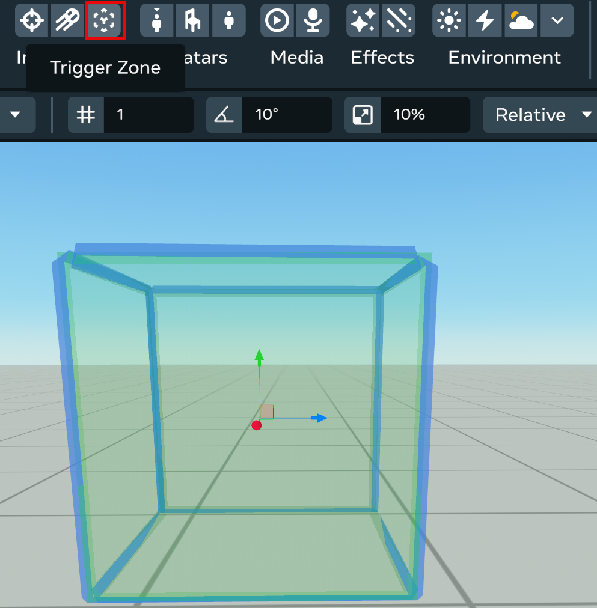

# [Trigger zone gizmo](#trigger-zone-gizmo)

The trigger zone [gizmo](About%20gizmos.md) triggers an event when you enter or exit a specified area.



## [Use the trigger zone gizmo](#use-the-trigger-zone-gizmo)

1. From the Build list, select **Gizmos**.
2. Select **Trigger zone** icon.
3. Under **Hierarchy**, right-click **Trigger** and select **Rename**, then rename the trigger zone to something that describes its purpose.

> [!Note]
>
> Renaming the trigger zone is optional, but it helps you track the zone’s purpose.

1. While the trigger zone is selected, you can edit its parameters in the **Properties** panel.

## [Things to remember](#things-to-remember)

- Each trigger can be activated by either players or objects, but not both. If **Triggered By** is set to **Players**, any player in the world can activate the Trigger.
- You can control which specific players can trigger the zone using the `setWhoCanTrigger()` method in TypeScript.
- If **Triggered By** is set to **Objects Named...**, you must fill out the **Triggered by Objects Named** field. This field currently accepts only one name, and any object with that name can activate the trigger.
- Objects may only have one name (or one word as a name), but multiple objects can share the same name. Adjust the trigger area size using the handles, just like other shapes.
- Use `enabled.set(false)` to temporarily disable a trigger zone without removing it from your world.

## [Use the gizmo with TypeScript](#use-the-gizmo-with-typescript)

Through TypeScript, you can monitor and respond when players enter or exit a Trigger Zone gizmo in your world. Create listeners for these trigger zone-specific CodeBlockEvents:

- `onPlayerEnterTrigger`
- `onPlayerExitTrigger`

You can also programmatically control trigger zones using the TriggerGizmo class, which provides:

- `setWhoCanTrigger()` - Control which specific players can activate the trigger
- `getWhoCanTrigger()` - Check which players currently have access to the trigger
- `enabled` - Enable or disable the trigger zone dynamically

CodeBlockEvents are platform-emitted events for key runtime functionality, including gizmo activities.

- For more information on CodeBlockEvents, see [CodeBlock Events](../Scripting/Events/CodeBlock%20Events.md).
- For API docs on CodeBlockEvents, see [CodeBlockEvents](https://horizon.meta.com/resources/scripting-api/core.codeblockevents.md/).
- For specific documentation on the TriggerGizmo API, see [TriggerGizmo class](../Reference/core/Classes/TriggerGizmo.md).

The following script can be attached to a Trigger Zone entity that you have deployed in your world:

```
import
 
*
 
as
 hz 
from
 
'horizon/core'
;


class
 
TriggerMe
 
extends
 hz
.
Component
<
typeof
 
TriggerMe
>
 
{


  start
()
 
{

    
// this listener for the CodeBlockEvent onPlayerEnterTrigger is fired

    
// when a player enters the trigger.

    
this
.
connectCodeBlockEvent
(
this
.
entity
,
 hz
.
CodeBlockEvents
.
OnPlayerEnterTrigger
,
 
(
enteredby
:
hz
.
Player
)=>{

      
this
.
world
.
ui
.
showPopupForEveryone
(
"You dare enter the Trigger of Doom, "
 
+
 enteredby
.
name
.
get
()
 
+
 
"?!?!"
,
 
3
)

    
});


    
// this listener for the CodeBlockEvent onPlayerExitTrigger is fired

    
// when a player exits the trigger.

    
this
.
connectCodeBlockEvent
(
this
.
entity
,
 hz
.
CodeBlockEvents
.
OnPlayerExitTrigger
,
 
(
exitedBy
:
hz
.
Player
)=>{

      
this
.
world
.
ui
.
showPopupForEveryone
(
"See you, "
 
+
 exitedBy
.
name
.
get
()
 
+
 
"."
,
 
2
)

    
});


  
}


}

hz
.
Component
.
register
(
TriggerMe
);
```

The above script defines two event listeners (`this.connectCodeBlockEvent`), one for each CodeBlockEvent for the trigger. Since this script is attached to the trigger zone entity, these listeners activate when the `enteredby` player enters or exits the trigger zone.

In the `onPlayerEnterTrigger` listener, a popup is displayed for everyone in the world with a message.

In the `onPlayerExitTrigger` listener, a new popup is displayed for everyone in the world with a different message.

