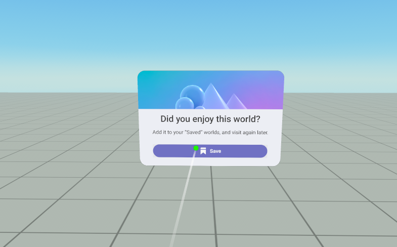
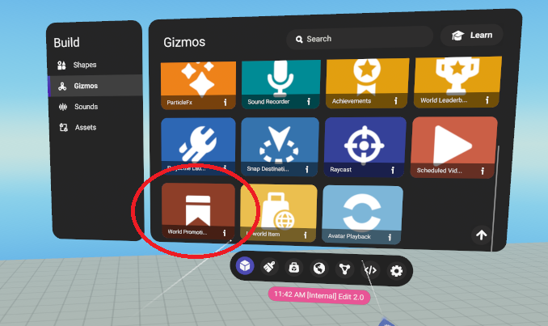
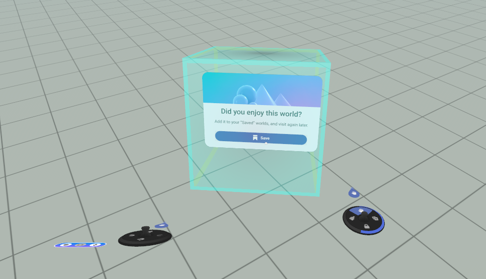
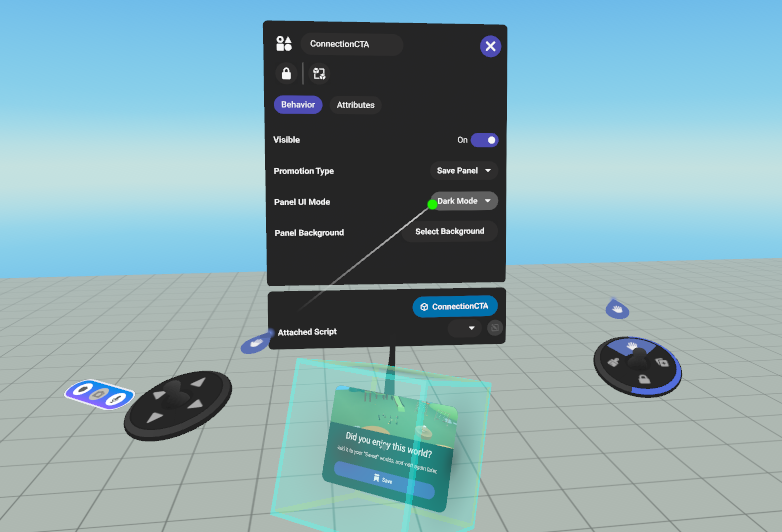

# [World Promotion Gizmo](#world-promotion-gizmo)

## [Feature Overview](#feature-overview)

You can place the World Promotion Gizmo in your worlds to make it easier for visitors to save a world, especially contextually when the visitor is in the world. Visitors to the world can save the world and later return to it using the **saved worlds icon** in their **Player User Interface** (PUI).

## [Experiment Status](#experiment-status)

This feature is experimental:

- Only 50% of users in the world will be able to see the gizmo.
- This experiment will last for 4 weeks. After the experiment concludes, the product team will rollback this feature and assess the effectiveness of the World Promotion Gizmo. This feature is subject to change and it is not guaranteed that this feature will be released beyond this experiment.

## [Guidelines for Implementation](#guidelines-for-implementation)

- The World Promotion Gizmo should be incorporated into 2-4 worlds; one of those worlds should statistically be your most popular and retentive world.
- Put the gizmo in an obvious place near the spawning point so that visitors will see it upon traveling to your world. This will help us gather the most accurate experiment data and make a shipping decision.
- Do not put any extra objects around the gizmo, for example explanatory texts or visual effects around the panel as they will confuse users who cannot see the gizmo.

## [Creating a World Promotion Gizmo](#creating-a-world-promotion-gizmo)

1. Access the Build panel in your Creator User Interface (CUI). Within the Gizmos tab, you should see a “World Promotion Gizmo”. 
2. Drag and drop the gizmo into your world. Scale and place it where desired. 

Open the **properties** panel. You can customize the header image or change the panel to the dark theme to better suit the style of your world. 

