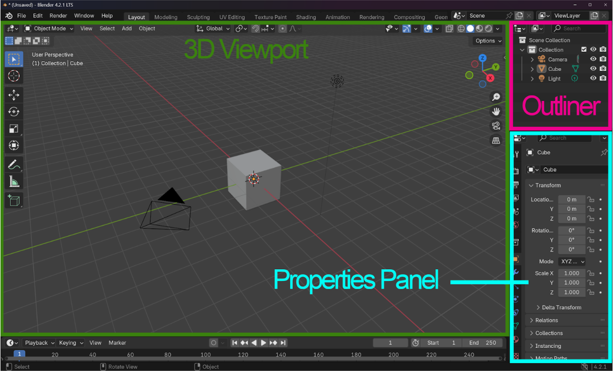
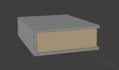
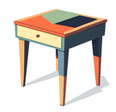
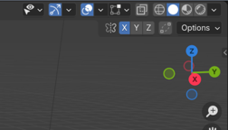
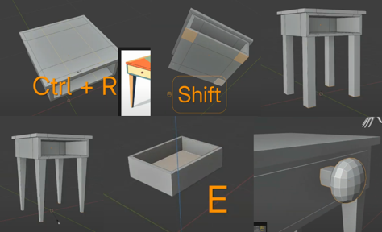
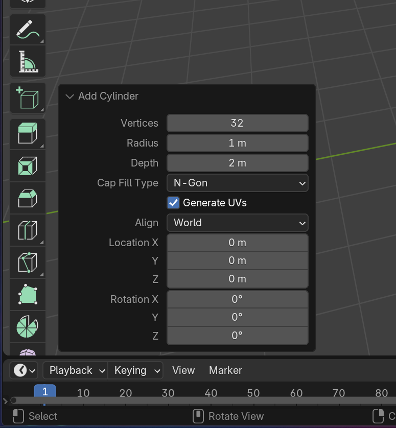
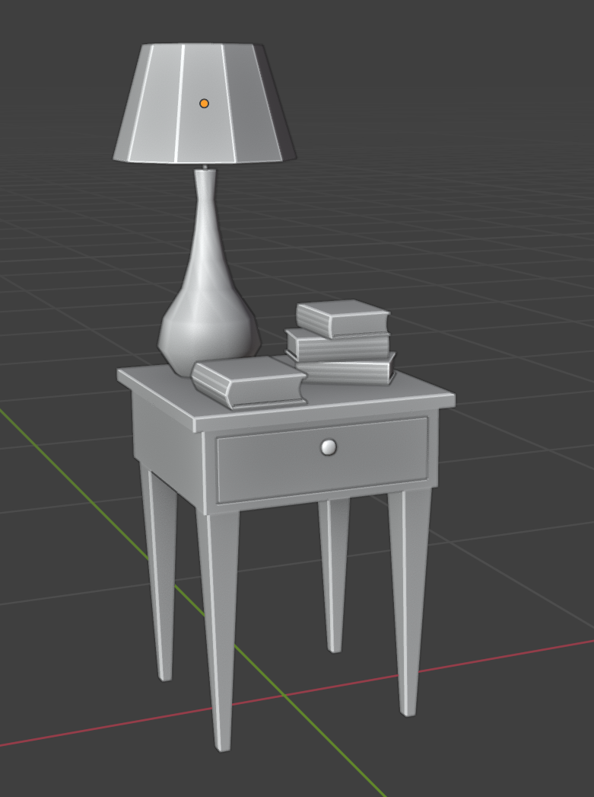
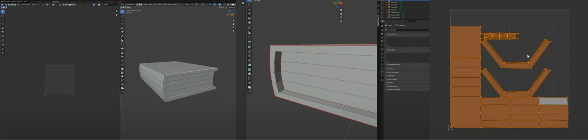

# [Blender basics and UV unwrapping with SpaceGlitterUnicorn](#blender-basics-and-uv-unwrapping-with-spaceglitterunicorn)

**Author**: SpaceGlitterUnicorn **Date**: August 2024

## [Introduction](#introduction)

This tutorial covers fundamental concepts in Blender, including 3D modeling, essential hotkeys, and UV unwrapping techniques. Following the steps outlined, you will learn how to create a simple book, table, and lamp, applying foundational skills in modeling and texturing.

🎥 Short videos are included throughout the written instructions to help you follow along.

**Creator Skill Level** Beginner

**Recommended Background Knowledge** Basic knowledge of the blender interface is good, but not required.

**Description**

This tutorial is focused on creating three simple objects: a book, a side table, and a lamp. Each object will be modeled step-by-step, followed by UV unwrapping to prepare the models for texturing. You will learn the essentials of Blender, including navigation, key hotkeys, and 3D modeling techniques. Throughout the tutorial, you will learn how to mark seams, unwrap meshes, and prepare for applying materials to the models. By the end, you will gain a solid understanding of basic 3D modeling and UV unwrapping in Blender, getting you started on future projects.

**Learning Objectives**

By reading and reviewing this written guide you will be able to:

- Understand Blender’s Interface:
  - Navigate the Blender workspace, including the 3D Viewport, Outliner, and Properties Panel.
- Master Basic 3D Navigation and Hotkeys:
  - Use essential Blender hotkeys (G, S, R, E) for moving, scaling, rotating, and extruding objects.
- Create Simple 3D Models:
  - Model a book, side table, and lamp using basic geometric shapes like cubes, cylinders, and cones.
- Apply UV Unwrapping Techniques:
  - Mark seams and unwrap 3D models for texturing purposes.
- Understand the Importance of UV Maps
  - Learn how UV maps work and why UV unwrapping is crucial for texturing in 3D modeling.

## [Learning the Blender Interface](#learning-the-blender-interface)

In this section, you will become more familiar with the basic interface, which includes:

- 3D Viewport
  - The 3D viewport in Blender is a 2D rectangle that allows users to visualize and interact with a 3D scene. It’s the main view that users see when they start Blender and is used for a variety of purposes, including modeling, animation, and texture painting.
- Outliner
  - The Outliner is the list of items in your blender file, such as mesh items, lights, materials, etc. This is where you will see your scene collections.
- Properties Panel
  - The Properties Panel in Blender is a user interface element that displays and allows editing of active data, such as the scene and object. The panel has several categories, or tabs, that group properties and settings by data type.

**Mentor’s Note:** The best thing to do is to get familiar with these main areas. Explore and toggle all of the functions and see what they do!

## [Basic Navigation & Hotkeys](#basic-navigation--hotkeys)

Understanding basic Blender navigation and hotkeys is crucial for efficient workflow, allowing you to quickly manipulate objects, change camera angles, and access tools without relying solely on the mouse, significantly speeding up your 3D modeling, animation, and editing process; essentially, memorizing these key commands lets you work intuitively and seamlessly within the Blender interface, maximizing your creative productivity.

The quick examples are:

**Basic Navigation:**

- **Zoom**: Scroll wheel.
- **Pan**: Shift + middle mouse button.
- **Orbit**: Middle mouse button.

**Hotkeys Essentials:** Quick access to frequently used functions.

- **Move**: G
- **Rotate**: R
- **Scale**: S
- **Extrude**: E
- **Duplicate**: Shift + D
- **Undo**: Ctrl + Z

Here’s a [PDF with a full list of Basic Navigation and Hotkey Essentials](Basic%20Hotkey%20Guide%20to%20the%20Blenderverse.md).

**Basic Navigation and Hotkeys video walkthrough:**

<video controls></video><source src="(BROKEN_REF)" type="video/mp4">

## [Asset 1: Create a Book](#asset-1-create-a-book)

Follow the steps below to create your first 3D asset:

**Mentor’s Note:** Always use references when modeling. I have included my reference image of a book above.

### [Book Asset Creation: A Step-by-Step Guide](#book-asset-creation-a-step-by-step-guide)

1. **Add a Cube**: Press **Shift + A** and select **Cube**.
2. **Scale the Cube**: Use the **S** key to shape the cube into a rectangular book shape. Utilizing the **X** and **Y** axis to guide your scaling
3. **Extruding:** In face select mode, Select where the book covers would be; front and back. Then select the spine. Press **E** to extrude.
4. **Inset:** Staying in face select mode, now you will select where the pages will go. Press **I** to inset.

These guidelines will help you Model your book.

**Create a Book video walkthrough:**

<video controls></video><source src="(BROKEN_REF)" type="video/mp4">

### [Asset 2: Make That Table](#asset-2-make-that-table)

This section will explore a more advanced technique to elevate your project.

**Mentor’s Note:** Save a lot. Save Often. Make it a habit to constantly save your progress. If you like what you made, **Press Save**!

### [Table Asset Creation: A Step-by-Step Guide](#table-asset-creation-a-step-by-step-guide)

1. **Start with a cube**: Press **Shift + A** and choose **Mesh > Cube**.

2. **Scaling and Shaping**: Use the **S** key to resize the cube to the desired table size.

3. **Extruding:** Pressing **TAB** to go into edit mode, choose the face select tool, and select the top face. Press **E** to extrude by the\*\* Z\*\* axis. That will be your tabletop. You will use these same steps to create a drawer in the front face, Including\*\* I\*\* for Inset.

4. **Creating Table Legs and adding edge loops:** Pressing **CTRL-R** to create edge loops to create some geometry for legs.

   - Note: This is a good time to experiment with symmetry, this will help create a more symmetrical and even build. The symmetry gizmo is located on the upper right-hand side of the **3D Viewport** in **Edit mode**.

   The image below will show the symmetry turned on by the X-axis, indicating mirrored actions. Take the time to experiment with symmetry!

   

5. **Make a Drawer:** We’re going to go back to the face we left over specifically to build the drawer.
   - **Extrude Face:** Pressing **E** to extrude, Just enough to fill the space inside the table.
   - **Inset: \*\*Selecting the top face you’re going to press** I \*\*to inset.
   - \*\*Extrude Face: E \*\*Extruding that top face down to create the inside of the drawer.

6. **Make a knob:** Let’s make a quick little knob for the drawer.
   - **Create a Cube: Shift + A** create cube. Here we are going to learn how to create a UV sphere.
   - **Add Modifier:** Here you are going to go to the right and look for the **Modifier tab**, Then select subdivision modifier. Then bring up 2 levels in the level viewport slider. Then Apply.
   - **Extrude and model:** Pressing **X** then the **Y** axix you’re going to squish in the sphere giving it a slight disk shape to form the knob. Selecting the 4 middle faces on one side of the sphere you’re going to **E** extrude outwards creating the stem of the knob.

**Mentor’s Note:** Be sure to make this Build your own and experiment with your own style!

Shown here are the different stages of the table being built! Sometimes it’s good to take a step back and look at the stages from a distance. If it looks close to this, you’re doing great!

**Make that Table video walkthrough:**

<video controls></video><source src="(BROKEN_REF)" type="video/mp4">

## [Asset 3: Brighten Up the Room with a Lamp](#asset-3-brighten-up-the-room-with-a-lamp)

**Mentor’s Note:** Don’t be afraid to experiment by adding additional shapes to form your model.

### [Lamp Asset Creation: A Step-by-Step Guide](#lamp-asset-creation-a-step-by-step-guide)

1. **Base Shape:** Start with a Cylinder by Pressing **Shift + A** and choose **Mesh > Cylinder**.(Be sure to bring down the poly count, there will be a tab in the lower left corner.) Then press **TAB** to jump into edit mode.
2. **Extrude Up:** In face select mode, you will then select the top faces of the cylinder then **E** to extrude up. Alternate pressing **S** for scale to guide the model to the desired shape.
3. **Add More Shapes:** What will your lampshade look like? Following the reference I will then Pressing **Shift + A** and choose **Mesh > Cylinder**. To create the lampshade. Then lower poly count on the lower left of your 3D Viewport. To Taper the lampshade, you will select top faces, and Press **S** to size it down.

After you create your mesh cylinder, this menu pops up on the lower left of your screen. Here you can adjust the vertice count! Keep an eye for these menus that pop up on the lower left, they can be very handy.

1. **Delete Faces and Extrude:** After the lampshade is modeled as desired, you will then delete the top faces on the cylinder and the bottom. Afterwards, Press **A** to select all. Press **E** to extrude.

**Brighten Up the Room With a Lamp Video Walkthrough:**

<video controls></video><source src="../../_assets/videos/de6a16c8e2f35ef5b82f5ed32f7d80ffc8c05557f62c598e26339abfe144fb70.mp4" type="video/mp4">

Cheers! You’ve created your first set of 3D assets!

**Mentor Note:** With these same steps you can easily create your very own set of assets remembering to gather references and start with simple shapes!

Here is what the UV unwrapping stage will look like. It’s very basic and it should get you prepared for texturing! Pretend you’re taking a pair of scissors and cut along seams.

## [Introduction to UV Unwrapping](#introduction-to-uv-unwrapping)

Now that we’ve got our models, let’s talk about UV unwrapping. This process allows us to apply textures to our 3D models.

**Mentor Note:** UV editing in Blender is the process of mapping a 2D image onto a 3D object, which gives the model more realism and control over how textures appear. The UV Editor is used to create and edit UV maps, which are flat areas that show how each face of a 3D object should be textured with a part of the 2D image.

### [Unwrapping the Book Asset: Step-by-Step Guide](#unwrapping-the-book-asset-step-by-step-guide)

1. **UV Editing Mode:** Select the book in object mode and locate the UV editing mode at the top center of the Blender interface. Now that we have the UV tab selected the screens will split. The left side will be the UV viewport, the right will be the 3D viewport.
2. **Mark Seam:** Start by going into edge select mode and selecting the upper corner seams of the book, following your way around that very line. After that has been done press Right Click> Mark Seam, afterward select the inner seam running parallel to the same set of edge loops, and repeat. Creating seams as if you were cutting a pattern on a piece of paper.
3. **Project from View:** Now that all seams have been marked let’s start unwrapping. Press A to select all, This ensures the proper parts are selected to work on. Afterward, on the upper side or the 3D Viewport, Locate the UV drop-down menu and select Project from View.
4. **Unwrap:** On the left-hand side in the UV viewport locate the projected model. Press A to select all. Afterward, Right Click>Unwrap and you will see the book unwrapped flat! In 2D form.

**UV Unwrapping Video Walkthrough:**

<video controls></video><source src="../../_assets/videos/1e7ba2ec22b98bc8dd001e04652c843a8b5051a06044992ee2a7c7e7cdebdd04.mp4" type="video/mp4">

## [Extended Learning](#extended-learning)

Below we have provided challenges for you to implement on your own. The advanced task may require some outside knowledge, and we encourage you to ask questions in Discord if you get stuck or are unsure how to complete any of these.

**Novice**

Create a House! In the tutorial link below, you will dive into learning how to make a structure that would pair nicely with your Book, Table, and Lamp.

<https://youtu.be/qIf1je9OnMI?si=lkBmV4sMsJjLZUlZ>

**Intermediate**

Make a Rocket! This item will explore more tools that will help you create things out of this world!

<https://www.youtube.com/watch?v=04HFOAnCGfI&t=66s>

**Advanced**

The Boss Round- but don’t be scared, the step-by-step tutorial linked below will guide you to create a bigger structure that is perfect for Horizon Living spaces. Make sure you give yourself time to complete this one. You won’t regret it!

<https://www.youtube.com/watch?v=SzYgg6TeDfo&t=7s>

## [Further Assistance](#further-assistance)

For any questions or further assistance, creators are encouraged to join the discussion on the Discord server or to schedule a mentor session for personalized guidance.

