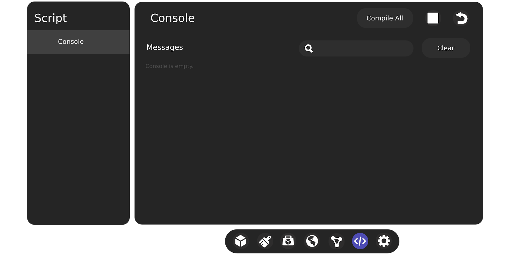
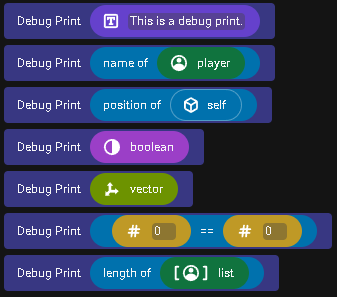
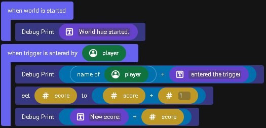

# [Debugging in Meta Horizon Worlds Using Print Codeblocks](#debugging-in-meta-horizon-worlds-using-print-codeblocks)

## [Author: SeeingBlue](#author-seeingblue)

#### [Target Audience](#target-audience)

Beginner to intermediate scripter

#### [Recommended Prerequisite Background Knowledge](#recommended-prerequisite-background-knowledge)

- Beginner understanding of CodeBlock scripting

## [Description](#description)

The Debug Print CodeBlock in Meta Horizon Worlds is a powerful tool for understanding and troubleshooting your scripts. It allows you to print messages to the console from within your scripts, which can help you track your code’s execution and pinpoint where things may not be working as expected. Below is a comprehensive guide tailored for beginner to intermediate scripters on how to use the Debug Print CodeBlock effectively and efficiently.

#### [Learning Objectives](#learning-objectives)

- Understand the function and purpose of the Debug Print CodeBlock in a scripting environment as well as identify where the Debug Print CodeBlock is located within the script editing tools.
- Understand how the Debug Print CodeBlock can be used to output useful information to the debug console for debugging purposes.
- Be able to utilize the Debug Print CodeBlock to confirm code paths and values to track down bugs.

## [Understanding Debug Print](#understanding-debug-print)

The Debug Print CodeBlock outputs a string message to the debug console, which is accessible in the scripting panel of your build menu. This feature is invaluable for debugging because it provides insight into the script’s behavior in real-time.

## [Basic Usage](#basic-usage)

Getting started with the Debug Print CodeBlock is a straightforward yet essential skill for debugging in codeblocks. The following section will guide you through the fundamental steps of utilizing the Debug Print codeblock, from locating and inserting it into your script to customizing messages for comprehensive debugging.

Whether you’re aiming to inspect variable values, verify script execution, or clarify the logic flow within your script, the Debug Print CodeBlock provides a versatile and powerful tool for real-time debugging insights.

#### [Locate the Debug Print CodeBlock](#locate-the-debug-print-codeblock)

In your script, find the Debug Print CodeBlock under the “Values” category. It’s specifically listed under “Debugging.”

#### [Insert the Debug Print](#insert-the-debug-print)

Drag the Debug Print CodeBlock into your script wherever you want to check the value of a variable, see if a part of the script is executed, or confirm the flow of logic.

#### [Customize the Message](#customize-the-message)

You can type any message within the Debug Print CodeBlock. Often, you’ll want to include variable values in your message for inspection. To do this, you can use the “variable as string” codeblock (found under “Type Casting”) to convert variables to strings and append them to your debug message.

## [Tips for Effective Debugging](#tips-for-effective-debugging)

- **Pinpointing Logic Flows**: Place Debug Print statements at different points in your script to see which parts are being executed. This can help you understand the flow of logic and identify where things might be going awry.
- **Variable Inspection**: Frequently print out the values of variables before and after changes. This can help you catch unexpected values or confirm that your code is modifying variables as intended.
- **Conditional Debugging**: Sometimes, you only want a Debug Print to execute under specific conditions. Use Debug Print within an “if” statement to only output messages when certain conditions are met.
- **Iterative Debugging** : In loops or iterative processes, use Debug Print to monitor the loop’s progress or to check values at each iteration. Be cautious, as printing in a high-frequency loop can flood your console.
- **Cleaning Up** : Once you’ve resolved issues, remember to remove or comment out unnecessary Debug Print codeblocks to keep your script clean and efficient.

## [Example Usage](#example-usage)

Imagine you have a script where a variable score is supposed to increment when a player triggers an event, but it’s not working as expected. Here’s how you might use Debug Print to debug this issue:

This setup allows you to see in the console when the world starts, when the trigger event occurs, and what the score is after it’s supposed to have been incremented. If you don’t see “Trigger entered by player,” you know the issue lies with the trigger detection. If the score doesn’t increment as expected, the issue is with how the score is being updated.

## [Summary](#summary)

The Debug Print CodeBlock is a simple yet powerful tool for understanding how your script behaves in real-time. By strategically placing debug statements throughout your code, you can gain insights into the execution flow and variable states, helping you quickly identify and resolve issues. Remember, debugging is an iterative process, and patience is key. With practice, you’ll become more adept at pinpointing issues and using Debug Print effectively in your Meta Horizon Worlds projects.

## [Further Assistance](#further-assistance)

For any questions or further assistance, creators are encouraged to join the discussion on the Discord server or to schedule a mentor session for personalized guidance.

