# In-World Purchase (IWP) in Codeblocks

Author: SeeingBlue

## Introduction

**Creator Skill Level**

Intermediate

**Recommended Prerequisite Background Knowledge**

An understanding of Intermediate Codeblock Scripting, [Persistent Player Variables](../../Desktop%20editor/Quests,%20leaderboards,%20and%20variable%20groups/Variable%20groups/Managing%20Persistent%20Variables%20Associated%20with%20a%20Variable%20Group.md), and [Basic Asset Spawning](Part%20One-%20Understanding%20Asset%20Spawning%20with%20SeeingBlue.md) is recommended.

**Note**: IWP creation is now available in the Desktop Editor. Visit the [documentation](../Monetization/In-world%20purchase%20guide.md) for more information on this.

**Description**

In this document, we will go over the different types of In-World Purchases (IWPs), how to create each one, their related codeblocks, and some examples of how to use them.

**Learning Objectives**

By reading and reviewing this written guide you will be able to:

* Understand the IWP item types and related codeblock events, actions, operators, and values.
* Create all IWP item types including durable items with and without assets, auto-use and manual-use consumables, and group consumables together using item packs.
* Create purchases for members-only areas in your worlds, offer tangible items via the player’s inventory, and sell consumables to enhance gameplay.

## Understanding IWP Item Types and Related Codeblocks

### IWP Types

* **Durable without Asset**

  + Permanent (unless deleted by the user)
  + Used as a permanent status on a player, like VIP.
* **Durable with Asset**

  + Permanent (unless deleted by the user)
  + Unlimited uses
  + Retrieved from player’s Horizon inventory
  + Used for items players can spawn/despawn from their inventory.
* **Consumable with Auto-Use**

  + One-time use (can be repurchased)
  + Consumed immediately after purchase, does not appear in inventory
  + Does not require confirmation
  + Used for temporary statuses, time-based upgrades, and more
* **Consumable without Auto-use**

  + One-time use per purchase, can stack multiple purchases
  + Consumed from Horizon’s Inventory
  + Requires confirmation (via codeblocks) before consumption
  + Used for temporary statuses, time-based upgrades, and more
* **Item Packs**

  + Created out of *Consumables without Auto-use* items.
  + Allows you to combine a consumable into a stack of multiples.
  + Used to discount the sale of multiple consumables at once.

### IWP Codeblocks

**Broadcast Events**

* **“when player starts purchase item (broadcast)”**
  + Broadcast Event - Can be heard from any script in the world
  + Parameters
    - `player`: A reference to the player who started the purchase
    - `itemId`: A string containing the name/id of the item being purchased.
  + This can be used on any script where you need to know when a purchase is started.

* **“when player completes purchase item (broadcast)”**
  + Broadcast Event - Can be heard from any script in the world
  + Parameters
    - `player`: A reference to the player who completed the purchase
    - `itemId`: A string containing the name/id of the item purchased.
    - `success`: A boolean letting us know if the purchase succeeded or failed.
  + This can be used on any script where you need to know when a purchase is completed successfully or not.

* **“when player starts consume item (broadcast)”**
  + Broadcast Event - Can be heard from any script in the world
  + Parameters
    - `player`: A reference to the player who started the consumption.
    - `itemId`: A string containing the name/id of the item being consumed.
  + This can be used on any script where you need to know when consumption is started.

* **“when player completes consume item (broadcast)”**
  + Broadcast Event - Can be heard from any script in the world
  + Parameters
    - `player`: A reference to the player who completed the consumption
    - `itemId`: A string containing the name/id of the item consumed.
    - `success`: A boolean letting us know if the consumption succeeded or failed.
  + This can be used on any script where you need to know when consumption is completed successfully or not.

****

* **“when an asset spawns from player inventory”**
  + Broadcast Event - Can be heard from any script in the world
  + Parameters
    - `obj`: A reference to the object that spawned from the player’s inventory.
    - `asset`: A reference to the asset used to spawn the object.
    - `player`: A reference to the player that spawned the item from their inventory.
  + This can be used on any script where you need to know when an item has spawned from a player’s inventory.

**Non-broadcast Events**

****

* **“when player purchase succeeds on item”**
  + Standard Event - Script must be attached to an In-World Item gizmo.
  + Parameters
    - `player`: A reference to the player that purchased the item.
  + This can be used in a script attached to a specific In-World Item gizmo that you need to know when a purchase of that item is successful.

****

* **“when player purchase fails on item”**
  + Standard Event - Script must be attached to an In-World Item gizmo.
  + Parameters
    - `player`: A reference to the player that attempted to purchase the item.
  + This can be used in a script attached to a specific In-World Item gizmo that you need to know when a purchase of that item fails.

* **“when player consume succeeds on item”**
  + Standard Event - Script must be attached to an In-World Item gizmo.
  + Parameters
    - `player`: A reference to the player consumed the item.
  + This can be used in a script attached to a specific In-World Item gizmo that you need to know when the item is consumed successfully.

* **“when player consume fails on item”**
  + Standard Event - Script must be attached to an In-World Item gizmo.
  + Parameters
    - `player`: A reference to the player that attempted to consume the item.
  + This can be used in a script attached to a specific In-World Item gizmo that you need to know when the item failed to be consumed.

* **“when player try to consume item”**
  + Standard Event - Script must be attached to an In-World Item gizmo.
  + Parameters
    - `player`: A reference to the player that’s trying to consume the item.
  + This can be used in a script attached to a specific In-World Item gizmo that you need to know when the item is attempted to be consumed.

**Actions**

* **“consume item for player”**
  + Required Parameters
    - `player`: A reference to the player to consume the item.
    - `itemId`: A reference to the item to be consumed.
      * *Note* : This is an *Input Value* found under the *Values* category of your Script gizmo.
  + This is to be used to confirm the consumption of a *Consumable without Auto-use*.

**Operators**

* **“player owns item”**
  + Required Parameters
    - `player`: A reference to the player we’re checking.
  + Returns a boolean that tells us whether the player owns the selected In-World item.

****

* **“player owns item quantity”**
  + Required Parameters
    - `player`: A reference to the player we’re checking.
  + Returns a number that tells us how many of the selected *Consumable without Auto-use* the player owns.

* **“time since player consumed item”**
  + Required Parameters
    - `player`: A reference to the player we’re checking.
  + Returns a number based on the selected value from a dropdown menu. Options are seconds, minutes, and days. The returned number represents how many seconds, minutes, or days that have passed since the item was consumed.
    - *Note*: Returns a 0 if the item has never been consumed. Recommended that you use this in conjunction with the “*player has consumed item*” codeblock.

* **“player has consumed item”**
  + Required Parameters
    - `player`: A reference to the player we’re checking.
  + Returns a boolean that tells us whether the player has consumed the selected item.

**Values**

* **“in-world items”**
  + Contains a dropdown menu that lets you select an In-World Item ID to be used when making conditional checks in your IF statements.

## Creating an IWP

Creating and implementing IWPs involves a series of steps from item creation to placement in your world. This section will walk you through the process of setting up IWPs, including naming, pricing, and configuring item properties. You’ll learn how to create durable and consumable items, add them to your world, and customize their appearance and functionality.

**Step 1:** While in build mode, open your build menu, navigate to *Systems,* and click *Commerce* then *Create Item*.

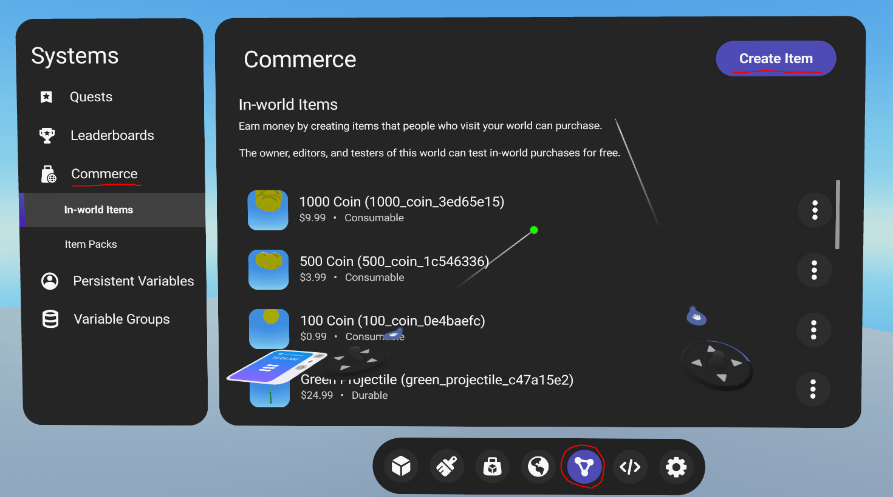

**Step 2:** Every IWP you create requires a *Name*, *Sell Price*, *Thumbnail*, and selected *Item type*.

| **Durable In-World Item** | **Consumable In-World Item** |
| --- | --- |
|  |  |
| Asset reference is optional. Leaving it blank will create a *Durable Item without an Asset* (permanent player statuses). Adding an Asset will create a *Durable Item with Asset*, like a permanent weapon, hat, etc… | Decide if your consumable will be automatically consumed upon purchase or allow the user to consume it from their inventory with *Auto use*. |

**Note:***Description* is an optional field, but it is recommended that you provide a detailed description to help users understand what they are buying.

**Step 3:** Once your In-World Item has been created, you can grab an In-World Item gizmo from your build menu and drag it into your world.

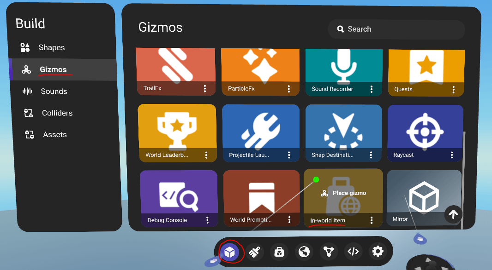

**Step 4:** Open the property panel for your In-World Item gizmo and there are several settings you can change here:

* Hit *Select* next to *In-World Item* and select the In-World Item associated with this gizmo.

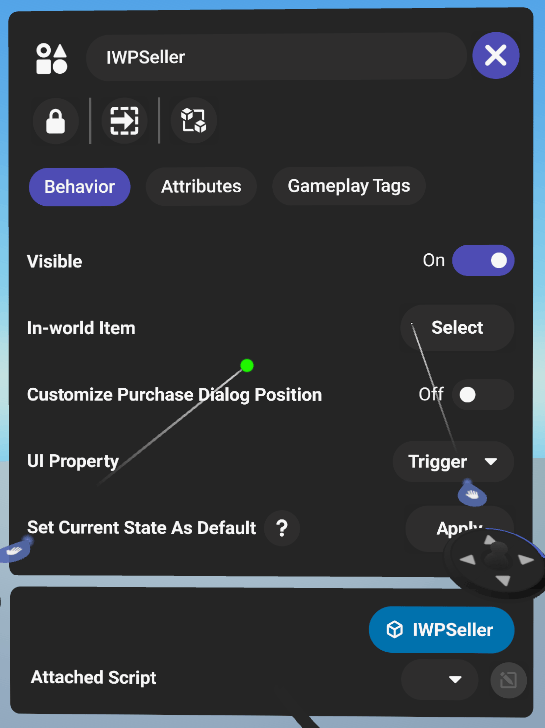

* Click the dropdown next to *UI Property* and change the display style of your gizmo.

| Trigger | Button | Icon |
| --- | --- | --- |
|  |  |  |

* This is also where you would attach any scripts using the non-broadcast event codeblocks described under the **IWP Codeblocks** section.

**Now your IWP is ready for purchase!**

## Creating Item Packs

This section will guide you through the process of creating and selling Item Packs, including how to access the feature, select items, set quantities and prices, and make them available for purchase in your game.

Item Packs consist of *Consumables without Auto-use* offering players the ability to purchase items in bulk. You can create one by opening your build menu, navigating to *Systems* then *Commerce* again, selecting *Item Packs*, and clicking *Create Item Pack*.

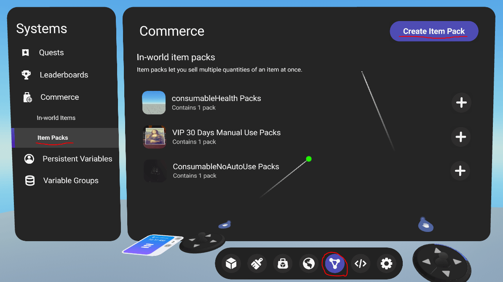

The next window will ask you which *Consumable without Auto-use* you would like to make an Item Pack out of. Once selected you can choose an *Item quantity* between 2 and 99 then select your *Sell Price*.

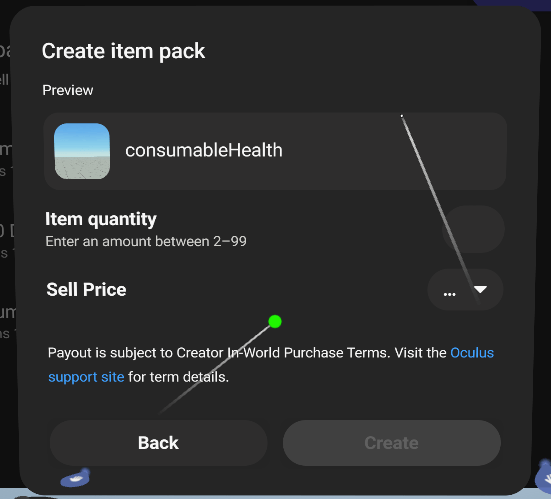

Once created you can follow the same steps 3-4 in the previous section, **Creating an IWP**, to start selling your item pack.

## Examples: Implementing & Selling IWPs

In the following section, we will apply what we learned in the previous sections to build practical applications for our world. Some examples will include developing members-only area, an inventory system for weapons or other items, consumable health potions, and a simple item shop. These examples will demonstrate how to implement common gameplay mechanics, allowing players to access restricted areas, manage their inventory, use items, and make purchases within the game.

### Durable without Asset

**VIP Area**

**Required:** Durable Item without Asset. Follow steps 1-4 under **Creating an IWP** to create the VIP commerce, and setup the related *In-World Item* gizmo. Then pull out a *Trigger Gizmo* to get started

Durable items without assets are straightforward since all you can do is check if the player owns the IWP.

In this example, the script below is attached to a Trigger gizmo that covers our VIP area. When a player enters the trigger, we will check if they own this item and respawn them if they do not.

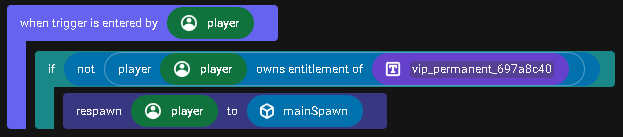

This is created by using the *when trigger is entered by player* event codeblock with an *IF* statement inside. We use a *NOT* operator and drag the *player owns item* codeblock inside of it. Using the *player* parameter from the event and an *in-world items* input value, we can complete this *IF* statement and respawn our players.

### Durable with Asset

**Spawning from Player Inventory**

**Required:** Durable Item with Asset. Follow steps 1-4 under **Creating an IWP** to create your durable item with asset commerce by assigning an asset from your asset library, and setup the related *In-World Item* gizmo. Then choose any object to run the following script. You will need to create an asset variable in your script, I called mine *assetToSpawn* and I linked it to the same asset from my asset library that I used when creating the *Durable Item*.

Durable items with assets do not require scripts, but what if we need to communicate with the item our player spawned?

This script can run anywhere in the world since it uses a broadcast event.

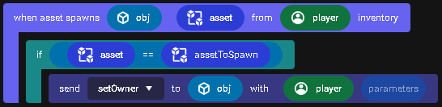

Using the *when an asset spawns from player inventory* codeblock we get the object that spawned, the asset it was created from, and the player who spawned it. Since this is a broadcast event that will fire on any item spawning from any player, we’re going to check that the asset received by the event is the one we want by using an IF statement to compare the parameter to a specific asset variable in our script. Once we determine this is our asset, we can now send an event to the newly spawned object with our player as a parameter for the object to receive.

### Consumable with Auto-Use

**30-VIP Access**

**Required:** Consumable with Auto-Use. Follow steps 1-4 under **Creating an IWP** to create the VIP consumsable with auto-use, and setup the related *In-World Item* gizmo. Then pull out a *Trigger Gizmo* to get started

In this example, we use a consumable to provide time-based(30 days) access to our users for their purchase. This script runs on a trigger gizmo that covers our VIP area.

**Note**: Because the script is too wide, I had to cut and modify the IF statement to show on two lines.

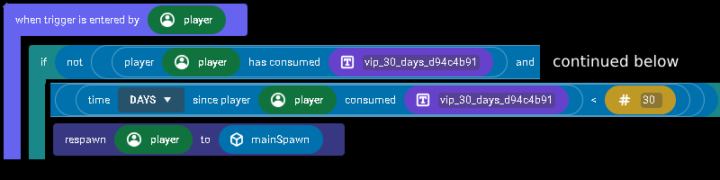

This script uses the *IF* statement and the *NOT* operator just like in our previous example. We also incorporate the *AND* operator so we can check two conditions. First, we use the *player has consumed item* codeblock to tell us if they have consumed the item, then we use the *time since player consumed item* codeblock in conjunction with the *LESS THAN* operator and *number* input value to determine if it has been less than 30 days since they consumed. Because of our *AND* operator, if one of these conditions returns false, they will be teleported away from the area.

**Restore Health**

**Required:** Consumable with Auto-Use. Follow steps 1-4 under **Creating an IWP** to create the Health Restore consumable with auto-use, and setup the related *In-World Item* gizmo.

In this example, our users can purchase an instant health restore. This script is attached to the In-World Item gizmo and the events below will fire when the item is purchased.

**Note:** This script assumes you have a player manager listening for the restoreHealth event.

We don’t have any need for the *when player purchase succeeds on item* or *when player purchase fails on item* events, but I wanted to show that they still fire.

We wait for the *when player consume succeeds on item* event to fire, although since this is an auto-consumed item, we could have also sent *restoreHealth* under the *when player purchase succeeds on item* event too.

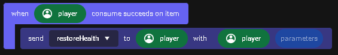

Below you’ll see an example of my player manager script to give you an idea of what that looks like. This script can be ran on any object in the world and listens for events being sent to players.

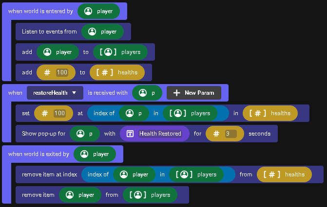

**Coin Shop**

**Required:** Consumable with Auto-Use. Follow steps 1-4 under **Creating an IWP** to create the Coin consumsable with auto-use, and setup the related *In-World Item* gizmo.

This is the same script as the previous **Restore Health** script, but I also wanted to show that you could set a Player-Persistent Variable. This script is attached to the In-World Item gizmo and the events below will fire when the item is purchased.

In this example, the user purchases 100 coins so we need to add the coins to their Coins PPV.

We use the *set player persistent var* to codeblock with a + operator to add their current Coin PPV that we retrieved using the *get user persistent var* codeblock to a number input value of 100.

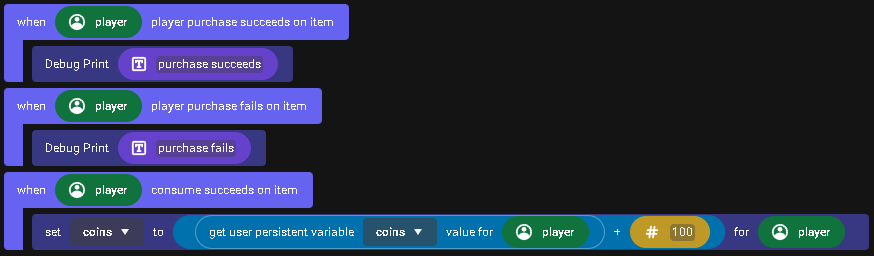

### Consumable without Auto-use

**Example: Manual Health Restore**

**Required:** Consumable without Auto-Use. Follow steps 1-4 under **Creating an IWP** to create the Health Restore consumsable without auto-use, and setup the related *In-World Item* gizmo.

In this example we show how to handle manual consumption of an In-World Item without auto-use, meaning the item is stored in the player’s inventory and consumed when they are ready. This script is attached to the In-World Item gizmo and the events below will fire when the item is consumed.

The important thing to note when a player tries to consume a *Consumable without Auto-use* is that you must recognize this using the *when player try to consume item**from inventory* codeblock and decide whether to acknowledge this attempt using the *consume item for player* codeblock before the consumption is considered successful, otherwise, the consumption will fail. Refer to the previous example, **Restore Health**, to see what a player manager script would look like.

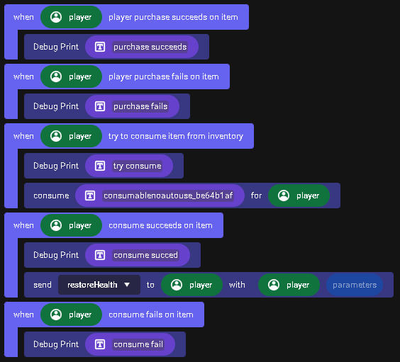

## Extended Learning

To reinforce your understanding of IWP mechanics and put your new skills into practice, try completing the hands-on challenges provided below:

**Challenge 1:** Create a basic auto-use and manual-use consumable, then purchase and consume it in build mode. Additionally, go on to create an item pack out of the manual-use consumable.

**Challenge 2:** Create a basic durable item with and without an asset, then purchase and use it in build mode.

## Further Assistance

For any questions or further assistance, creators are encouraged to join the discussion on the Discord server or to schedule a mentor session for personalized guidance.