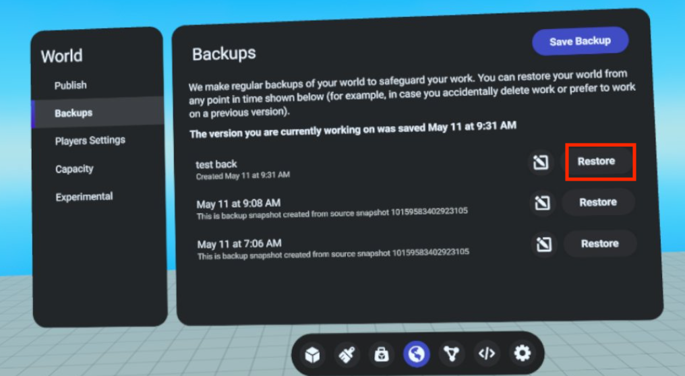
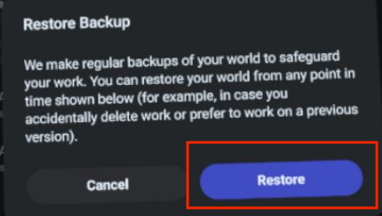

# Managing World Backups

You can manage world backups in the [Developer Dashboard](https://developers.meta.com/horizon/manage/) or in VR.

## Managing backups in VR

This feature will allow creators to view the list of backups, make new backups, edit names and descriptions of backups, and restore previous backups from the Creator UI (CUI). Follow these steps to get started:

- Go to Meta Horizon Worlds.
- Visit any world in “**Edit**” mode.
- Enter “ **Build** ” mode (pull down on right joystick).
- Open CUI (press context menu button on left joystick).
- Open World tab.

## Saving a Backup

These steps will enable creators to make manual backups using the save process.

- Select the “ **Save Backup** ” button on the Backups tab.
- Enter a title and description (optional).
- Click “ **Save** ”.

A demo of how to save a backup is shown below.

## Editing a Backup

- Click on the “ **Edit** ” button from the list of backups you want to modify.
  
- Update with a new title and descriptions (optional).
- Click “ **Save** ”.
- All changes should be reflected in the backup list.

A demo of how to edit a backup is shown below.

## Restoring a Backup

- Click on the “ **Restore** “ button from the list of backups you want to restore from.
  
- Click the “ **Restore** “ button on the dialog box to confirm.
  
- You will be removed from the world and transported to your home world. From there you can travel back to the original world to observe the restored changes.

A demo of how to restore a backup is shown below.

